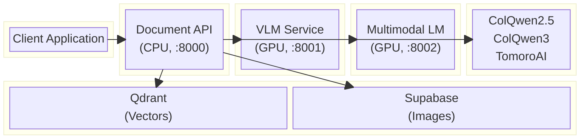

# ColPali RAG App Documentation

Welcome to the ColPali RAG App documentation. This application provides a three-microservice backend for document retrieval using Vision Language Models (VLMs).

## What is ColPali RAG App?

ColPali RAG App uses **ColQwen 2.5**, **ColQwen3**, or **TomoroAI ColQwen3** to index and retrieve information directly from document images, preserving visual elements like tables, figures, and charts. Unlike traditional text-based RAG systems, this approach maintains the full visual context of documents.

The system is split into three independently deployable services:
- **colpali-vlm/** - GPU-based VLM embedding service
- **multimodal_lm/** - GPU-based multimodal LM service (Qwen3-VL-32B-Instruct via vLLM)
- **document-api/** - CPU-based API orchestration service

## Quick Links

| Document | Description |
|----------|-------------|
| [Architecture Overview](./architecture.md) | Three-service design and component relationships |
| [API Reference](./api-reference.md) | VLM, Multimodal LM, and Document API endpoint documentation |
| [Data Flow](./data-flow.md) | Request lifecycle and inter-service communication |
| [Configuration](./configuration.md) | Environment variables and settings for all services |
| [Deployment](./deployment.md) | Local, Docker, RunPod (GPU), and cloud deployment |

## Module Documentation

| Module | Description |
|--------|-------------|
| [API Module](./modules/api.md) | FastAPI endpoints, dependencies, and lifespan for both services |
| [ColPali Module](./modules/colpali.md) | Multi-model loader factory (ColQwen2.5, ColQwen3, TomoroAI) |
| [Services Module](./modules/services.md) | VLM client, image upload/download services |
| [Utils Module](./modules/utils.md) | Utility functions |
| [Settings Module](./modules/settings.md) | Configuration management for all services |

## Technology Stack



## Core Technologies

| Technology | Service | Purpose |
|------------|---------|---------|
| **FastAPI** | VLM, Document API | Async web framework |
| **ColQwen 2.5 / ColQwen3 / TomoroAI** | VLM | Vision-language models for embeddings |
| **vLLM** | Multimodal LM | OpenAI-compatible inference server |
| **Qwen3-VL-32B-Instruct** | Multimodal LM | Multimodal LLM for response generation |
| **httpx + tenacity** | Document API | HTTP client for VLM service with retry |
| **OpenAI Python SDK** | Document API | Client for multimodal LM service (via vLLM) |
| **Qdrant** | Document API | Vector database for similarity search |
| **Supabase** | Document API | Cloud storage for document images |

## Getting Started

### Prerequisites

- Python 3.11+ (VLM service) / Python 3.12.8+ (Document API)
- [uv](https://github.com/astral-sh/uv) package manager
- Poppler (for PDF conversion, Document API only)
- NVIDIA GPU (for VLM and Multimodal LM services)
- Access to Qdrant and Supabase APIs

### Quick Start

```bash
# Configure environment for all services
cp colpali-vlm/.env.example colpali-vlm/.env
cp multimodal_lm/.env.example multimodal_lm/.env
cp document-api/.env.example document-api/.env
# Edit .env files with your credentials

# Option 1: Docker Compose (all services)
make docker_up

# Option 2: Local development
# Terminal 1: VLM service (requires GPU)
make dev_vlm

# Multimodal LM service (requires GPU, Docker)
cd multimodal_lm && make docker_build && make docker_run

# Terminal 2: Document API
make dev_api
```

- Document API: `http://localhost:8000`
- VLM Service: `http://localhost:8001`
- Multimodal LM Service: `http://localhost:8002`

## License

See the root [LICENSE](../LICENSE) file for details.
