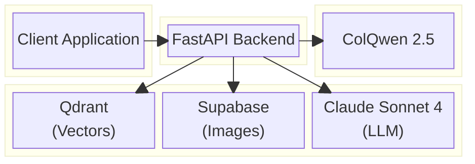

# ColPali RAG App Documentation

Welcome to the ColPali RAG App documentation. This application provides a FastAPI backend for document retrieval using Vision Language Models (VLMs).

## What is ColPali RAG App?

ColPali RAG App uses **ColQwen 2.5** to index and retrieve information directly from document images, preserving visual elements like tables, figures, and charts. Unlike traditional text-based RAG systems, this approach maintains the full visual context of documents.

## Quick Links

| Document | Description |
|----------|-------------|
| [Architecture Overview](./architecture.md) | System design and component relationships |
| [API Reference](./api-reference.md) | Detailed API endpoint documentation |
| [Data Flow](./data-flow.md) | Request lifecycle and data processing |
| [Configuration](./configuration.md) | Environment variables and settings |
| [Deployment](./deployment.md) | Local, Docker, RunPod (GPU), and cloud deployment |

## Module Documentation

| Module | Description |
|--------|-------------|
| [API Module](./modules/api.md) | FastAPI endpoints, dependencies, and lifespan |
| [ColPali Module](./modules/colpali.md) | Vision model loading and embedding |
| [Services Module](./modules/services.md) | Image upload/download services |
| [Models Module](./modules/models.md) | Pydantic data models |
| [Utils Module](./modules/utils.md) | Utility functions |
| [Settings Module](./modules/settings.md) | Configuration management |

## Technology Stack



## Core Technologies

| Technology | Purpose |
|------------|---------|
| **FastAPI** | Async web framework |
| **ColQwen 2.5** | Vision-language model for embeddings |
| **Qdrant** | Vector database for similarity search |
| **Supabase** | Cloud storage for document images |
| **Claude Sonnet 4** | LLM for response generation |
| **Instructor** | Structured output validation |

## Getting Started

### Prerequisites

- Python 3.12+
- [uv](https://github.com/astral-sh/uv) package manager
- Poppler (for PDF conversion)
- Access to Qdrant, Supabase, and Anthropic APIs

### Quick Start

```bash
# Install dependencies
uv sync --all-groups

# Configure environment
cp .env.example .env
# Edit .env with your API keys

# Create Qdrant collection
make create_collection

# Start development server
make dev
```

The API will be available at `http://localhost:8000`.

## License

See the root [LICENSE](../LICENSE) file for details.
