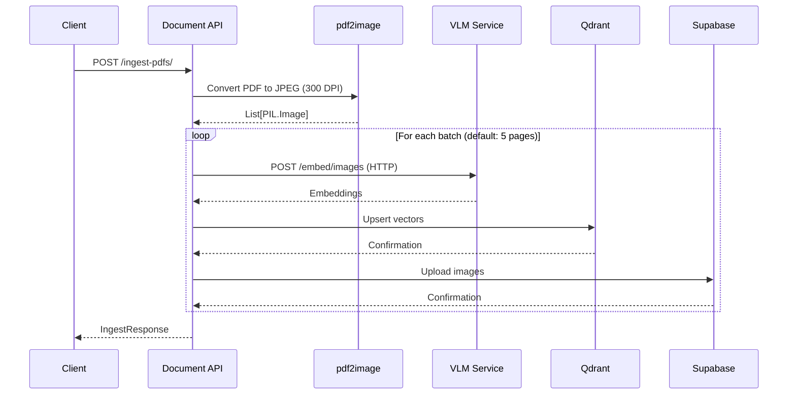
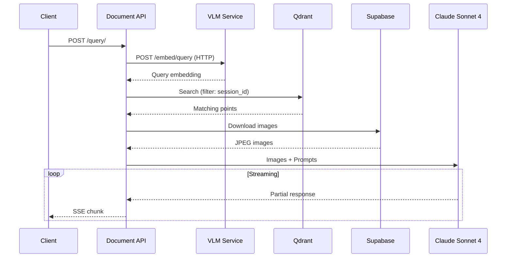

# API Reference

This document provides detailed documentation for all API endpoints across both services.

## Services Overview

| Service | Base URL | Description |
|---------|----------|-------------|
| Document API | `http://localhost:8000` | PDF ingestion, querying, health check |
| VLM Service | `http://localhost:8001` | Image/query embedding, health checks |

---

## Document API Endpoints (`:8000`)

| Endpoint | Method | Description |
|----------|--------|-------------|
| `/ingest-pdfs/` | POST | Ingest PDF documents |
| `/query/` | POST | Query ingested documents |
| `/health` | GET | Health check |
| `/docs` | GET | Interactive API documentation |

### POST /ingest-pdfs/

Ingest PDF documents into the system. PDFs are converted to images, sent to the VLM service for embedding, and stored in Qdrant and Supabase.

#### Request Flow



#### Request

**Content-Type:** `multipart/form-data`

| Parameter | Type | Required | Description |
|-----------|------|----------|-------------|
| `files` | `File[]` | Yes | PDF files to ingest |
| `session_id` | `UUID4` | Yes | Session identifier for filtering |

#### Example Request

```bash
curl -X POST "http://localhost:8000/ingest-pdfs/" \
  -H "Authorization: Bearer <your-jwt-token>" \
  -H "Content-Type: multipart/form-data" \
  -F "files=@document1.pdf" \
  -F "files=@document2.pdf" \
  -F "session_id=550e8400-e29b-41d4-a716-446655440000"
```

#### Response

**Content-Type:** `application/json`

```json
{
  "results": [
    {
      "filename": "document1.pdf",
      "num_pages": 10
    },
    {
      "filename": "document2.pdf",
      "num_pages": 5
    }
  ]
}
```

#### Error Response

```json
{
  "results": [
    {
      "filename": "corrupted.pdf",
      "error": "Failed to convert PDF: Invalid PDF format"
    }
  ]
}
```

#### Processing Details

1. **PDF Conversion**: Each PDF is converted to JPEG images at 300 DPI using `pdf2image` with 4 threads
2. **Batch Processing**: Images are processed in batches (default: 5 images per batch, configurable via `MAX_PAGES_PER_BATCH`)
3. **Embedding**: Images sent to VLM service via HTTP, which returns multi-vectors (128-dim for ColQwen2.5, 320-dim for ColQwen3/TomoroAI)
4. **Storage**: Vectors stored in Qdrant with payload `{session_id, document, page}`
5. **Image Storage**: JPEGs stored in Supabase at `{session_id}/{document}/{page}.jpeg`

---

### POST /query/

Query ingested documents using natural language. Returns a streaming response with references and an answer.

#### Request Flow



#### Request

**Content-Type:** `application/x-www-form-urlencoded`

| Parameter | Type | Required | Description |
|-----------|------|----------|-------------|
| `query` | `string` | Yes | Natural language query |
| `top_k` | `integer` | Yes | Number of results to retrieve |
| `session_id` | `UUID4` | Yes | Session identifier for filtering |

#### Example Request

```bash
curl -X POST "http://localhost:8000/query/" \
  -H "Authorization: Bearer <your-jwt-token>" \
  -H "Content-Type: application/x-www-form-urlencoded" \
  -d "query=What are the key findings?" \
  -d "top_k=5" \
  -d "session_id=550e8400-e29b-41d4-a716-446655440000"
```

#### Response

**Content-Type:** `text/event-stream`

The response is streamed as Server-Sent Events (SSE). Each chunk is a JSON object representing the partial `FinalResponse`.

```json
{"references": [], "answer": "Based on"}
{"references": [], "answer": "Based on the documents"}
{"references": [{"id": 1, "title": "Key Findings", "filename": "report.pdf"}], "answer": "Based on the documents, the key findings include..."}
```

#### Final Response Structure

```json
{
  "references": [
    {
      "id": 1,
      "title": "Section Title",
      "filename": "document.pdf"
    }
  ],
  "answer": "The analysis shows significant improvements [1]."
}
```

---

### GET /health

Health check endpoint for container orchestration and load balancers.

```bash
curl http://localhost:8000/health
```

```json
{
  "status": "healthy"
}
```

---

## VLM Service Endpoints (`:8001`)

| Endpoint | Method | Description |
|----------|--------|-------------|
| `/embed/images` | POST | Generate image embeddings |
| `/embed/query` | POST | Generate query embedding |
| `/health` | GET | Health check (model status) |
| `/health/detailed` | GET | Detailed health with model info |
| `/docs` | GET | Interactive API documentation |

### POST /embed/images

Generate embeddings for a list of images.

#### Request

**Content-Type:** `multipart/form-data`

| Parameter | Type | Required | Description |
|-----------|------|----------|-------------|
| `images` | `File[]` | Yes | JPEG/PNG image files |

#### Response

```json
{
  "embeddings": [[[0.1, 0.2, ...], [0.3, 0.4, ...]], ...],
  "processing_time_ms": 1234.56
}
```

Returns multi-vectors for each image:
- **128-dim** for ColQwen2.5
- **320-dim** for ColQwen3/TomoroAI

**Note:** Embeddings are returned as float16 values (converted from float32) for ~50% response size reduction. Responses are also GZip-compressed (60-80% further reduction) via middleware.

---

### POST /embed/query

Generate embedding for a text query.

#### Request

**Content-Type:** `application/json`

```json
{
  "query": "What are the key findings?"
}
```

#### Response

```json
{
  "embedding": [[0.1, 0.2, ...], [0.3, 0.4, ...]],
  "processing_time_ms": 234.56
}
```

---

### GET /health

Returns model load status. Returns 503 if model is not yet loaded.

```json
{
  "status": "healthy",
  "model_loaded": true
}
```

### GET /health/detailed

Returns detailed model information.

```json
{
  "status": "healthy",
  "model_loaded": true,
  "device": "cuda",
  "model_name": "vidore/colqwen2.5-v0.2"
}
```

---

## Authentication

Both services support optional JWT authentication via Supabase tokens.

- **Document API**: `AUTH_ENABLED=true` by default. All endpoints except `/health` require a valid JWT token.
- **VLM Service**: `AUTH_ENABLED=false` by default. When enabled, `/embed/*` endpoints require authentication. Health endpoints remain unauthenticated for Docker healthchecks.

The Document API forwards auth tokens to the VLM service when making embedding requests.

### Bearer Token

```bash
curl -X POST "http://localhost:8000/query/" \
  -H "Authorization: Bearer <your-supabase-jwt-token>" \
  -H "Content-Type: application/x-www-form-urlencoded" \
  -d "query=What are the key findings?" \
  -d "top_k=5" \
  -d "session_id=550e8400-e29b-41d4-a716-446655440000"
```

---

## Error Handling

### HTTP Status Codes

| Code | Description |
|------|-------------|
| `200` | Success |
| `400` | Bad Request - Invalid parameters |
| `401` | Unauthorized - Missing or invalid authentication token |
| `413` | Payload Too Large - File exceeds size limit |
| `422` | Validation Error - Missing required fields |
| `429` | Too Many Requests - Rate limit exceeded |
| `500` | Internal Server Error |
| `503` | Service Unavailable - VLM model not loaded |
| `504` | Gateway Timeout - Request exceeded timeout limit |

---

## Rate Limits (Document API)

| Endpoint | Default Limit | Environment Variable |
|----------|---------------|---------------------|
| `/query/` | 30 requests/minute | `QUERY_RATE_LIMIT` |
| `/ingest-pdfs/` | 10 requests/minute | `INGEST_RATE_LIMIT` |
| `/health` | No limit | - |

---

## Request Limits (Document API)

### File Size Limits

| Limit | Default | Environment Variable |
|-------|---------|---------------------|
| Max file size | 50 MB | `MAX_FILE_SIZE_MB` |
| Max total upload | 200 MB | `MAX_TOTAL_UPLOAD_MB` |
| Max pages per PDF | 200 | `MAX_PDF_PAGES` |

### Timeout Limits

| Limit | Default | Description |
|-------|---------|-------------|
| Ingest timeout | 600s | `/ingest-pdfs/` endpoint |
| Query timeout | 180s | `/query/` endpoint |
| VLM inference timeout | 60s | VLM service per-request |

---

## Python Client Example

```python
import httpx
import asyncio
from uuid import uuid4

async def ingest_pdfs():
    async with httpx.AsyncClient() as client:
        session_id = str(uuid4())

        with open("document.pdf", "rb") as f:
            response = await client.post(
                "http://localhost:8000/ingest-pdfs/",
                files={"files": ("document.pdf", f, "application/pdf")},
                data={"session_id": session_id}
            )

        return session_id, response.json()

async def query_documents(session_id: str, query: str):
    async with httpx.AsyncClient() as client:
        async with client.stream(
            "POST",
            "http://localhost:8000/query/",
            data={
                "query": query,
                "top_k": 5,
                "session_id": session_id
            }
        ) as response:
            async for line in response.aiter_lines():
                if line:
                    print(line)

asyncio.run(ingest_pdfs())
```

---

## OpenAPI Schema

Each service has its own interactive documentation:
- Document API: `http://localhost:8000/docs`
- VLM Service: `http://localhost:8001/docs`
