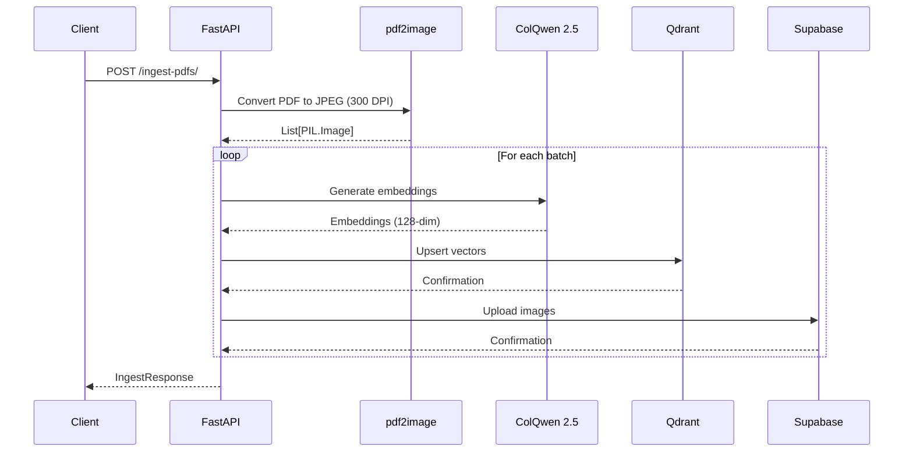
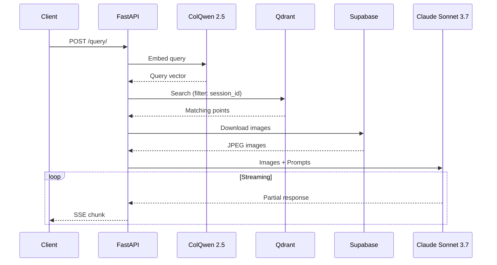

# API Reference

This document provides detailed documentation for all API endpoints.

## Base URL

```
http://localhost:8000
```

## Endpoints Overview

| Endpoint | Method | Description |
|----------|--------|-------------|
| `/ingest-pdfs/` | POST | Ingest PDF documents |
| `/query/` | POST | Query ingested documents |
| `/docs` | GET | Interactive API documentation |
| `/openapi.json` | GET | OpenAPI schema |

---

## POST /ingest-pdfs/

Ingest PDF documents into the system. PDFs are converted to images, embedded using ColQwen 2.5, and stored in Qdrant and Supabase.

### Request Flow



### Request

**Content-Type:** `multipart/form-data`

| Parameter | Type | Required | Description |
|-----------|------|----------|-------------|
| `files` | `File[]` | Yes | PDF files to ingest |
| `session_id` | `UUID4` | Yes | Session identifier for filtering |

### Example Request

```bash
curl -X POST "http://localhost:8000/ingest-pdfs/" \
  -H "Content-Type: multipart/form-data" \
  -F "files=@document1.pdf" \
  -F "files=@document2.pdf" \
  -F "session_id=550e8400-e29b-41d4-a716-446655440000"
```

### Response

**Content-Type:** `application/json`

```json
{
  "results": [
    {
      "filename": "document1.pdf",
      "num_pages": 10
    },
    {
      "filename": "document2.pdf",
      "num_pages": 5
    }
  ]
}
```

### Error Response

```json
{
  "results": [
    {
      "filename": "corrupted.pdf",
      "error": "Failed to convert PDF: Invalid PDF format"
    }
  ]
}
```

### Processing Details

1. **PDF Conversion**: Each PDF is converted to JPEG images at 300 DPI using `pdf2image` with 4 threads
2. **Batch Processing**: Images are processed in batches (default: 1 image per batch)
3. **Embedding**: ColQwen 2.5 generates 128-dimensional multi-vectors
4. **Storage**: Vectors stored in Qdrant with payload `{session_id, document, page}`
5. **Image Storage**: JPEGs stored in Supabase at `{session_id}/{document}/{page}.jpeg`

---

## POST /query/

Query ingested documents using natural language. Returns a streaming response with references and an answer.

### Request Flow



### Request

**Content-Type:** `application/x-www-form-urlencoded`

| Parameter | Type | Required | Description |
|-----------|------|----------|-------------|
| `query` | `string` | Yes | Natural language query |
| `top_k` | `integer` | Yes | Number of results to retrieve |
| `session_id` | `UUID4` | Yes | Session identifier for filtering |

### Example Request

```bash
curl -X POST "http://localhost:8000/query/" \
  -H "Content-Type: application/x-www-form-urlencoded" \
  -d "query=What are the key findings?" \
  -d "top_k=5" \
  -d "session_id=550e8400-e29b-41d4-a716-446655440000"
```

### Response

**Content-Type:** `text/event-stream`

The response is streamed as Server-Sent Events (SSE). Each chunk is a JSON object representing the partial `FinalResponse`.

```json
{"references": [], "answer": "Based on"}
{"references": [], "answer": "Based on the documents"}
{"references": [{"id": 1, "title": "Key Findings", "filename": "report.pdf"}], "answer": "Based on the documents, the key findings include..."}
```

### Final Response Structure

```json
{
  "references": [
    {
      "id": 1,
      "title": "Section Title",
      "filename": "document.pdf"
    },
    {
      "id": 2,
      "title": "Another Section",
      "filename": "document.pdf"
    }
  ],
  "answer": "The analysis shows significant improvements [1]. Additional details can be found in the methodology section [2]."
}
```

### Response Fields

| Field | Type | Description |
|-------|------|-------------|
| `references` | `Reference[]` | List of cited document references |
| `references[].id` | `integer` | Citation number (used in answer) |
| `references[].title` | `string` | Section or page title |
| `references[].filename` | `string` | Source document filename |
| `answer` | `string` | Generated answer with citations `[1]`, `[2]` |

---

## Error Handling

### HTTP Status Codes

| Code | Description |
|------|-------------|
| `200` | Success |
| `400` | Bad Request - Invalid parameters |
| `422` | Validation Error - Missing required fields |
| `500` | Internal Server Error |

### Validation Error Response

```json
{
  "detail": [
    {
      "loc": ["body", "session_id"],
      "msg": "field required",
      "type": "value_error.missing"
    }
  ]
}
```

---

## Rate Limits

Rate limits are determined by the external services:

- **Anthropic API**: Check your API tier limits
- **Qdrant**: Depends on deployment configuration
- **Supabase**: Based on your plan limits

---

## Python Client Example

```python
import httpx
import asyncio
from uuid import uuid4

async def ingest_pdfs():
    async with httpx.AsyncClient() as client:
        session_id = str(uuid4())

        with open("document.pdf", "rb") as f:
            response = await client.post(
                "http://localhost:8000/ingest-pdfs/",
                files={"files": ("document.pdf", f, "application/pdf")},
                data={"session_id": session_id}
            )

        return session_id, response.json()

async def query_documents(session_id: str, query: str):
    async with httpx.AsyncClient() as client:
        async with client.stream(
            "POST",
            "http://localhost:8000/query/",
            data={
                "query": query,
                "top_k": 5,
                "session_id": session_id
            }
        ) as response:
            async for line in response.aiter_lines():
                if line:
                    print(line)

asyncio.run(ingest_pdfs())
```

---

## OpenAPI Schema

The full OpenAPI schema is available at `/openapi.json`. Interactive documentation is available at `/docs` (Swagger UI) and `/redoc` (ReDoc).
