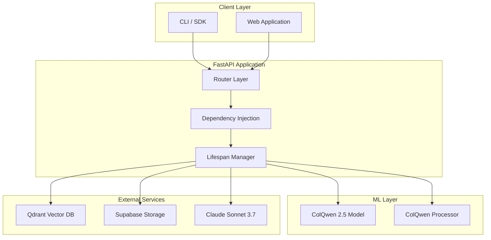
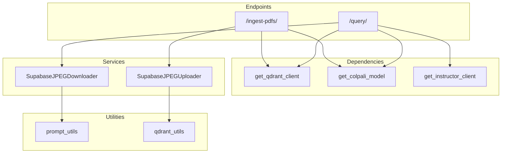
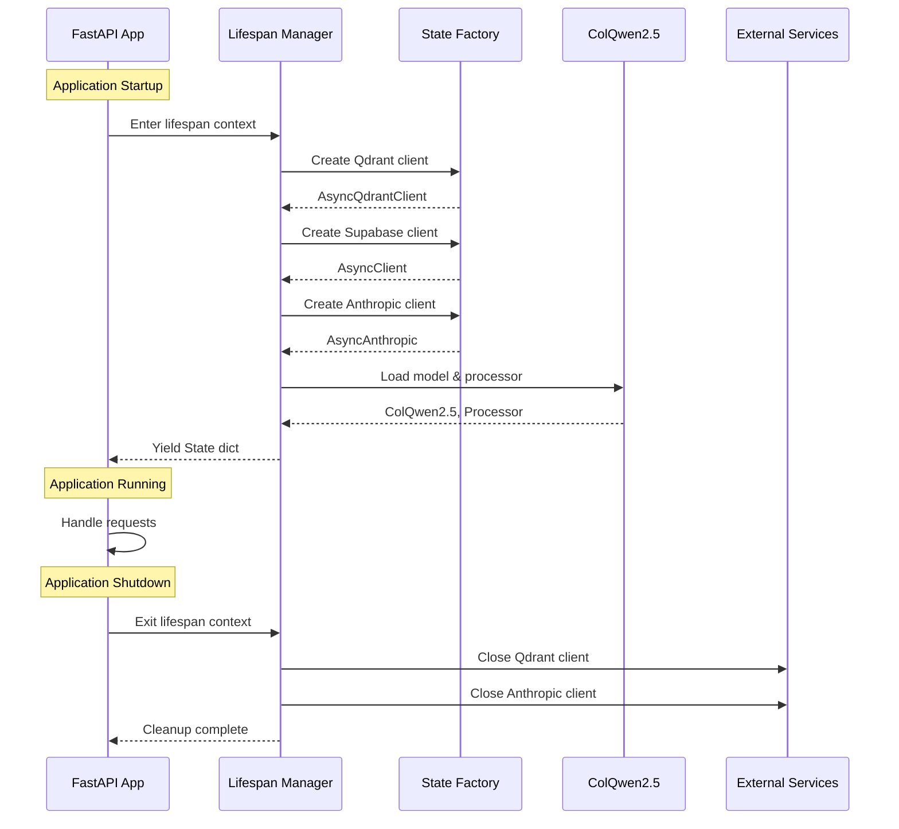
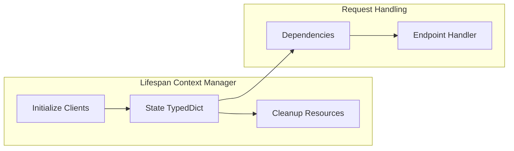
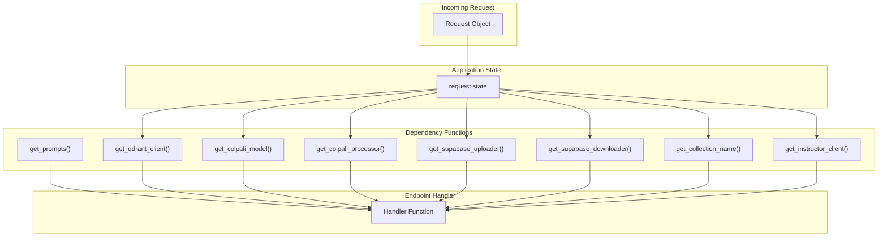
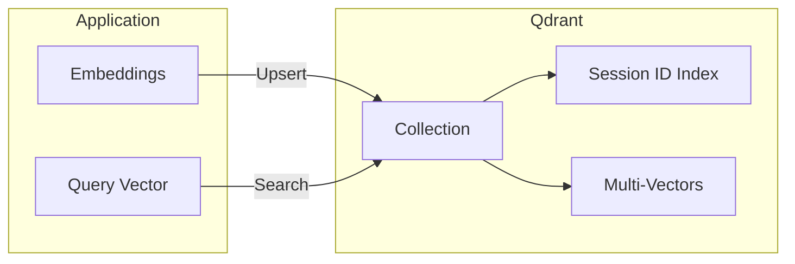
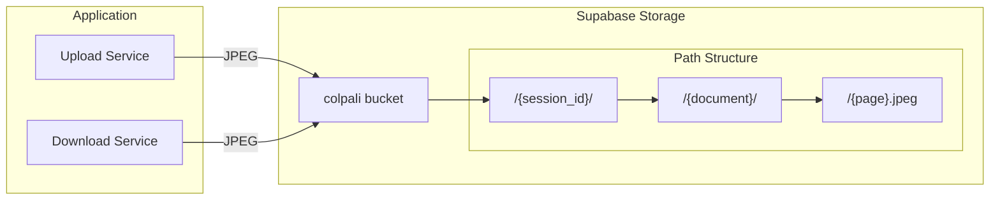
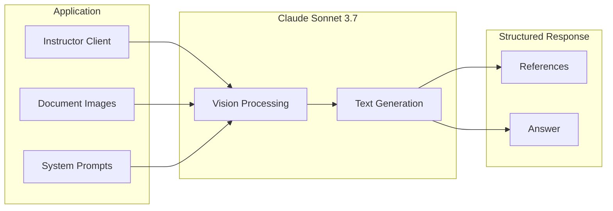

# Architecture Overview

This document describes the system architecture of the ColPali RAG App.

## High-Level Architecture



## Component Architecture



## Directory Structure

```
colpali-rag-app/
├── server.py                 # Application entry point
├── scripts/
│   └── create_collection.py  # Qdrant initialization
├── prompts/
│   ├── response_1            # System prompt part 1
│   └── response_2            # System prompt part 2
└── src/app/
    ├── settings.py           # Configuration
    ├── logging_config.py     # Logging setup
    ├── api/
    │   ├── state.py          # Client factories
    │   ├── lifespan.py       # Lifecycle management
    │   ├── dependencies.py   # DI functions
    │   └── endpoints/
    │       ├── pdf_ingest.py # Ingestion endpoint
    │       └── query.py      # Query endpoint
    ├── colpali/
    │   └── loaders.py        # Model loading
    ├── models/
    │   └── query_response.py # Response models
    ├── services/
    │   ├── img_uploader.py   # Upload service
    │   └── img_downloader.py # Download service
    └── utils/
        ├── prompt_utils.py   # Prompt loading
        └── qdrant_utils.py   # Qdrant helpers
```

## Application Lifecycle



## State Management

The application uses FastAPI's lifespan pattern for state management:



### State TypedDict Fields

| Field | Type | Description |
|-------|------|-------------|
| `model` | `ColQwen2_5` | Loaded vision-language model |
| `processor` | `ColQwen2_5_Processor` | Image/text processor |
| `supabase_uploader` | `SupabaseJPEGUploader` | Image upload service |
| `supabase_downloader` | `SupabaseJPEGDownloader` | Image download service |
| `instructor_client` | `AsyncInstructor` | Structured LLM client |
| `qdrant_client` | `AsyncQdrantClient` | Vector DB client |
| `collection_name` | `str` | Qdrant collection name |

## Dependency Injection



## External Service Integration

### Qdrant (Vector Database)



**Collection Configuration:**
- Vector size: 128
- Distance: Cosine with MaxSim
- Multi-vector support enabled
- Indexed field: `session_id`

### Supabase (Object Storage)



### Anthropic (LLM)



## Design Patterns

### 1. Factory Pattern
Client creation is delegated to factory functions in `state.py`.

### 2. Dependency Injection
FastAPI's `Depends()` provides loose coupling between endpoints and services.

### 3. Context Manager Pattern
Lifespan context manager ensures proper resource initialization and cleanup.

### 4. Repository Pattern
Services abstract storage operations (Supabase uploader/downloader).

### 5. Streaming Pattern
Query responses use Server-Sent Events for real-time output.

### 6. Retry Pattern
Qdrant operations use Tenacity for automatic retry with exponential backoff.
