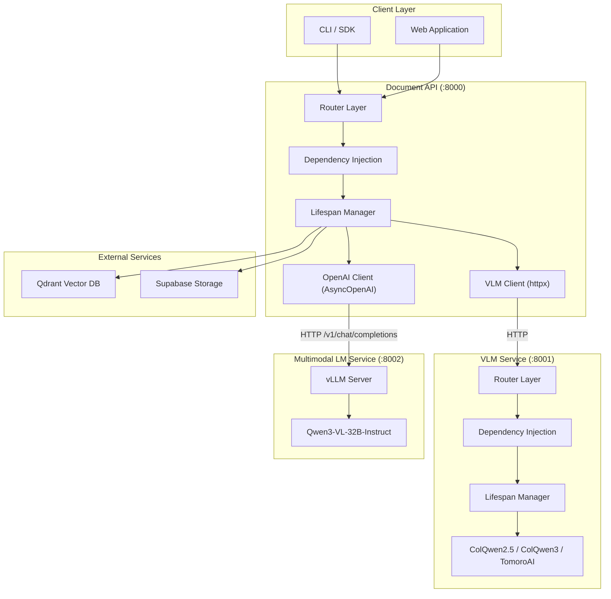
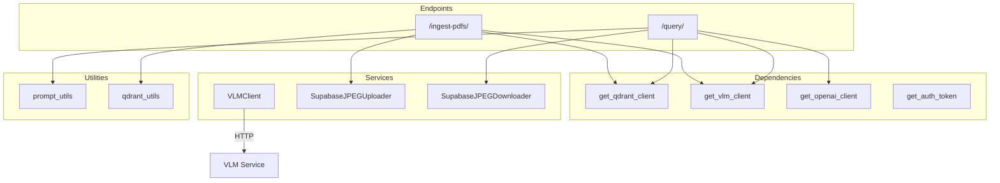
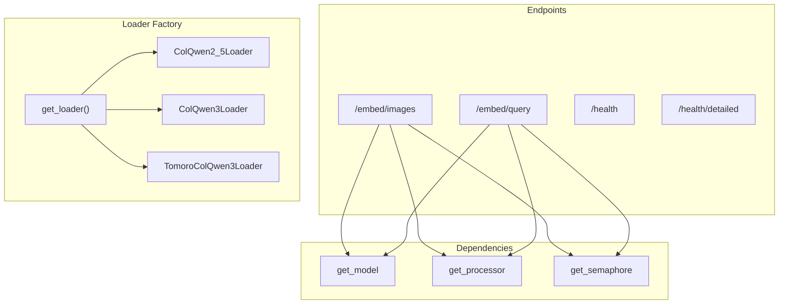
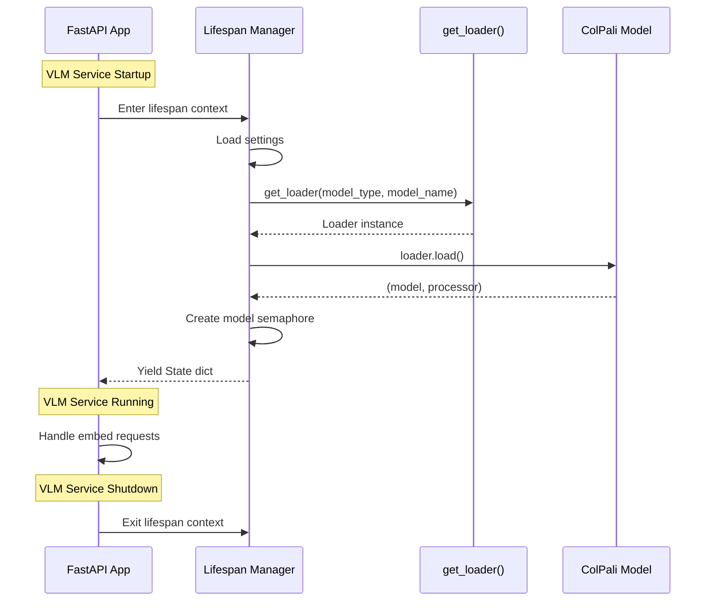
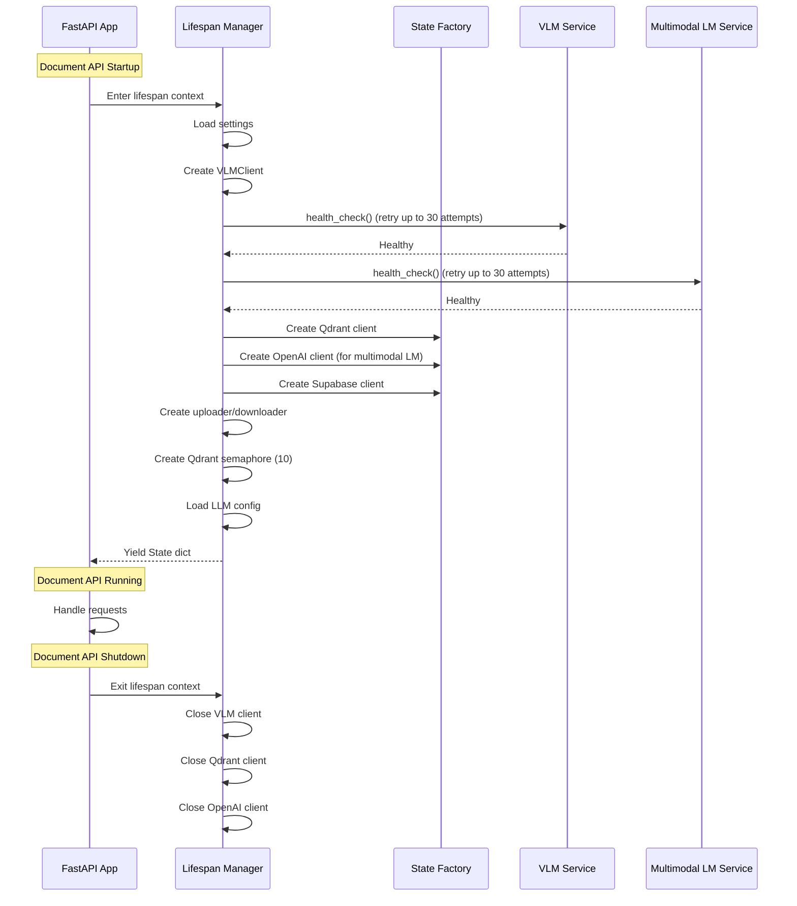

# Architecture Overview

This document describes the three-service architecture of the ColPali RAG App.

## High-Level Architecture



## Component Architecture

### Document API Components



### VLM Service Components



## Directory Structure

```
colpali-rag-app/
├── colpali-vlm/                        # VLM microservice (GPU)
│   ├── server.py                       # Application entry point
│   └── src/vlm/
│       ├── settings.py                 # Configuration
│       ├── logging_config.py           # Logging setup
│       ├── api/
│       │   ├── lifespan.py             # Model loading lifecycle
│       │   ├── dependencies.py         # DI functions
│       │   ├── auth.py                 # JWT authentication
│       │   └── endpoints/
│       │       └── embed.py            # Embedding endpoints
│       └── colpali/
│           └── loaders.py              # Multi-model loader factory
│
├── multimodal_lm/                      # Multimodal LM microservice (GPU)
│   ├── Dockerfile                      # vLLM-OpenAI base image
│   ├── entrypoint.sh                   # Model download + vLLM launch
│   ├── Makefile
│   └── .env.example
│
├── document-api/                       # Document API microservice (CPU)
│   ├── server.py                       # Application entry point
│   ├── prompts/
│   │   ├── response_1                  # System prompt
│   │   └── response_2                  # User prompt template
│   └── src/doc_api/
│       ├── settings.py                 # Configuration
│       ├── logging_config.py           # Logging setup
│       ├── api/
│       │   ├── state.py                # Client factories
│       │   ├── lifespan.py             # Client initialization lifecycle
│       │   ├── dependencies.py         # DI functions
│       │   ├── auth.py                 # JWT authentication
│       │   ├── middleware.py            # Timeout middleware
│       │   ├── rate_limit.py           # Rate limiting
│       │   └── endpoints/
│       │       ├── pdf_ingest.py       # Ingestion endpoint
│       │       └── query.py            # Query endpoint
│       ├── services/
│       │   ├── vlm_client.py           # HTTP client for VLM service
│       │   ├── img_uploader.py         # Upload service
│       │   └── img_downloader.py       # Download service
│       └── utils/
│           ├── prompt_utils.py         # Prompt loading
│           └── qdrant_utils.py         # Qdrant helpers
```

## Application Lifecycle

### VLM Service Startup



### Document API Startup



## State Management

### VLM Service State

| Field | Type | Description |
|-------|------|-------------|
| `model` | `Any` | Loaded vision-language model |
| `processor` | `Any` | Image/text processor |
| `model_semaphore` | `asyncio.Semaphore` | Concurrency control for GPU |
| `device` | `str` | Device (cuda/mps/cpu) |
| `model_name` | `str` | HuggingFace model name |
| `model_type` | `str` | Model type identifier |
| `settings` | `Settings` | VLM settings |

### Document API State

| Field | Type | Description |
|-------|------|-------------|
| `vlm_client` | `VLMClient` | HTTP client for VLM service |
| `supabase_uploader` | `SupabaseJPEGUploader` | Image upload service |
| `supabase_downloader` | `SupabaseJPEGDownloader` | Image download service |
| `openai_client` | `AsyncOpenAI` | Client for multimodal LM service |
| `qdrant_client` | `AsyncQdrantClient` | Vector DB client |
| `collection_name` | `str` | Qdrant collection name |
| `qdrant_semaphore` | `asyncio.Semaphore` | Concurrency control for Qdrant (10) |
| `llm_config` | `dict[str, Any]` | LLM model configuration |
| `settings` | `Settings` | Application settings |

## Dependency Injection

### Document API Dependencies

| Function | Returns | Source |
|----------|---------|--------|
| `get_vlm_client` | `VLMClient` | `request.state.vlm_client` |
| `get_qdrant_client` | `AsyncQdrantClient` | `request.state.qdrant_client` |
| `get_supabase_uploader` | `SupabaseJPEGUploader` | `request.state.supabase_uploader` |
| `get_supabase_downloader` | `SupabaseJPEGDownloader` | `request.state.supabase_downloader` |
| `get_collection_name` | `str` | `request.state.collection_name` |
| `get_openai_client` | `AsyncOpenAI` | `request.state.openai_client` |
| `get_qdrant_semaphore` | `asyncio.Semaphore` | `request.state.qdrant_semaphore` |
| `get_llm_config` | `dict[str, Any]` | `request.state.llm_config` |
| `get_settings_from_state` | `Settings` | `request.state.settings` |
| `get_prompts` | `dict[str, str]` | Cached prompt loading |
| `get_auth_token` | `str \| None` | Authorization header |

### VLM Service Dependencies

| Function | Returns | Source |
|----------|---------|--------|
| `get_model` | `Any` | `request.state.model` |
| `get_processor` | `Any` | `request.state.processor` |
| `get_semaphore` | `asyncio.Semaphore` | `request.state.model_semaphore` |
| `get_device` | `str` | `request.state.device` |
| `get_model_name` | `str` | `request.state.model_name` |
| `get_settings_from_state` | `Settings` | `request.state.settings` |

## Inter-Service Communication

The Document API communicates with the VLM service via HTTP using `VLMClient` (httpx + tenacity retry), and with the multimodal LM service via `AsyncOpenAI` (OpenAI-compatible API):

```mermaid
graph LR
    subgraph DocAPI["Document API"]
        Client["VLMClient"]
        OAI["AsyncOpenAI"]
    end

    subgraph VLMService["VLM Service"]
        Embed["/embed/images"]
        Query["/embed/query"]
        Health["/health"]
    end

    subgraph MLMService["Multimodal LM Service"]
        Chat["/v1/chat/completions"]
        MLMHealth["/health"]
    end

    Client -->|"POST (retry x3)"| Embed
    Client -->|"POST (retry x3)"| Query
    Client -->|"GET"| Health
    OAI -->|"POST (stream)"| Chat
```



**VLM error types:** `VLMClientError`, `VLMServiceUnavailable`, `VLMInferenceError`

## Design Patterns

1. **Microservice Pattern**: GPU inference isolated from CPU orchestration (three independent services)
2. **Factory Pattern**: `get_loader()` creates appropriate model loader; client factories in `state.py`
3. **Dependency Injection**: FastAPI's `Depends()` provides loose coupling
4. **Context Manager Pattern**: Lifespan context managers for resource initialization and cleanup
5. **Repository Pattern**: Services abstract storage operations (Supabase uploader/downloader)
6. **Streaming Pattern**: Query responses use Server-Sent Events for real-time output
7. **Retry Pattern**: VLMClient and Qdrant operations use Tenacity for automatic retry with exponential backoff
8. **Semaphore Pattern**: Model inference (VLM, 1) and Qdrant connections (API, 10) protected by asyncio.Semaphore
9. **Middleware Pattern**: Request timeouts and rate limiting as middleware layers
10. **Bearer Token Authentication**: JWT-based authentication using Supabase tokens in both services
