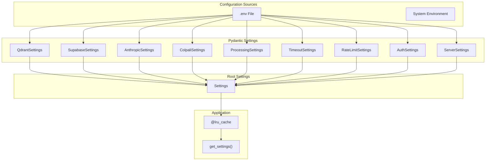
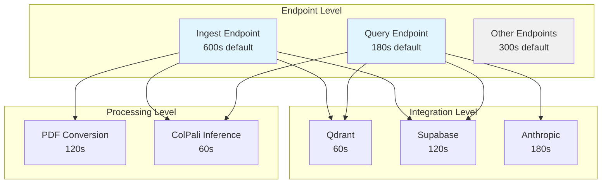
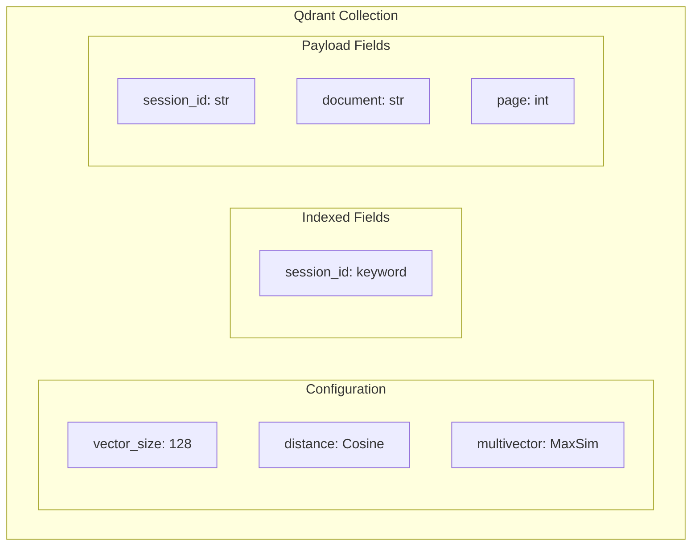
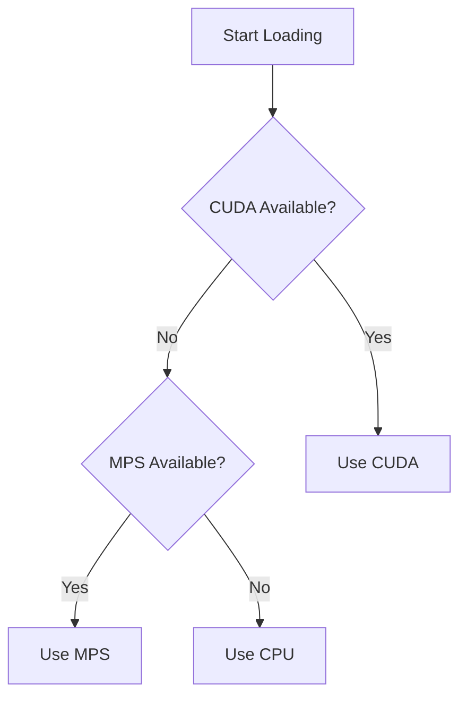
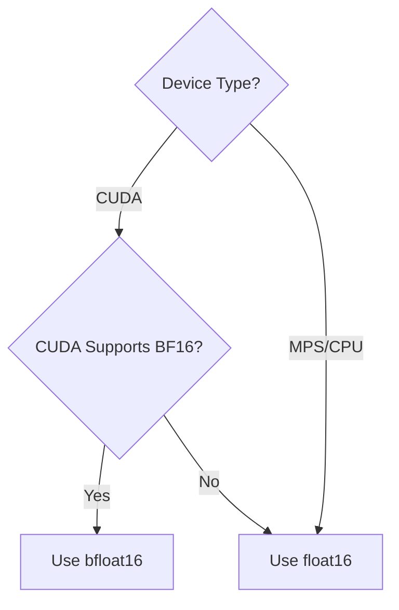
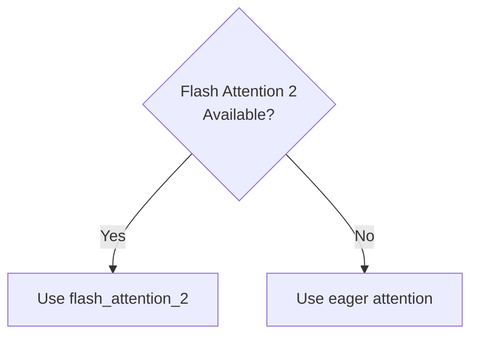
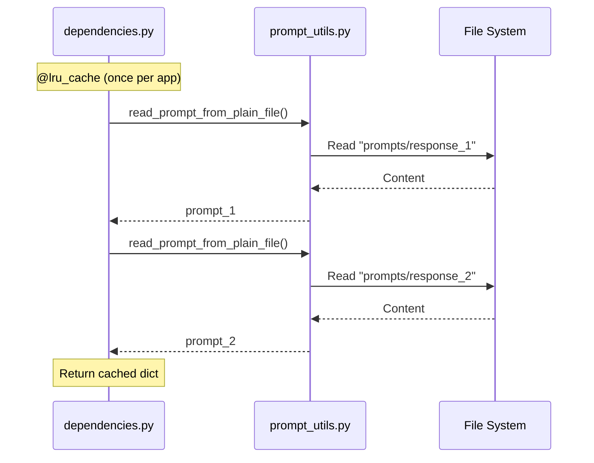

# Configuration

This document describes all configuration options for the ColPali RAG App.

## Environment Variables

All configuration is done through environment variables, typically stored in a `.env` file.

### Required Variables

```bash
# Qdrant Configuration
QDRANT_URL=https://your-qdrant-instance.cloud
QDRANT_API_KEY=your-qdrant-api-key
COLLECTION_NAME=colpali-collection

# Supabase Configuration
SUPABASE_URL=https://your-project.supabase.co
SUPABASE_KEY=your-supabase-anon-key

# Anthropic Configuration
ANTHROPIC_API_KEY=your-anthropic-api-key
```

### Configuration Hierarchy



---

## Settings Classes

### QdrantSettings

Vector database configuration.

| Variable | Type | Required | Default | Description |
|----------|------|----------|---------|-------------|
| `COLLECTION_NAME` | `str` | Yes | - | Qdrant collection name |
| `QDRANT_URL` | `str` | Yes | - | Qdrant instance URL |
| `QDRANT_API_KEY` | `str` | Yes | - | Qdrant API key |

```python
class QdrantSettings(BaseSettings):
    model_config = SettingsConfigDict(env_file=".env", extra="ignore")

    collection_name: str = ""
    qdrant_url: str = ""
    qdrant_api_key: str = ""
```

### SupabaseSettings

Object storage configuration.

| Variable | Type | Required | Default | Description |
|----------|------|----------|---------|-------------|
| `SUPABASE_KEY` | `str` | Yes | - | Supabase API key |
| `SUPABASE_URL` | `str` | Yes | - | Supabase project URL |
| `SUPABASE_JWT_SECRET` | `str` | No* | - | JWT secret for auth (*required if AUTH_ENABLED=true) |
| `BUCKET` | `str` | No | `colpali` | Storage bucket name |

```python
class SupabaseSettings(BaseSettings):
    model_config = SettingsConfigDict(env_file=".env", extra="ignore")

    supabase_key: str = ""
    supabase_url: str = ""
    supabase_jwt_secret: str = ""
    bucket: str = "colpali"
```

### AnthropicSettings

LLM configuration.

| Variable | Type | Required | Default | Description |
|----------|------|----------|---------|-------------|
| `ANTHROPIC_API_KEY` | `str` | Yes | - | Anthropic API key |
| `DEFAULT_MODEL` | `str` | No | `claude-sonnet-4-20250514` | Claude model for response generation |
| `MAX_TOKENS` | `int` | No | `8192` | Maximum tokens in response |
| `TEMPERATURE` | `float` | No | `0.0` | Model temperature |

```python
class AnthropicSettings(BaseSettings):
    model_config = SettingsConfigDict(env_file=".env", extra="ignore")

    anthropic_api_key: str = ""
    default_model: str = "claude-sonnet-4-20250514"
    max_tokens: int = 8192
    temperature: float = 0.0
```

### ColpaliSettings

Model configuration.

| Variable | Type | Required | Default | Description |
|----------|------|----------|---------|-------------|
| `COLPALI_MODEL_NAME` | `str` | No | `vidore/colqwen2.5-v0.2` | HuggingFace model ID |
| `MAX_CONCURRENT_INFERENCES` | `int` | No | `1` | Maximum concurrent model inferences |

```python
class ColpaliSettings(BaseSettings):
    model_config = SettingsConfigDict(env_file=".env", extra="ignore")

    colpali_model_name: str = "vidore/colqwen2.5-v0.2"
    max_concurrent_inferences: int = 1
```

### ProcessingSettings

File and batch processing limits.

| Variable | Type | Required | Default | Description |
|----------|------|----------|---------|-------------|
| `MAX_FILE_SIZE_MB` | `int` | No | `50` | Maximum file size per PDF |
| `MAX_TOTAL_UPLOAD_MB` | `int` | No | `200` | Maximum total upload size |
| `MAX_PAGES_PER_BATCH` | `int` | No | `5` | Pages processed per batch |
| `MAX_PDF_PAGES` | `int` | No | `200` | Maximum pages per PDF |
| `CLEAR_CUDA_CACHE_INTERVAL` | `int` | No | `10` | Clear GPU memory every N batches |

```python
class ProcessingSettings(BaseSettings):
    model_config = SettingsConfigDict(env_file=".env", extra="ignore")

    max_file_size_mb: int = 50
    max_total_upload_mb: int = 200
    max_pages_per_batch: int = 5
    max_pdf_pages: int = 200
    clear_cuda_cache_interval: int = 10
```

### TimeoutSettings

Comprehensive timeout configuration for endpoints, integrations, and processing operations.

| Variable | Type | Required | Default | Description |
|----------|------|----------|---------|-------------|
| **Endpoint Timeouts** |
| `INGEST_ENDPOINT_TIMEOUT_SECONDS` | `int` | No | `600` | Timeout for /ingest-pdfs/ endpoint |
| `QUERY_ENDPOINT_TIMEOUT_SECONDS` | `int` | No | `180` | Timeout for /query/ endpoint |
| **Integration Timeouts** |
| `QDRANT_TIMEOUT_SECONDS` | `int` | No | `60` | Qdrant vector database operations timeout |
| `SUPABASE_TIMEOUT_SECONDS` | `int` | No | `120` | Supabase storage operations timeout |
| `ANTHROPIC_TIMEOUT_SECONDS` | `int` | No | `180` | Claude API call timeout |
| **Processing Timeouts** |
| `PDF_CONVERSION_TIMEOUT_SECONDS` | `int` | No | `120` | PDF to image conversion timeout |
| `COLPALI_INFERENCE_TIMEOUT_SECONDS` | `int` | No | `60` | ColPali model inference timeout |

```python
class TimeoutSettings(BaseSettings):
    model_config = SettingsConfigDict(env_file=".env", extra="ignore")

    # Overall request timeouts
    ingest_endpoint_timeout_seconds: int = 600
    query_endpoint_timeout_seconds: int = 180

    # Integration-specific timeouts
    qdrant_timeout_seconds: int = 60
    supabase_timeout_seconds: int = 120
    anthropic_timeout_seconds: int = 180

    # Processing timeouts
    pdf_conversion_timeout_seconds: int = 120
    colpali_inference_timeout_seconds: int = 60
```

#### Timeout Hierarchy



#### Timeout Behavior

- **Endpoint timeouts**: Applied via middleware to entire request lifecycle
- **Integration timeouts**: Applied to individual client operations (Qdrant queries, Supabase uploads/downloads, Claude API calls)
- **Processing timeouts**: Applied to CPU/GPU-intensive operations (PDF conversion, model inference)

Timeouts are enforced using `asyncio.wait_for()` and will raise `asyncio.TimeoutError` when exceeded.

### RateLimitSettings

API rate limiting configuration.

| Variable | Type | Required | Default | Description |
|----------|------|----------|---------|-------------|
| `QUERY_RATE_LIMIT` | `str` | No | `30/minute` | Rate limit for /query/ endpoint |
| `INGEST_RATE_LIMIT` | `str` | No | `10/minute` | Rate limit for /ingest-pdfs/ endpoint |

```python
class RateLimitSettings(BaseSettings):
    model_config = SettingsConfigDict(env_file=".env", extra="ignore")

    query_rate_limit: str = "30/minute"
    ingest_rate_limit: str = "10/minute"
```

### AuthSettings

Authentication configuration.

| Variable | Type | Required | Default | Description |
|----------|------|----------|---------|-------------|
| `AUTH_ENABLED` | `bool` | No | `true` | Enable JWT authentication |
| `ALLOWED_ORIGINS` | `list[str]` | No | `["*"]` | CORS allowed origins |

```python
class AuthSettings(BaseSettings):
    model_config = SettingsConfigDict(env_file=".env", extra="ignore")

    auth_enabled: bool = True
    allowed_origins: list[str] = ["*"]
```

### ServerSettings

Server deployment configuration.

| Variable | Type | Required | Default | Description |
|----------|------|----------|---------|-------------|
| `WORKERS` | `int` | No | `1` | Number of uvicorn workers |
| `HOST` | `str` | No | `0.0.0.0` | Server host |
| `PORT` | `int` | No | `8000` | Server port |

```python
class ServerSettings(BaseSettings):
    model_config = SettingsConfigDict(env_file=".env", extra="ignore")

    workers: int = 1
    host: str = "0.0.0.0"
    port: int = 8000
```

---

## Qdrant Collection Configuration

The Qdrant collection must be created before first use. Configuration is defined in `scripts/create_collection.py`.

### Collection Schema



### Create Collection Script

```bash
make create_collection
# or
python scripts/create_collection.py
```

---

## Model Configuration

### Device Selection

The model loader automatically selects the best available device:



### Data Type Selection



### Attention Implementation



---

## Prompt Configuration

System prompts are stored as plain text files in the `prompts/` directory.

| File | Purpose |
|------|---------|
| `prompts/response_1` | System instructions for document analysis |
| `prompts/response_2` | Output format and citation instructions |

### Prompt Loading



---

## Logging Configuration

Logging is configured in `src/app/logging_config.py`.

### Log Format

```
TIMESTAMP | LEVEL | MODULE:FUNCTION:LINE | MESSAGE
```

Example:
```
2024-01-15 10:30:45 | INFO | lifespan:lifespan:42 | Starting application...
```

### Configuration

```python
def configure_logging() -> None:
    logger.remove()
    logger.add(
        sys.stderr,
        format="<green>{time:YYYY-MM-DD HH:mm:ss}</green> | "
               "<level>{level: <8}</level> | "
               "<cyan>{name}</cyan>:<cyan>{function}</cyan>:<cyan>{line}</cyan> | "
               "<level>{message}</level>",
        level="INFO",
        colorize=True,
    )
```

---

## Docker Configuration

### Environment Variables in Docker

```dockerfile
ENV PYTHONPATH=/app/src
```

### Docker Compose Example

```yaml
version: "3.8"
services:
  app:
    build: .
    ports:
      - "8000:8000"
    env_file:
      - .env
    volumes:
      - ./src:/app/src  # For development hot-reload
```

---

## Example .env File

```bash
# ===================
# Qdrant Configuration
# ===================
QDRANT_URL=https://abc123.us-east-1-0.aws.cloud.qdrant.io
QDRANT_API_KEY=your-qdrant-api-key-here
COLLECTION_NAME=colpali-documents

# ===================
# Supabase Configuration
# ===================
SUPABASE_URL=https://your-project-id.supabase.co
SUPABASE_KEY=eyJhbGciOiJIUzI1NiIsInR5cCI6IkpXVCJ9...
SUPABASE_JWT_SECRET=your-jwt-secret  # Required if AUTH_ENABLED=true
# BUCKET=colpali  # Optional, defaults to "colpali"

# ===================
# Anthropic Configuration
# ===================
ANTHROPIC_API_KEY=sk-ant-api03-...
# DEFAULT_MODEL=claude-sonnet-4-20250514  # Optional
# MAX_TOKENS=8192  # Optional
# TEMPERATURE=0.0  # Optional

# ===================
# Authentication (Optional)
# ===================
# AUTH_ENABLED=true  # Set to false to disable
# ALLOWED_ORIGINS=["https://yourapp.com"]  # CORS origins

# ===================
# Processing Limits (Optional)
# ===================
# MAX_FILE_SIZE_MB=50
# MAX_PDF_PAGES=200
# MAX_PAGES_PER_BATCH=5

# ===================
# Rate Limiting (Optional)
# ===================
# QUERY_RATE_LIMIT=30/minute
# INGEST_RATE_LIMIT=10/minute

# ===================
# Timeouts (Optional)
# ===================
# INGEST_ENDPOINT_TIMEOUT_SECONDS=600     # Timeout for /ingest-pdfs/ endpoint
# QUERY_ENDPOINT_TIMEOUT_SECONDS=180      # Timeout for /query/ endpoint

# Integration timeouts
# QDRANT_TIMEOUT_SECONDS=60               # Qdrant vector database operations
# SUPABASE_TIMEOUT_SECONDS=120            # Supabase storage operations
# ANTHROPIC_TIMEOUT_SECONDS=180           # Claude API calls

# Processing timeouts
# PDF_CONVERSION_TIMEOUT_SECONDS=120      # PDF to image conversion
# COLPALI_INFERENCE_TIMEOUT_SECONDS=60    # ColPali model inference

# ===================
# Model Configuration (Optional)
# ===================
# COLPALI_MODEL_NAME=vidore/colqwen2.5-v0.2
# MAX_CONCURRENT_INFERENCES=1

# ===================
# Docker Hub (for RunPod deployment)
# ===================
# DOCKERHUB_USERNAME=your-dockerhub-username
```

---

## Security Considerations

1. **Never commit `.env` files** to version control
2. **Enable authentication** in production (`AUTH_ENABLED=true`)
3. **Configure CORS origins** - Don't use `["*"]` in production
4. **Rotate API keys** regularly
5. **Use service roles** for Supabase in production (not anon key)
6. **Enable Qdrant authentication** in production
7. **Rate limiting** is enabled by default to prevent abuse
8. **Request timeouts** prevent long-running requests from consuming resources
