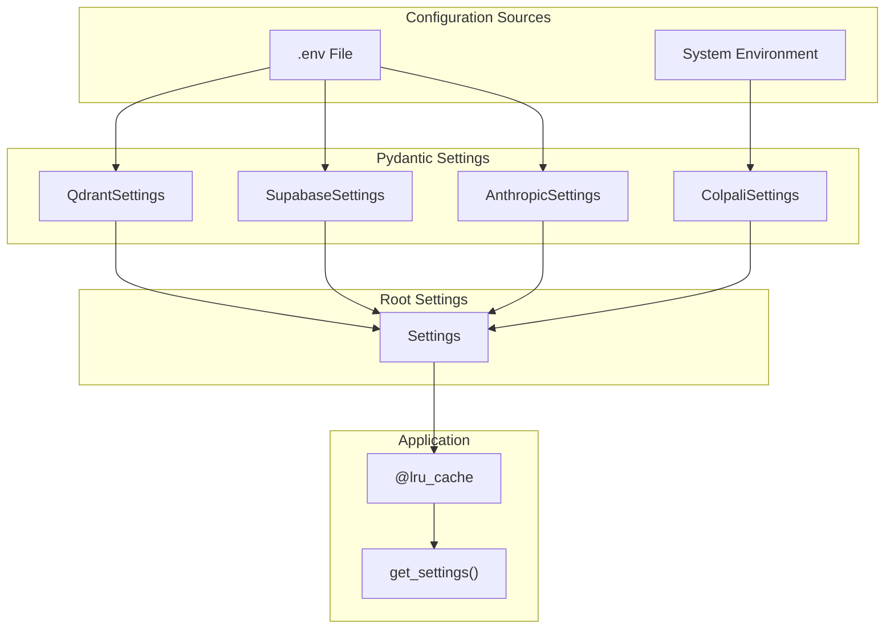
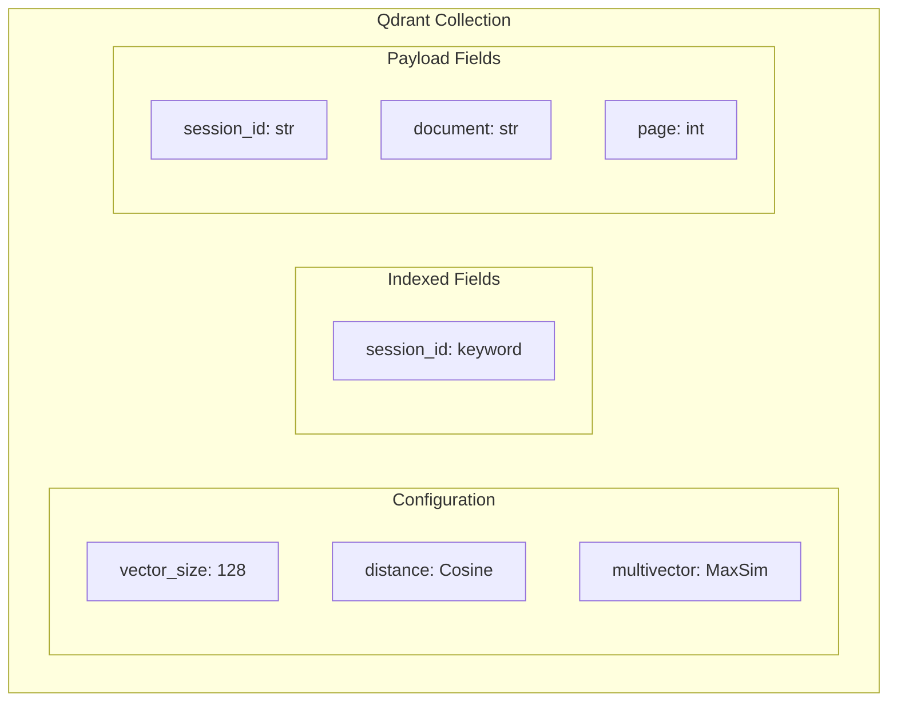
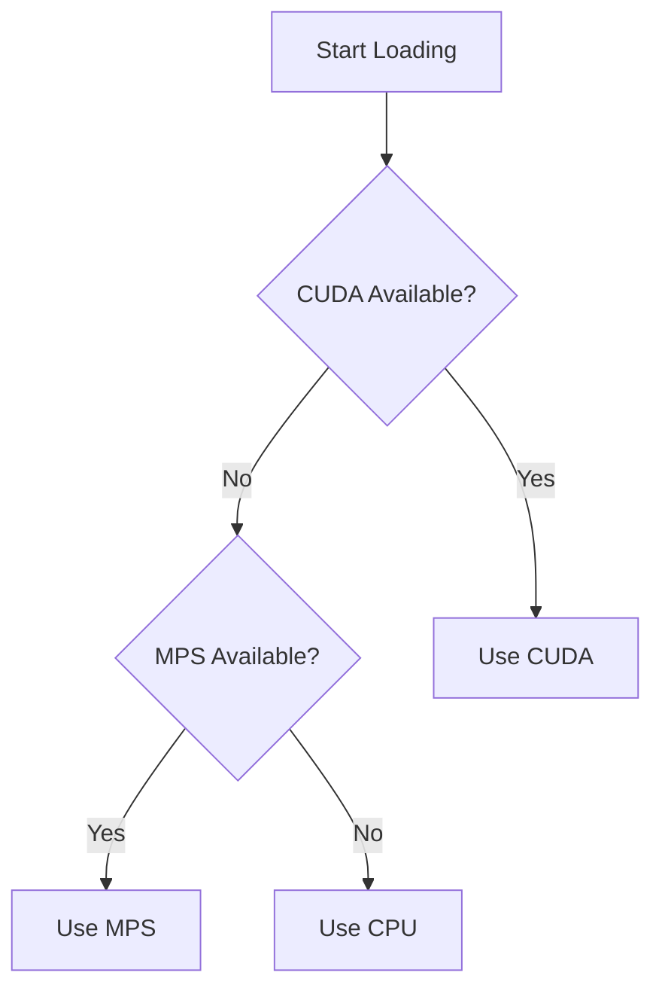
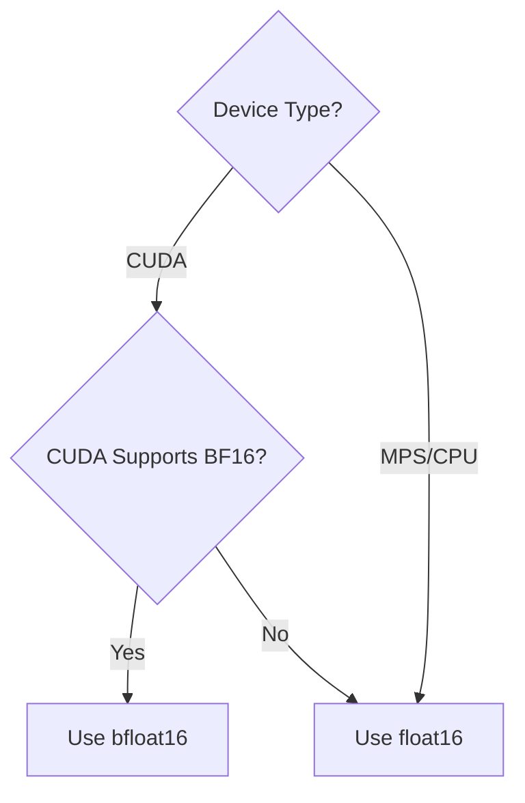
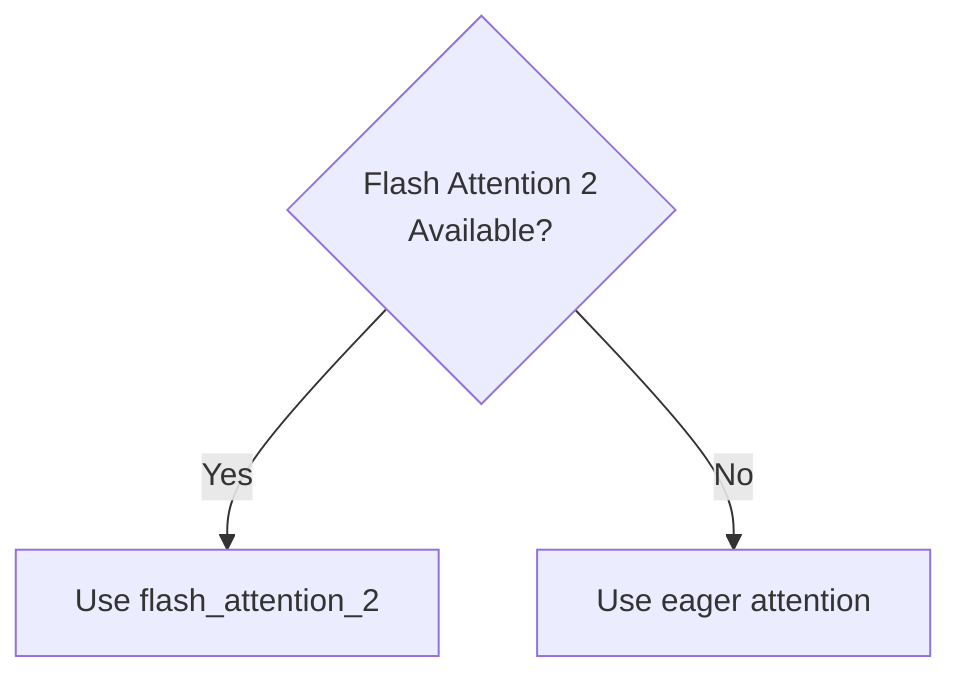
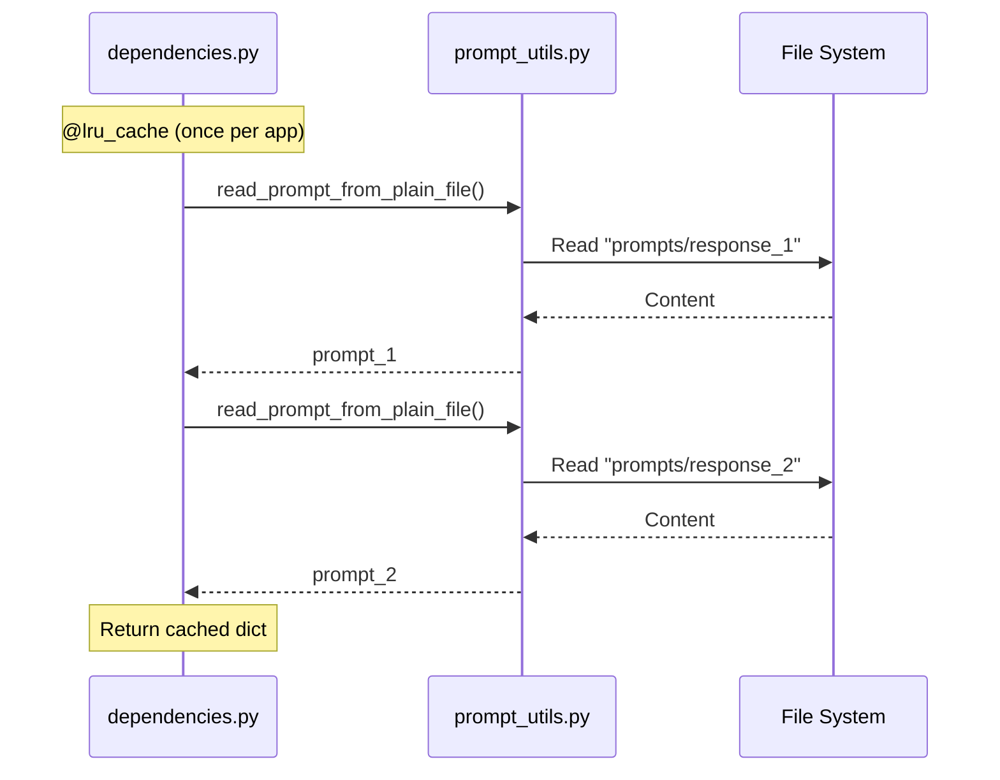

# Configuration

This document describes all configuration options for the ColPali RAG App.

## Environment Variables

All configuration is done through environment variables, typically stored in a `.env` file.

### Required Variables

```bash
# Qdrant Configuration
QDRANT_URL=https://your-qdrant-instance.cloud
QDRANT_API_KEY=your-qdrant-api-key
COLLECTION_NAME=colpali-collection

# Supabase Configuration
SUPABASE_URL=https://your-project.supabase.co
SUPABASE_KEY=your-supabase-anon-key

# Anthropic Configuration
ANTHROPIC_API_KEY=your-anthropic-api-key
```

### Configuration Hierarchy



---

## Settings Classes

### QdrantSettings

Vector database configuration.

| Variable | Type | Required | Default | Description |
|----------|------|----------|---------|-------------|
| `COLLECTION_NAME` | `str` | Yes | - | Qdrant collection name |
| `QDRANT_URL` | `str` | Yes | - | Qdrant instance URL |
| `QDRANT_API_KEY` | `SecretStr` | Yes | - | Qdrant API key |

```python
class QdrantSettings(BaseSettings):
    collection_name: str
    qdrant_url: str
    qdrant_api_key: SecretStr

    model_config = SettingsConfigDict(
        env_file=".env",
        extra="ignore"
    )
```

### SupabaseSettings

Object storage configuration.

| Variable | Type | Required | Default | Description |
|----------|------|----------|---------|-------------|
| `SUPABASE_KEY` | `SecretStr` | Yes | - | Supabase anon/service key |
| `SUPABASE_URL` | `str` | Yes | - | Supabase project URL |
| `BUCKET` | `str` | No | `colpali` | Storage bucket name |

```python
class SupabaseSettings(BaseSettings):
    supabase_key: SecretStr
    supabase_url: str
    bucket: str = "colpali"

    model_config = SettingsConfigDict(
        env_file=".env",
        extra="ignore"
    )
```

### AnthropicSettings

LLM configuration.

| Variable | Type | Required | Default | Description |
|----------|------|----------|---------|-------------|
| `ANTHROPIC_API_KEY` | `SecretStr` | Yes | - | Anthropic API key |

```python
class AnthropicSettings(BaseSettings):
    anthropic_api_key: SecretStr

    model_config = SettingsConfigDict(
        env_file=".env",
        extra="ignore"
    )
```

### ColpaliSettings

Model configuration.

| Variable | Type | Required | Default | Description |
|----------|------|----------|---------|-------------|
| `COLPALI_MODEL_NAME` | `str` | No | `vidore/colqwen2.5-v0.2` | HuggingFace model ID |

```python
class ColpaliSettings(BaseSettings):
    colpali_model_name: str = "vidore/colqwen2.5-v0.2"

    model_config = SettingsConfigDict(extra="ignore")
```

---

## Qdrant Collection Configuration

The Qdrant collection must be created before first use. Configuration is defined in `scripts/create_collection.py`.

### Collection Schema



### Create Collection Script

```bash
make create_collection
# or
python scripts/create_collection.py
```

---

## Model Configuration

### Device Selection

The model loader automatically selects the best available device:



### Data Type Selection



### Attention Implementation



---

## Prompt Configuration

System prompts are stored as plain text files in the `prompts/` directory.

| File | Purpose |
|------|---------|
| `prompts/response_1` | System instructions for document analysis |
| `prompts/response_2` | Output format and citation instructions |

### Prompt Loading



---

## Logging Configuration

Logging is configured in `src/app/logging_config.py`.

### Log Format

```
TIMESTAMP | LEVEL | MODULE:FUNCTION:LINE | MESSAGE
```

Example:
```
2024-01-15 10:30:45 | INFO | lifespan:lifespan:42 | Starting application...
```

### Configuration

```python
def configure_logging() -> None:
    logger.remove()
    logger.add(
        sys.stderr,
        format="<green>{time:YYYY-MM-DD HH:mm:ss}</green> | "
               "<level>{level: <8}</level> | "
               "<cyan>{name}</cyan>:<cyan>{function}</cyan>:<cyan>{line}</cyan> | "
               "<level>{message}</level>",
        level="INFO",
        colorize=True,
    )
```

---

## Docker Configuration

### Environment Variables in Docker

```dockerfile
ENV PYTHONPATH=/app/src
```

### Docker Compose Example

```yaml
version: "3.8"
services:
  app:
    build: .
    ports:
      - "8000:8000"
    env_file:
      - .env
    volumes:
      - ./src:/app/src  # For development hot-reload
```

---

## Example .env File

```bash
# ===================
# Qdrant Configuration
# ===================
QDRANT_URL=https://abc123.us-east-1-0.aws.cloud.qdrant.io
QDRANT_API_KEY=your-qdrant-api-key-here
COLLECTION_NAME=colpali-documents

# ===================
# Supabase Configuration
# ===================
SUPABASE_URL=https://your-project-id.supabase.co
SUPABASE_KEY=eyJhbGciOiJIUzI1NiIsInR5cCI6IkpXVCJ9...
# BUCKET=colpali  # Optional, defaults to "colpali"

# ===================
# Anthropic Configuration
# ===================
ANTHROPIC_API_KEY=sk-ant-api03-...

# ===================
# Model Configuration (Optional)
# ===================
# COLPALI_MODEL_NAME=vidore/colqwen2.5-v0.2

# ===================
# Docker Hub (for RunPod deployment)
# ===================
# DOCKERHUB_USERNAME=your-dockerhub-username
```

---

## Security Considerations

1. **Never commit `.env` files** to version control
2. **Use SecretStr** for sensitive values (API keys are masked in logs)
3. **Rotate API keys** regularly
4. **Use service roles** for Supabase in production (not anon key)
5. **Enable Qdrant authentication** in production
