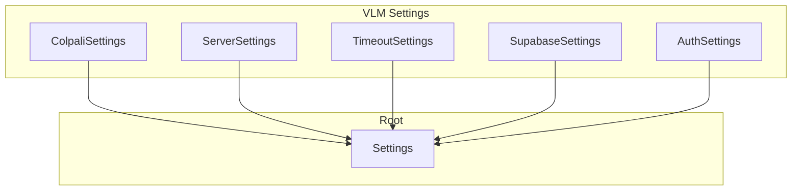
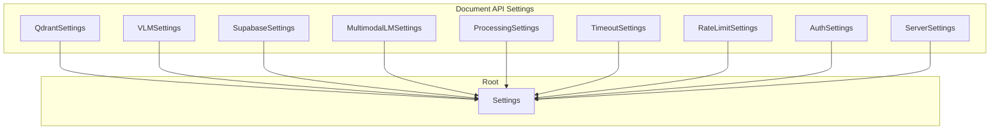

# Configuration

This document describes all configuration options for the ColPali RAG App's three services.

## Overview

Each microservice has its own `.env` file and settings classes:

- **VLM Service**: `colpali-vlm/.env` → `colpali-vlm/src/vlm/settings.py`
- **Multimodal LM Service**: `multimodal_lm/.env` → configured via environment variables in `entrypoint.sh`
- **Document API**: `document-api/.env` → `document-api/src/doc_api/settings.py`

---

## VLM Service Configuration

### Settings Classes



### ColpaliSettings

| Variable | Type | Default | Description |
|----------|------|---------|-------------|
| `COLPALI_MODEL_NAME` | `str` | `vidore/colqwen2.5-v0.2` | HuggingFace model ID |
| `COLPALI_MODEL_TYPE` | `str` | `auto` | Model type: `auto`, `colqwen2.5`, `colqwen3`, `tomoro-colqwen3` |
| `COLPALI_VECTOR_DIM` | `int` | `128` | Vector dimension: 128 for ColQwen2.5, 320 for ColQwen3/TomoroAI |
| `MAX_CONCURRENT_INFERENCES` | `int` | `1` | Max concurrent model inferences |

### ServerSettings (VLM)

| Variable | Type | Default | Description |
|----------|------|---------|-------------|
| `WORKERS` | `int` | `1` | Number of uvicorn workers |
| `HOST` | `str` | `0.0.0.0` | Server bind address |
| `PORT` | `int` | `8000` | Server port (container internal) |

### TimeoutSettings (VLM)

| Variable | Type | Default | Description |
|----------|------|---------|-------------|
| `INFERENCE_TIMEOUT_SECONDS` | `int` | `60` | Model inference timeout per request |

### SupabaseSettings (VLM)

Required only if `AUTH_ENABLED=true`.

| Variable | Type | Default | Description |
|----------|------|---------|-------------|
| `SUPABASE_URL` | `str` | `""` | Supabase project URL |
| `SUPABASE_KEY` | `str` | `""` | Supabase API key |
| `SUPABASE_JWT_SECRET` | `str` | `""` | JWT secret for auth validation |

### AuthSettings (VLM)

| Variable | Type | Default | Description |
|----------|------|---------|-------------|
| `AUTH_ENABLED` | `bool` | `false` | Enable JWT authentication for `/embed/*` endpoints |

### VLM .env.example

```bash
# Model Configuration
COLPALI_MODEL_NAME=vidore/colqwen2.5-v0.2
COLPALI_MODEL_TYPE=auto
COLPALI_VECTOR_DIM=128

# Concurrency
MAX_CONCURRENT_INFERENCES=1

# Timeouts
INFERENCE_TIMEOUT_SECONDS=60

# Server
WORKERS=1
HOST=0.0.0.0
PORT=8000

# Authentication (optional)
AUTH_ENABLED=false
SUPABASE_URL=https://your-project.supabase.co
SUPABASE_KEY=your-supabase-service-role-key
SUPABASE_JWT_SECRET=your-jwt-secret
```

---

## Document API Configuration

### Settings Classes



### QdrantSettings

| Variable | Type | Default | Description |
|----------|------|---------|-------------|
| `COLLECTION_NAME` | `str` | `""` | Qdrant collection name |
| `QDRANT_URL` | `str` | `""` | Qdrant instance URL |
| `QDRANT_API_KEY` | `str` | `""` | Qdrant API key |
| `VECTOR_DIM` | `int` | `128` | Vector dimension (must match VLM service) |

### VLMSettings

| Variable | Type | Default | Description |
|----------|------|---------|-------------|
| `VLM_SERVICE_URL` | `str` | `http://localhost:8001` | URL of the VLM service |
| `VLM_TIMEOUT_SECONDS` | `int` | `480` | Timeout for VLM HTTP requests (.env.example sets 120) |

### SupabaseSettings (API)

| Variable | Type | Default | Description |
|----------|------|---------|-------------|
| `SUPABASE_KEY` | `str` | `""` | Supabase API key |
| `SUPABASE_URL` | `str` | `""` | Supabase project URL |
| `SUPABASE_JWT_SECRET` | `str` | `""` | JWT secret (required if AUTH_ENABLED=true) |
| `BUCKET` | `str` | `colpali` | Storage bucket name |

### MultimodalLMSettings

| Variable | Type | Default | Description |
|----------|------|---------|-------------|
| `MULTIMODAL_LM_SERVICE_URL` | `str` | `http://localhost:8002` | URL of the vLLM service |
| `MULTIMODAL_LM_MODEL_NAME` | `str` | `Qwen/Qwen3-VL-32B-Instruct` | Model name (must match vLLM) |
| `MULTIMODAL_LM_MAX_TOKENS` | `int` | `8192` | Maximum response tokens |
| `MULTIMODAL_LM_TEMPERATURE` | `float` | `0.0` | Model temperature |

### ProcessingSettings

| Variable | Type | Default | Description |
|----------|------|---------|-------------|
| `MAX_FILE_SIZE_MB` | `int` | `50` | Maximum file size per PDF |
| `MAX_TOTAL_UPLOAD_MB` | `int` | `200` | Maximum total upload size |
| `MAX_PAGES_PER_BATCH` | `int` | `5` | Pages processed per batch |
| `MAX_PDF_PAGES` | `int` | `200` | Maximum pages per PDF |

### TimeoutSettings (API)

| Variable | Type | Default | Description |
|----------|------|---------|-------------|
| **Endpoint Timeouts** | | | |
| `INGEST_ENDPOINT_TIMEOUT_SECONDS` | `int` | `600` | Timeout for /ingest-pdfs/ endpoint |
| `QUERY_ENDPOINT_TIMEOUT_SECONDS` | `int` | `180` | Timeout for /query/ endpoint |
| **Integration Timeouts** | | | |
| `QDRANT_TIMEOUT_SECONDS` | `int` | `60` | Qdrant operations timeout |
| `SUPABASE_TIMEOUT_SECONDS` | `int` | `120` | Supabase operations timeout |
| `MULTIMODAL_LM_TIMEOUT_SECONDS` | `int` | `180` | Multimodal LM service call timeout |
| **Processing Timeouts** | | | |
| `PDF_CONVERSION_TIMEOUT_SECONDS` | `int` | `120` | PDF to image conversion timeout |

### RateLimitSettings

| Variable | Type | Default | Description |
|----------|------|---------|-------------|
| `QUERY_RATE_LIMIT` | `str` | `30/minute` | Rate limit for /query/ endpoint |
| `INGEST_RATE_LIMIT` | `str` | `10/minute` | Rate limit for /ingest-pdfs/ endpoint |

### AuthSettings (API)

| Variable | Type | Default | Description |
|----------|------|---------|-------------|
| `AUTH_ENABLED` | `bool` | `true` | Enable JWT authentication |
| `ALLOWED_ORIGINS` | `list[str]` | `["*"]` | CORS allowed origins |

### ServerSettings (API)

| Variable | Type | Default | Description |
|----------|------|---------|-------------|
| `WORKERS` | `int` | `1` | Number of uvicorn workers |
| `HOST` | `str` | `0.0.0.0` | Server bind address |
| `PORT` | `int` | `8000` | Server port |

### Multimodal LM .env.example

```bash
# Model Configuration
MULTIMODAL_LM_MODEL_NAME=Qwen/Qwen3-VL-32B-Instruct
MULTIMODAL_LM_MAX_MODEL_LEN=16384
MULTIMODAL_LM_TENSOR_PARALLEL=1        # GPU parallelism (1 for single GPU, 2+ for multi-GPU)
MULTIMODAL_LM_GPU_MEMORY_UTIL=0.90

# Server
PORT=8000
```

### Document API .env.example

```bash
# VLM Service Connection
VLM_SERVICE_URL=http://localhost:8001
VLM_TIMEOUT_SECONDS=120

# Qdrant (Required)
QDRANT_URL=https://your-qdrant-instance.cloud.qdrant.io
QDRANT_API_KEY=your-qdrant-api-key
COLLECTION_NAME=colpali
VECTOR_DIM=128

# Supabase (Required)
SUPABASE_URL=https://your-project.supabase.co
SUPABASE_KEY=your-supabase-service-role-key
SUPABASE_JWT_SECRET=your-jwt-secret
BUCKET=colpali

# Multimodal LM Service (Required)
MULTIMODAL_LM_SERVICE_URL=http://localhost:8002
MULTIMODAL_LM_MODEL_NAME=Qwen/Qwen3-VL-32B-Instruct
MULTIMODAL_LM_MAX_TOKENS=8192
MULTIMODAL_LM_TEMPERATURE=0.0

# Authentication
AUTH_ENABLED=true
ALLOWED_ORIGINS=["*"]

# Processing Limits
MAX_FILE_SIZE_MB=50
MAX_TOTAL_UPLOAD_MB=200
MAX_PAGES_PER_BATCH=5
MAX_PDF_PAGES=200

# Rate Limiting
QUERY_RATE_LIMIT=30/minute
INGEST_RATE_LIMIT=10/minute

# Endpoint Timeouts
INGEST_ENDPOINT_TIMEOUT_SECONDS=600
QUERY_ENDPOINT_TIMEOUT_SECONDS=180

# Integration Timeouts
QDRANT_TIMEOUT_SECONDS=60
SUPABASE_TIMEOUT_SECONDS=120
MULTIMODAL_LM_TIMEOUT_SECONDS=180
PDF_CONVERSION_TIMEOUT_SECONDS=120

# Server
WORKERS=1
HOST=0.0.0.0
PORT=8000
```

---

## Qdrant Collection Configuration

The Qdrant collection is auto-created on first ingest via `ensure_collection_exists()` in `document-api/src/doc_api/utils/qdrant_utils.py`.

### Collection Schema

| Property | Value |
|----------|-------|
| Vector size | 128 (ColQwen2.5) or 320 (ColQwen3/TomoroAI) |
| Distance | Cosine with MaxSim comparator |
| Multi-vector | Enabled |
| Indexed field | `session_id` (keyword type) |
| Payload | `{session_id, document, page}` |

The `vector_dim` parameter is passed from `settings.qdrant.vector_dim`.

---

## Model Configuration

### Switching Models

To switch from ColQwen2.5 (default) to TomoroAI:

1. Update `colpali-vlm/.env`:
   ```bash
   COLPALI_MODEL_NAME=TomoroAI/tomoro-colqwen3-embed-4b
   COLPALI_MODEL_TYPE=auto
   COLPALI_VECTOR_DIM=320
   ```

2. Update `document-api/.env`:
   ```bash
   VECTOR_DIM=320
   ```

3. Recreate Qdrant collection (vector dimensions must match)
4. Re-ingest all documents

---

## Security Considerations

1. **Never commit `.env` files** to version control
2. **Enable authentication** in production (`AUTH_ENABLED=true`)
3. **Configure CORS origins** - Don't use `["*"]` in production
4. **Rotate API keys** regularly
5. **Use service roles** for Supabase in production (not anon key)
6. **Enable Qdrant authentication** in production
7. **Rate limiting** is enabled by default to prevent abuse
8. **Request timeouts** prevent long-running requests from consuming resources
