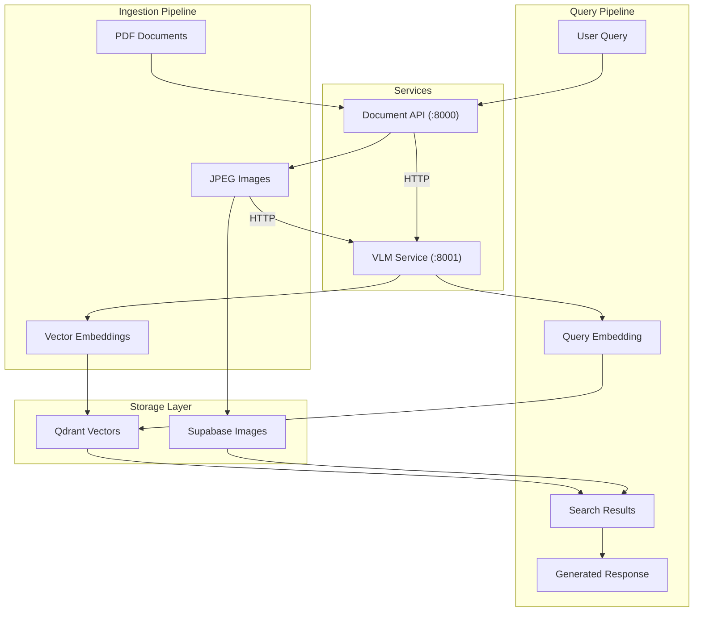
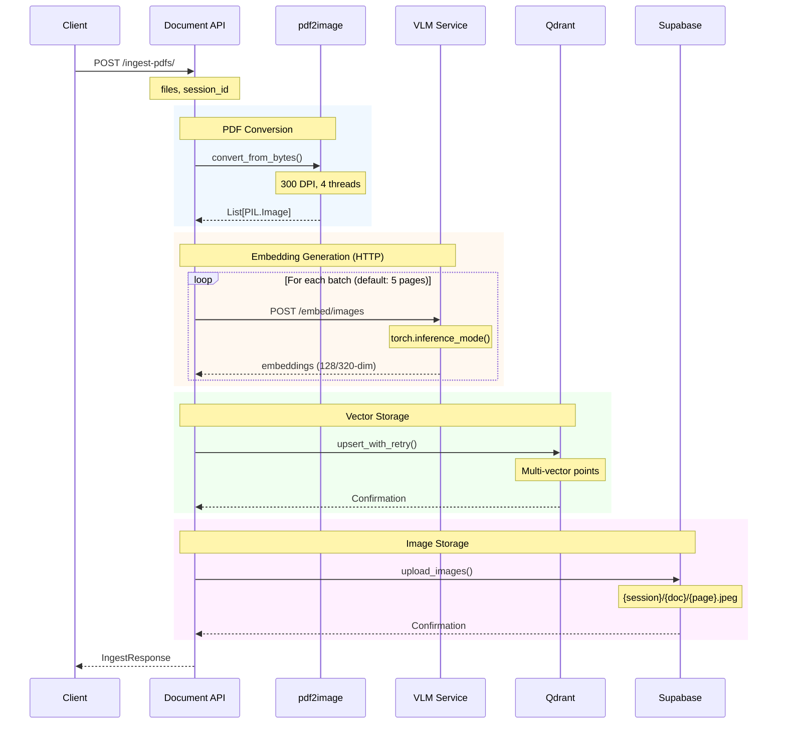
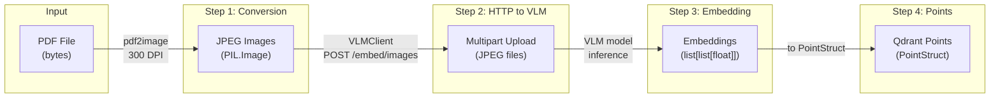
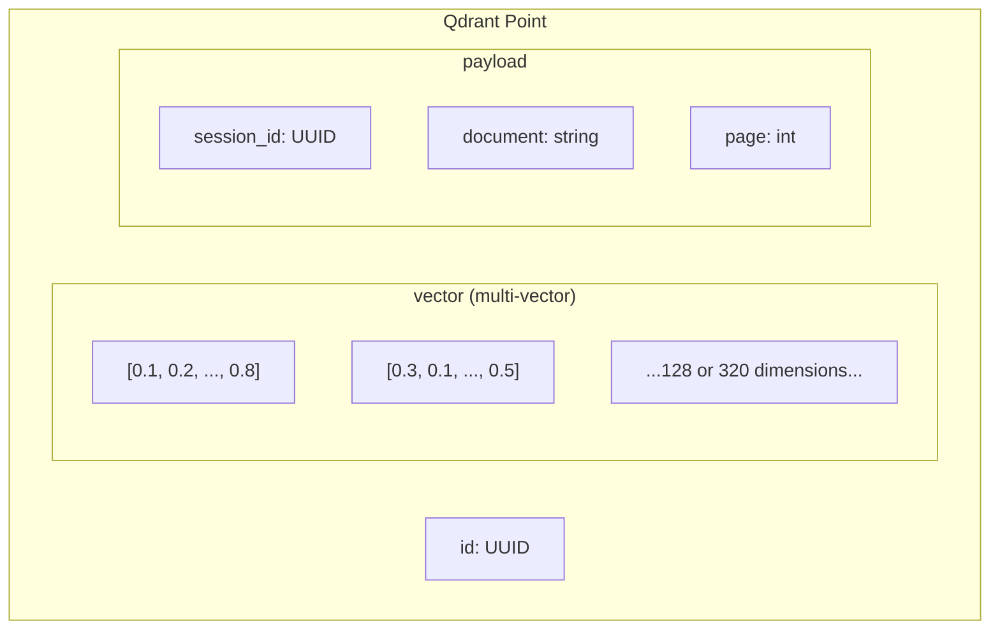
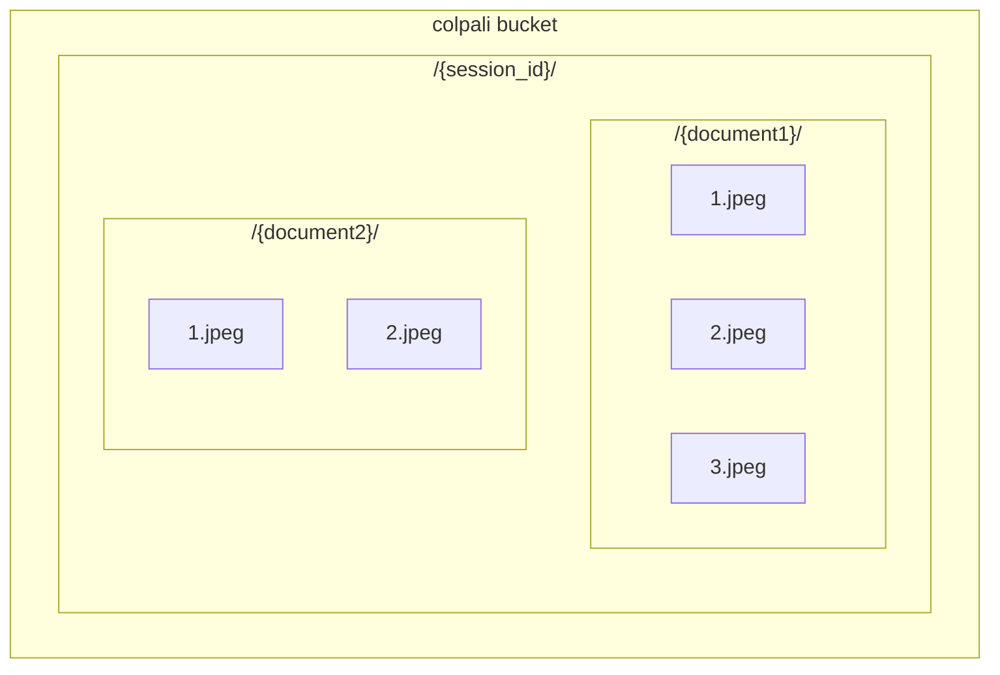
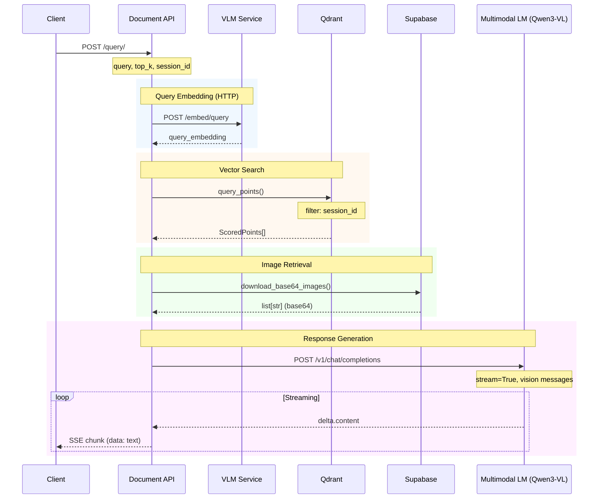
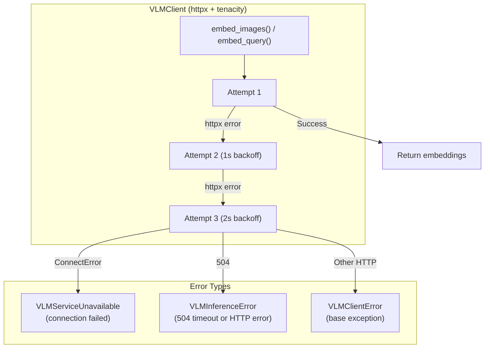
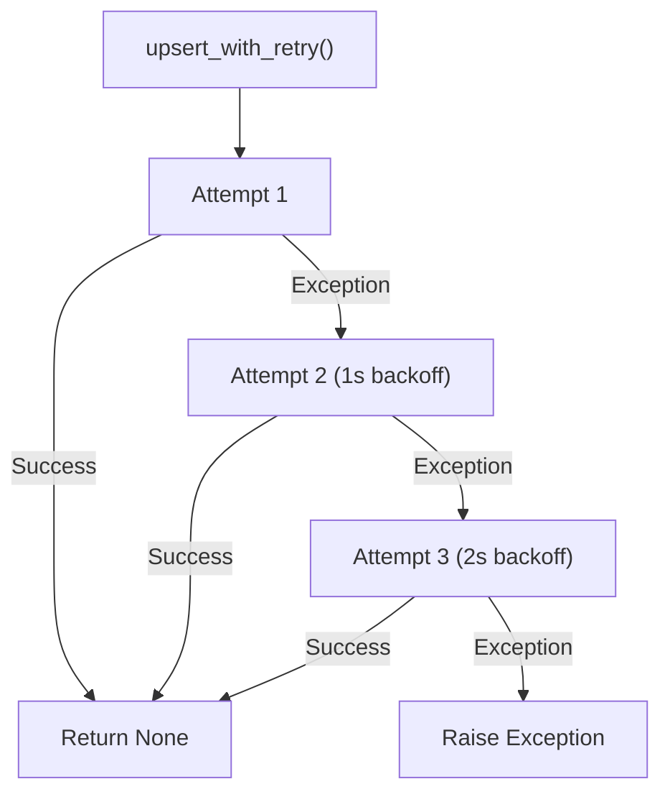
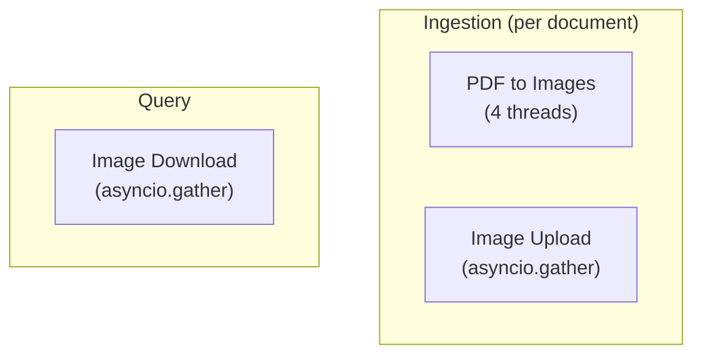
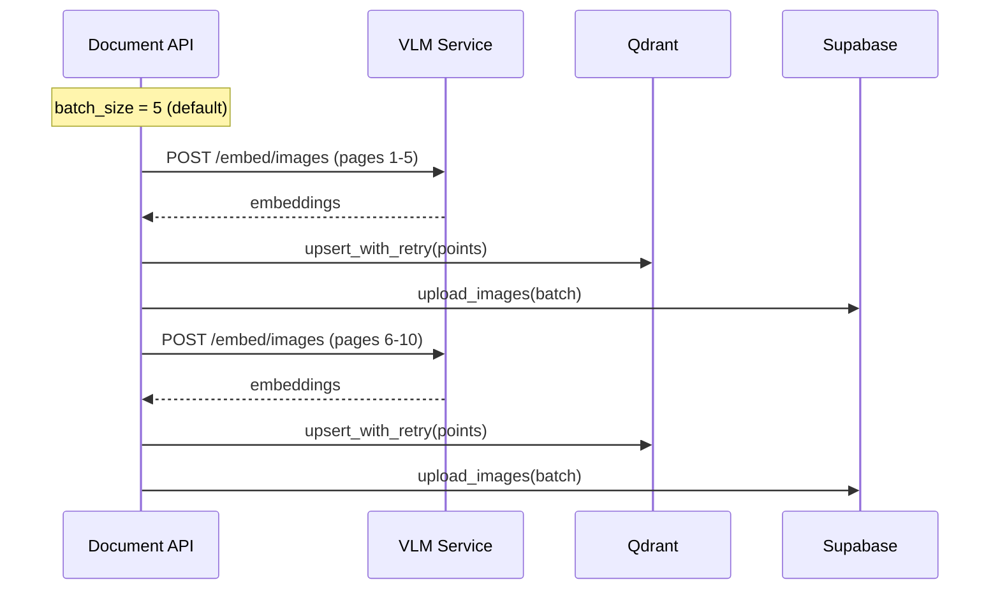

# Data Flow

This document describes the complete data flow through the ColPali RAG App's three-service architecture.

## Overview

---

## Ingestion Pipeline

The ingestion pipeline processes PDF documents and prepares them for retrieval.

### Step-by-Step Flow

### Data Transformations

### Qdrant Point Structure

Each page becomes a multi-vector point in Qdrant:

### Supabase Storage Structure

---

## Query Pipeline

The query pipeline retrieves relevant documents and generates responses.

### Step-by-Step Flow

---

## Error Handling Flow

### VLM Client Errors

### Qdrant Retry

---

## Concurrency Model

### Semaphores

| Service | Semaphore | Limit | Purpose |
|---------|-----------|-------|---------|
| VLM Service | `model_semaphore` | 1 (configurable) | Prevents concurrent GPU access |
| Document API | `qdrant_semaphore` | 10 | Prevents Qdrant connection pool exhaustion |

### Parallel Operations

### Batch Processing

