# Data Flow

This document describes the complete data flow through the ColPali RAG App system.

## Overview

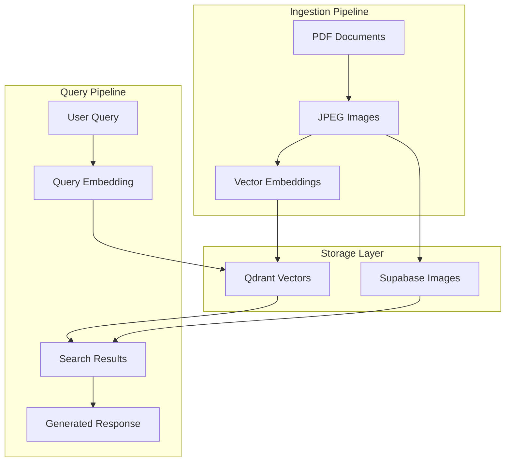

---

## Ingestion Pipeline

The ingestion pipeline processes PDF documents and prepares them for retrieval.

### Step-by-Step Flow

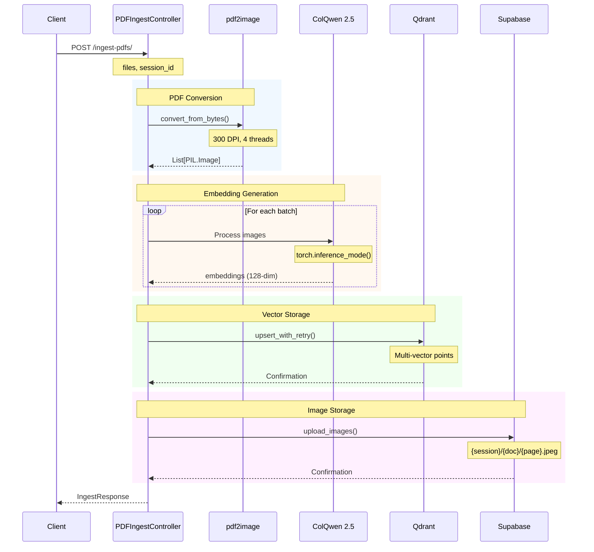

### Data Transformations

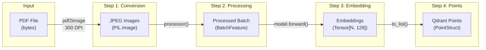

### Qdrant Point Structure

Each page becomes a multi-vector point in Qdrant:

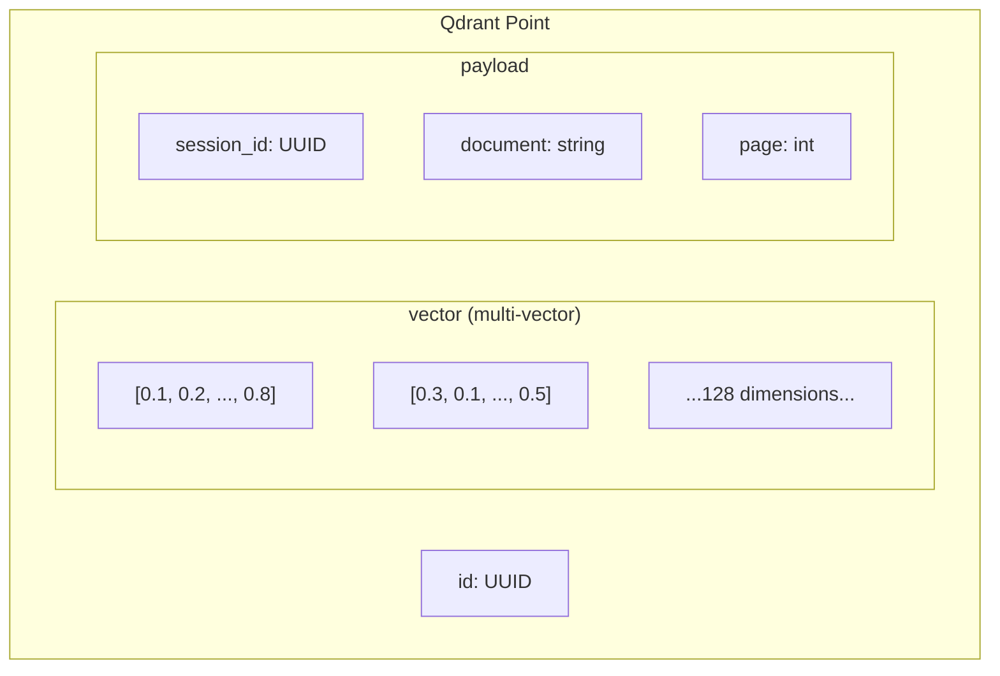

### Supabase Storage Structure

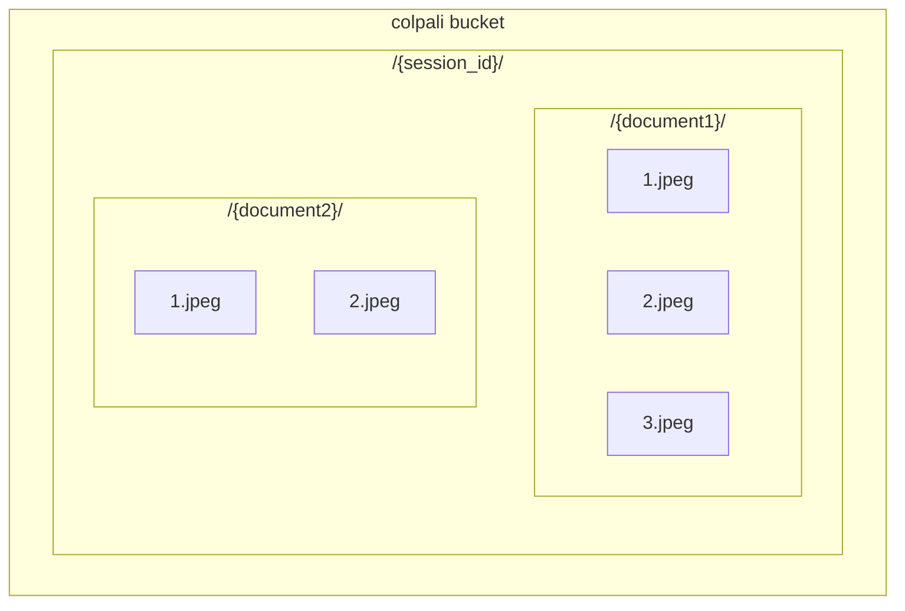

---

## Query Pipeline

The query pipeline retrieves relevant documents and generates responses.

### Step-by-Step Flow

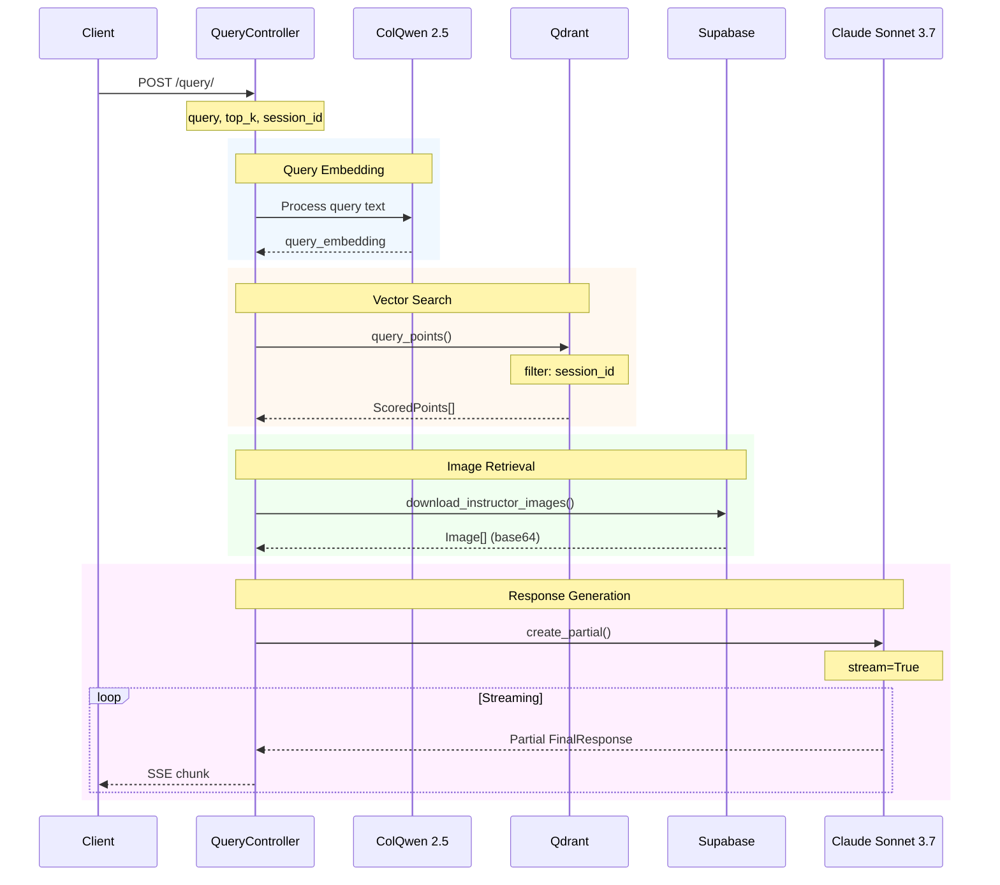

### Search Parameters

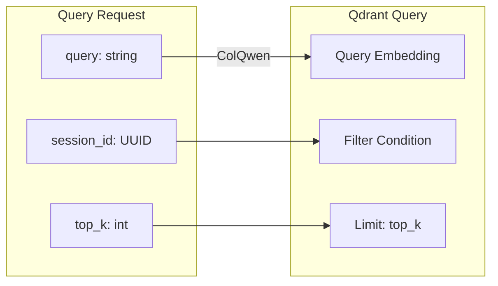

### Prompt Construction

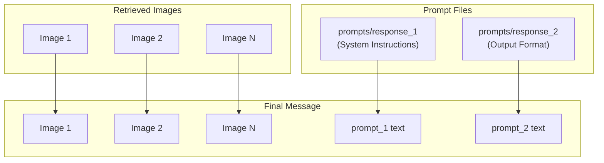

### Streaming Response

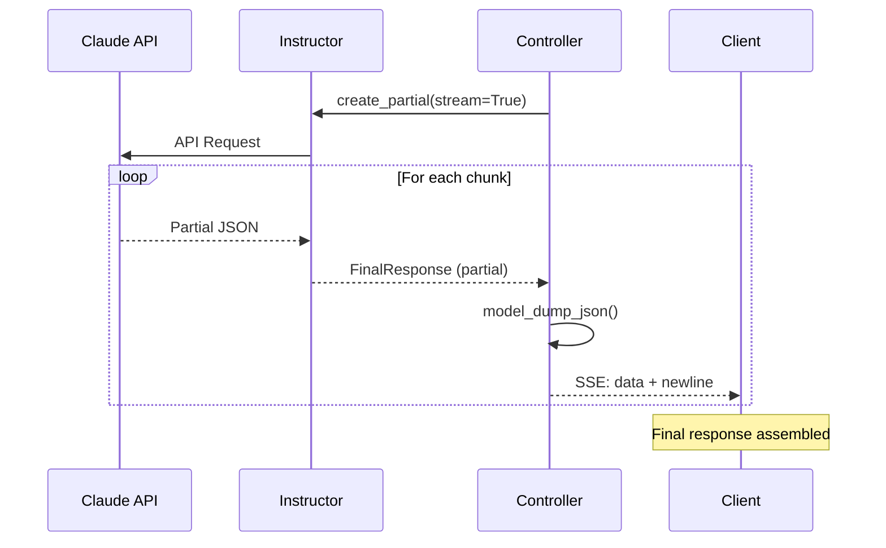

---

## Data Models

### Ingestion Data Flow

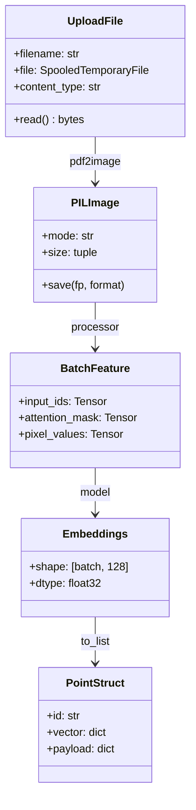

### Query Data Flow

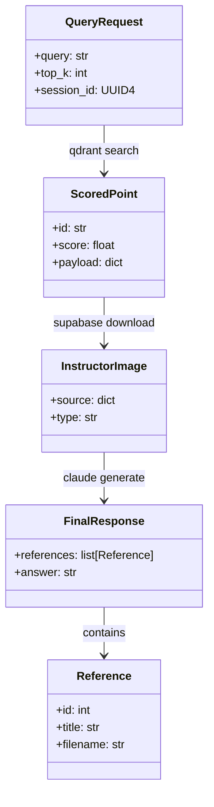

---

## Concurrency Model

### Parallel Operations

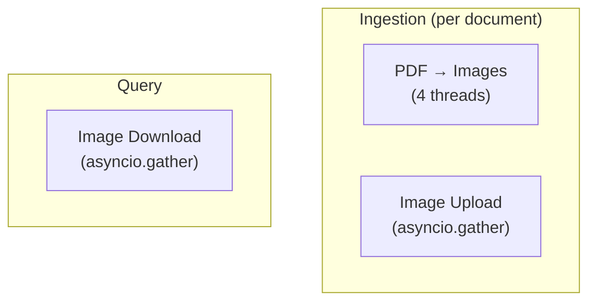

### Batch Processing

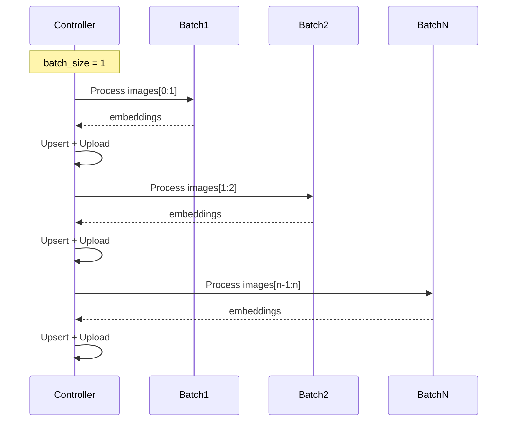

---

## Error Handling Flow

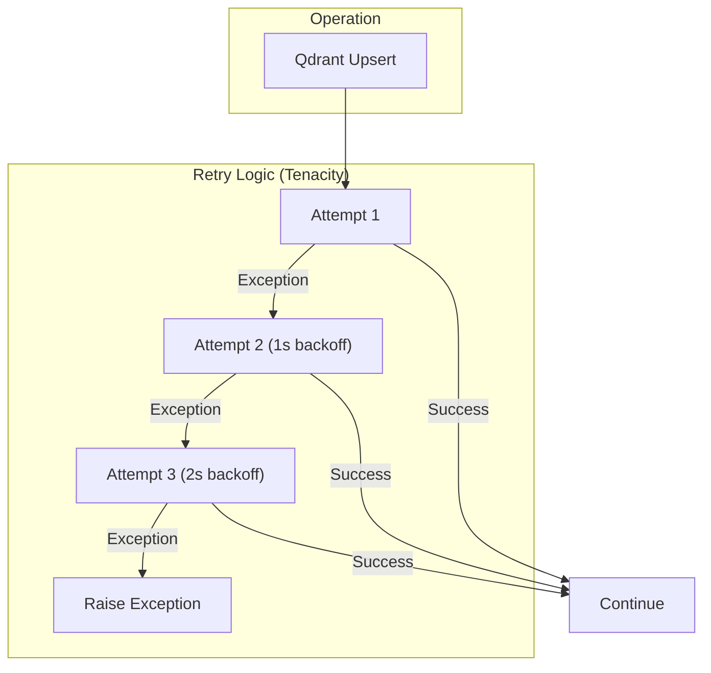
