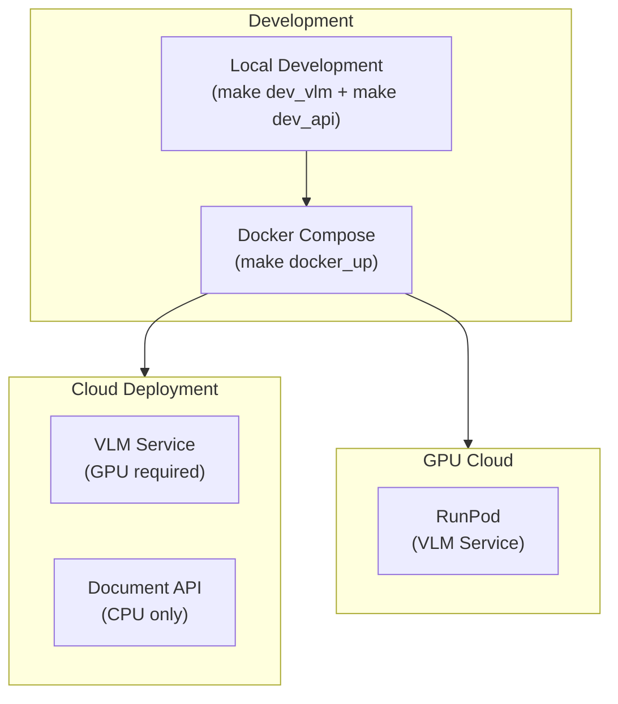
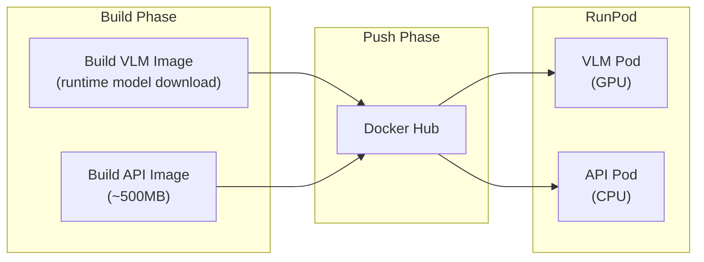
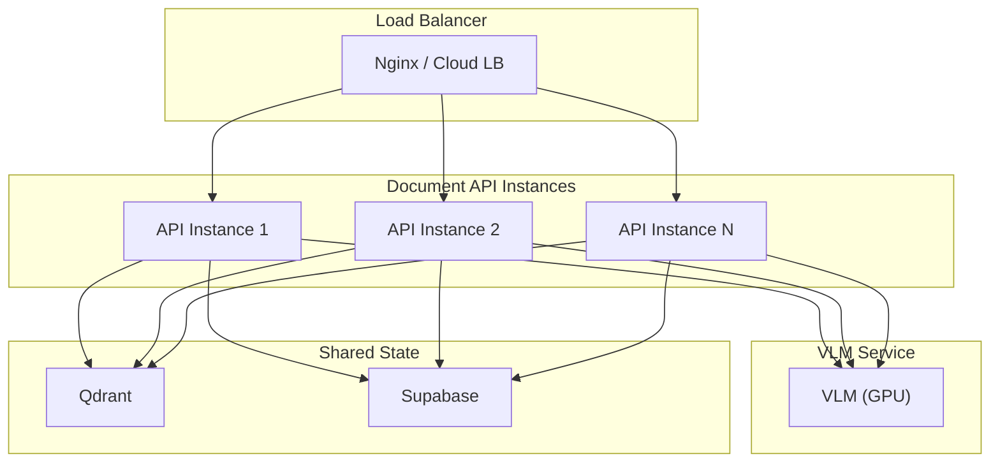

# Deployment Guide

This document covers deployment options for the ColPali RAG App's three-service architecture.

## Deployment Options Overview



---

## Prerequisites

### System Requirements

| Component | VLM Service | Document API |
|-----------|-------------|--------------|
| CPU | 2+ cores | 2+ cores |
| RAM | 8 GB | 4 GB |
| GPU | NVIDIA (16GB+ VRAM) | Not required |
| Disk | 20 GB | 5 GB |

### Software Dependencies

- [uv](https://github.com/astral-sh/uv) - Package manager
- [Poppler](https://poppler.freedesktop.org/) - PDF rendering (Document API only)
- Docker (for containerized deployment)

### External Services

- Qdrant Cloud or self-hosted instance
- Supabase project

---

## Local Development

### Setup

```bash
# Clone repository
git clone https://github.com/jjovalle99/colpali-rag-app.git
cd colpali-rag-app

# Configure environment for all services
cp colpali-vlm/.env.example colpali-vlm/.env
cp multimodal_lm/.env.example multimodal_lm/.env
cp document-api/.env.example document-api/.env
# Edit .env files with your credentials
```

### Running All Services

**Option 1: Two terminals**

```bash
# Terminal 1: Start VLM service (requires GPU, port 8001)
make dev_vlm

# Terminal 2: Start Document API (port 8000)
make dev_api
```

**Option 2: Docker Compose**

```bash
# Build and start all services
make docker_up

# Or in background
make docker_up_detach
make docker_logs        # View logs
make docker_down        # Stop services
```

### Code Quality Commands

```bash
make pretty    # Run lint + format + imports on both services
make mypy      # Type checking for both services
make all       # All checks + cleanup
```

---

## Docker Deployment

### Docker Images

| Service | Dockerfile | Model Loading | Use Case |
|---------|-----------|---------------|----------|
| VLM Service | `colpali-vlm/Dockerfile` | Runtime download via `entrypoint.sh` | All environments |
| Multimodal LM | `multimodal_lm/Dockerfile` | Runtime download via `entrypoint.sh` | All environments |
| Document API | `document-api/Dockerfile` | N/A (CPU-only, ~500MB) | All environments |

The VLM image uses a multi-stage build (CUDA 12.4 + Ubuntu 22.04 + prebuilt flash-attn) with stripped site-packages for a smaller image. The multimodal LM image is based on `vllm/vllm-openai:latest`. Both GPU services download their models at container startup and cache them in Docker volumes.

### Docker Compose (Development)

The `docker-compose.yml` starts all three services:

```yaml
services:
  vlm:
    build: ./colpali-vlm
    ports: ["8001:8000"]
    env_file: colpali-vlm/.env
    volumes: [vlm_hf_cache:/models]
    deploy:
      resources:
        reservations:
          devices: [{driver: nvidia, count: 1, capabilities: [gpu]}]

  multimodal_lm:
    build: ./multimodal_lm
    ports: ["8002:8000"]
    env_file: multimodal_lm/.env
    volumes: [mlm_hf_cache:/models]
    deploy:
      resources:
        reservations:
          devices: [{driver: nvidia, count: all, capabilities: [gpu]}]

  api:
    build: ./document-api
    ports: ["8000:8000"]
    env_file: document-api/.env
    depends_on:
      vlm: {condition: service_healthy}
      multimodal_lm: {condition: service_healthy}
```

### Docker Compose (Cloud / RunPod)

The `docker-compose.runpod.yml` runs only the Document API service (VLM and multimodal LM are deployed separately on GPU instances):

```bash
make docker_runpod_up           # Build and start API only
make docker_runpod_up_detach    # Run in background
make docker_runpod_logs         # View logs
make docker_runpod_down         # Stop
```

### Building and Pushing Images

```bash
# VLM image
make docker_build_vlm           # Build VLM image
make docker_push_vlm            # Push to Docker Hub

# Multimodal LM image
make docker_build_mlm           # Build Multimodal LM image
make docker_push_mlm            # Push to Docker Hub

# API image
make docker_build_api           # Build Document API image (~500MB)
make docker_push_api            # Push to Docker Hub

# All at once
make docker_build_all           # Build VLM + MLM + API
make docker_push_all            # Push VLM + MLM + API
```

---

## RunPod Deployment (GPU)

RunPod provides GPU instances ideal for running the VLM service with CUDA acceleration.



### Build and Push

```bash
# Build all images
make docker_build_vlm
make docker_build_mlm
make docker_build_api

# Push all to Docker Hub
export DOCKERHUB_USERNAME=your-username
docker login
make docker_push_all
```

### Deploy on RunPod

1. **VLM Service Pod**:
   - Select GPU with 16GB+ VRAM (RTX 4000 Ada, A4000, RTX 4090)
   - Image: `your-username/colpali-vlm:runpod`
   - Container Disk: 20 GB
   - HTTP Port: 8000
   - Set environment variables from `colpali-vlm/.env`

2. **Multimodal LM Service Pod**:
   - Select GPU with 48GB+ VRAM (A6000, A100, etc.) for Qwen3-VL-32B
   - Image: `your-username/multimodal-lm:latest`
   - HTTP Port: 8000
   - Set environment variables from `multimodal_lm/.env`

3. **API Service Pod** (or deploy elsewhere):
   - CPU-only instance
   - Image: `your-username/document-api:latest`
   - HTTP Port: 8000
   - Set `VLM_SERVICE_URL` to RunPod VLM pod URL
   - Set `MULTIMODAL_LM_SERVICE_URL` to RunPod multimodal LM pod URL
   - Set remaining environment variables from `document-api/.env`

### GPU Requirements

| GPU | VRAM | Status |
|-----|------|--------|
| RTX 3080 | 10GB | Minimum (may need optimization) |
| RTX 4000 Ada | 16GB | Works well |
| RTX 4090 | 24GB | Recommended |
| A4000 | 16GB | Works well |
| A5000/A6000 | 24-48GB | Optimal |

---

## Scaling

### VLM Service (Vertical)

- Scale per GPU (1 worker per GPU recommended)
- `MAX_CONCURRENT_INFERENCES=1` prevents GPU memory issues
- Use more powerful GPUs for faster inference

### Document API (Horizontal)

- Stateless - can run multiple instances behind a load balancer
- All state stored in external services (Qdrant, Supabase)
- No GPU dependency



---

## Production Considerations

### Health Checks

Both services include `/health` endpoints:

- **VLM Service**: Returns 503 if model not loaded, 200 when healthy
- **Document API**: Simple 200 health check

Docker Compose uses these for `depends_on: condition: service_healthy`.

### Monitoring

Both services use Loguru for structured logging:

```
2024-01-15 10:30:45 | INFO | lifespan:lifespan:42 | Starting application...
```

---

## Troubleshooting

### Common Issues

| Issue | Cause | Solution |
|-------|-------|----------|
| VLM service timeout | Model still loading | Increase `start_period` in Docker healthcheck |
| Document API fails to start | VLM or MLM not ready | API retries health checks 30 times with exponential backoff for each service |
| Out of GPU memory | Model too large | Use a GPU with more VRAM |
| PDF conversion fails | Missing Poppler | Install `poppler-utils` |
| Connection refused (VLM) | Wrong URL | Check `VLM_SERVICE_URL` in Document API .env |
| Connection refused (MLM) | Wrong URL | Check `MULTIMODAL_LM_SERVICE_URL` in Document API .env |
| Vector dimension mismatch | Mismatched config | Ensure `VECTOR_DIM` matches `COLPALI_VECTOR_DIM` |

### Container Debugging

```bash
# Shell into running container
docker exec -it colpali-vlm /bin/bash
docker exec -it multimodal_lm /bin/bash
docker exec -it document_api /bin/bash

# Check logs
docker compose logs vlm
docker compose logs multimodal_lm
docker compose logs api
```
