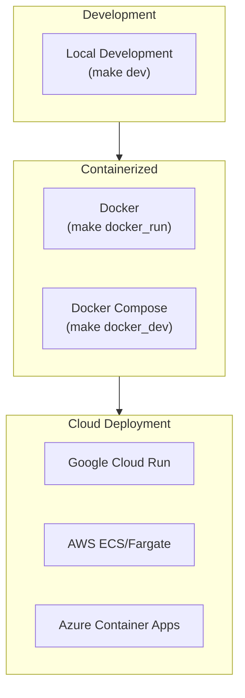
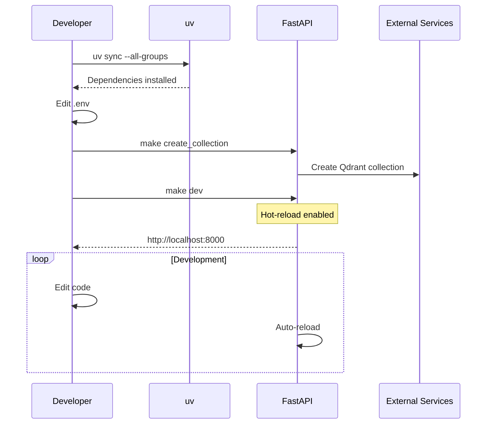
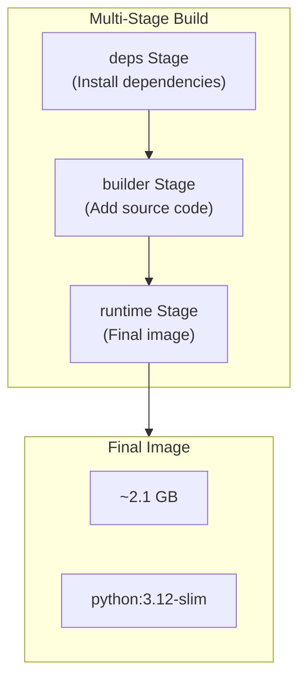
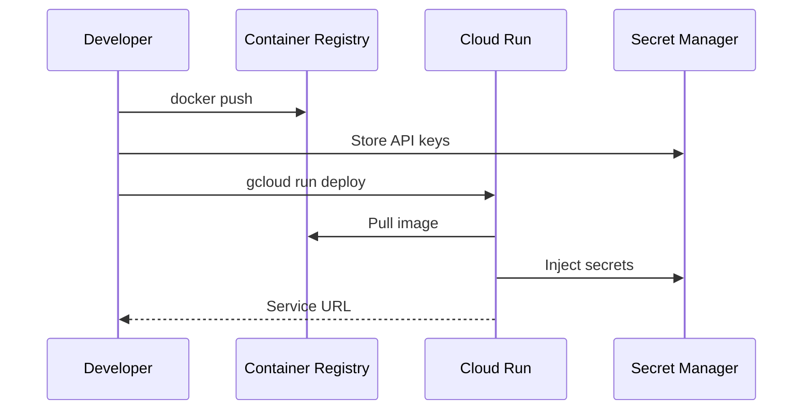
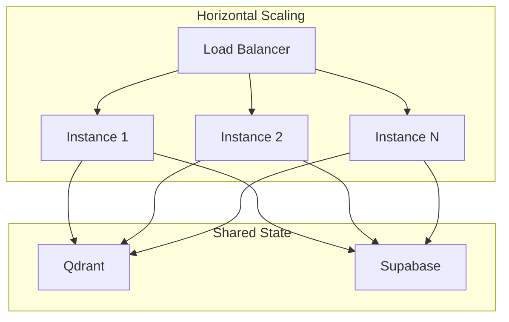
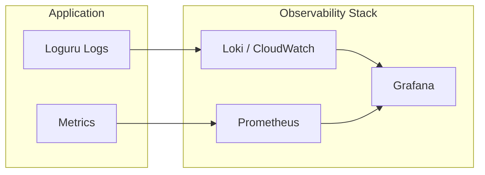

# Deployment Guide

This document covers deployment options for the ColPali RAG App.

## Deployment Options Overview



---

## Prerequisites

### System Requirements

| Requirement | Minimum | Recommended |
|-------------|---------|-------------|
| Python | 3.11+ | 3.12 |
| RAM | 8 GB | 16 GB |
| GPU | - | NVIDIA (CUDA 11.8+) |
| Disk | 10 GB | 20 GB |

### Software Dependencies

- [uv](https://github.com/astral-sh/uv) - Package manager
- [Poppler](https://poppler.freedesktop.org/) - PDF rendering (for pdf2image)
- Docker (for containerized deployment)

### External Services

- Qdrant Cloud or self-hosted instance
- Supabase project
- Anthropic API access

---

## Local Development

### Setup

```bash
# Clone repository
git clone https://github.com/your-org/colpali-rag-app.git
cd colpali-rag-app

# Install dependencies
uv sync --all-groups

# Configure environment
cp .env.example .env
# Edit .env with your credentials

# Initialize Qdrant collection
make create_collection
```

### Running the Server

```bash
# Start with hot-reload
make dev
```

The server will be available at `http://localhost:8000`.

### Development Workflow



### Code Quality Commands

```bash
# Run all linters and formatters
make pretty

# Type checking
make mypy

# Run all checks
make all
```

---

## Docker Deployment

### Build Architecture



### Building the Image

```bash
# Build production image
make docker_build

# Or manually
docker build -t colpali-rag-app:latest .
```

### Running the Container

```bash
# Run with .env file
make docker_run

# Or manually
docker run -p 8000:8000 --env-file .env colpali-rag-app:latest
```

### Docker Compose (Development)

```bash
# Start with hot-reload
make docker_dev
```

This mounts the source directory for live code updates.

### Docker Compose Configuration

```yaml
version: "3.8"

services:
  app:
    build:
      context: .
      dockerfile: Dockerfile
    ports:
      - "8000:8000"
    env_file:
      - .env
    volumes:
      - ./src:/app/src  # Hot-reload support
    restart: unless-stopped
    healthcheck:
      test: ["CMD", "curl", "-f", "http://localhost:8000/docs"]
      interval: 30s
      timeout: 10s
      retries: 3
```

---

## Cloud Deployment

### Google Cloud Run



#### Deployment Steps

```bash
# Authenticate
gcloud auth login
gcloud config set project YOUR_PROJECT_ID

# Build and push
docker build -t gcr.io/YOUR_PROJECT_ID/colpali-rag-app:latest .
docker push gcr.io/YOUR_PROJECT_ID/colpali-rag-app:latest

# Deploy
gcloud run deploy colpali-rag-app \
  --image gcr.io/YOUR_PROJECT_ID/colpali-rag-app:latest \
  --platform managed \
  --region us-central1 \
  --memory 4Gi \
  --cpu 2 \
  --set-secrets=QDRANT_API_KEY=qdrant-api-key:latest,\
                ANTHROPIC_API_KEY=anthropic-key:latest,\
                SUPABASE_KEY=supabase-key:latest \
  --set-env-vars=QDRANT_URL=your-qdrant-url,\
                 SUPABASE_URL=your-supabase-url,\
                 COLLECTION_NAME=your-collection
```

### AWS ECS/Fargate

#### Task Definition

```json
{
  "family": "colpali-rag-app",
  "networkMode": "awsvpc",
  "requiresCompatibilities": ["FARGATE"],
  "cpu": "2048",
  "memory": "4096",
  "containerDefinitions": [
    {
      "name": "app",
      "image": "YOUR_ECR_REPO/colpali-rag-app:latest",
      "portMappings": [
        {
          "containerPort": 8000,
          "protocol": "tcp"
        }
      ],
      "secrets": [
        {
          "name": "QDRANT_API_KEY",
          "valueFrom": "arn:aws:secretsmanager:region:account:secret:qdrant-key"
        },
        {
          "name": "ANTHROPIC_API_KEY",
          "valueFrom": "arn:aws:secretsmanager:region:account:secret:anthropic-key"
        },
        {
          "name": "SUPABASE_KEY",
          "valueFrom": "arn:aws:secretsmanager:region:account:secret:supabase-key"
        }
      ],
      "environment": [
        {"name": "QDRANT_URL", "value": "your-qdrant-url"},
        {"name": "SUPABASE_URL", "value": "your-supabase-url"},
        {"name": "COLLECTION_NAME", "value": "your-collection"}
      ]
    }
  ]
}
```

### Azure Container Apps

```bash
# Create container app
az containerapp create \
  --name colpali-rag-app \
  --resource-group YOUR_RG \
  --environment YOUR_ENV \
  --image YOUR_ACR.azurecr.io/colpali-rag-app:latest \
  --target-port 8000 \
  --ingress external \
  --cpu 2 --memory 4Gi \
  --secrets qdrant-key=YOUR_KEY anthropic-key=YOUR_KEY supabase-key=YOUR_KEY \
  --env-vars QDRANT_URL=your-url SUPABASE_URL=your-url COLLECTION_NAME=your-collection \
             QDRANT_API_KEY=secretref:qdrant-key \
             ANTHROPIC_API_KEY=secretref:anthropic-key \
             SUPABASE_KEY=secretref:supabase-key
```

---

## Production Considerations

### Health Checks

Add a health endpoint for load balancer probes:

```python
@app.get("/health")
async def health():
    return {"status": "healthy"}
```

### Scaling



**Key Points:**
- Application is stateless (state stored in external services)
- Model loaded per instance (memory consideration)
- Consider GPU instances for faster inference

### Resource Recommendations

| Workload | CPU | Memory | GPU |
|----------|-----|--------|-----|
| Development | 2 cores | 4 GB | Optional |
| Production (light) | 2 cores | 8 GB | Optional |
| Production (heavy) | 4 cores | 16 GB | Recommended |

### Monitoring



---

## Troubleshooting

### Common Issues

| Issue | Cause | Solution |
|-------|-------|----------|
| Out of memory | Model too large | Increase memory or use CPU |
| PDF conversion fails | Missing Poppler | Install Poppler |
| Connection refused (Qdrant) | Wrong URL or firewall | Check URL and network |
| Authentication error | Invalid API key | Verify API keys |
| Slow inference | No GPU | Use CUDA-enabled instance |

### Debug Mode

Enable debug logging:

```python
# In logging_config.py
logger.add(sys.stderr, level="DEBUG")
```

### Container Debugging

```bash
# Shell into running container
docker exec -it <container_id> /bin/bash

# Check logs
docker logs <container_id>

# Inspect environment
docker exec <container_id> env | grep -E "(QDRANT|SUPABASE|ANTHROPIC)"
```
