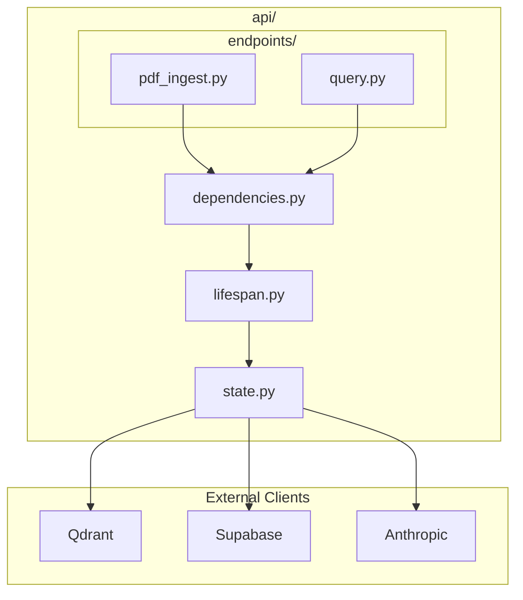
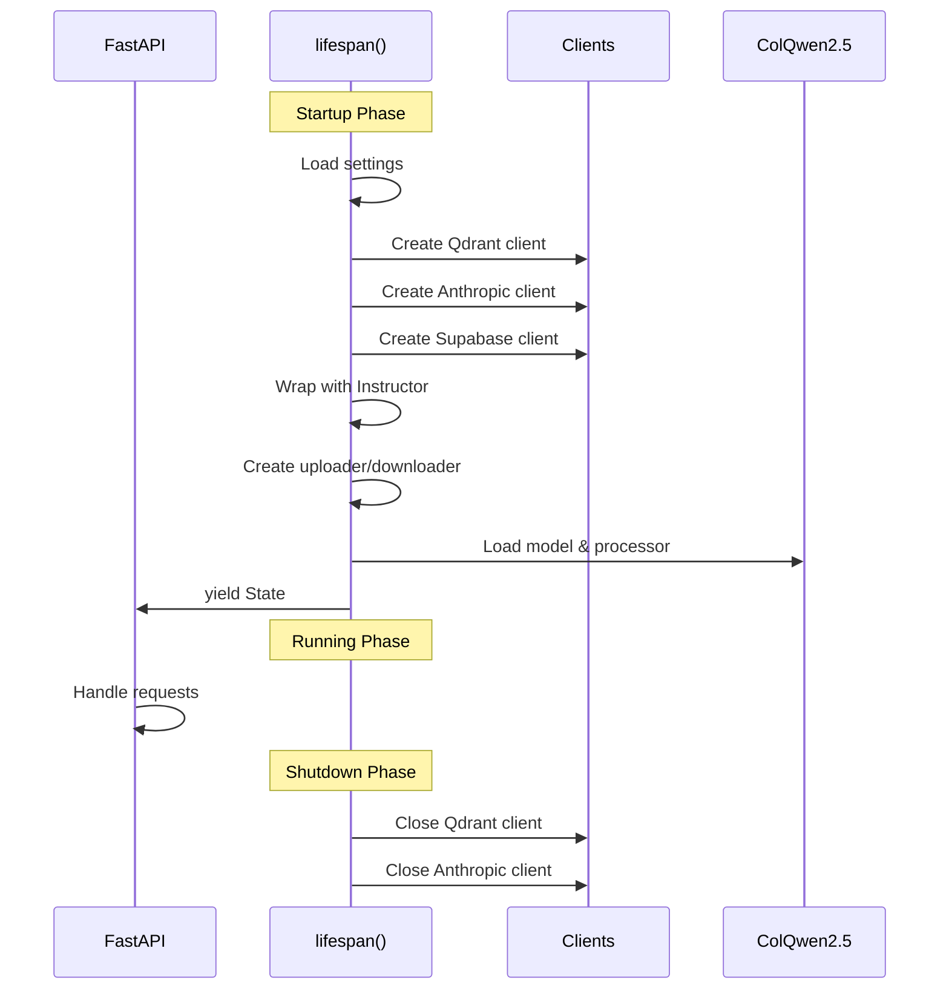
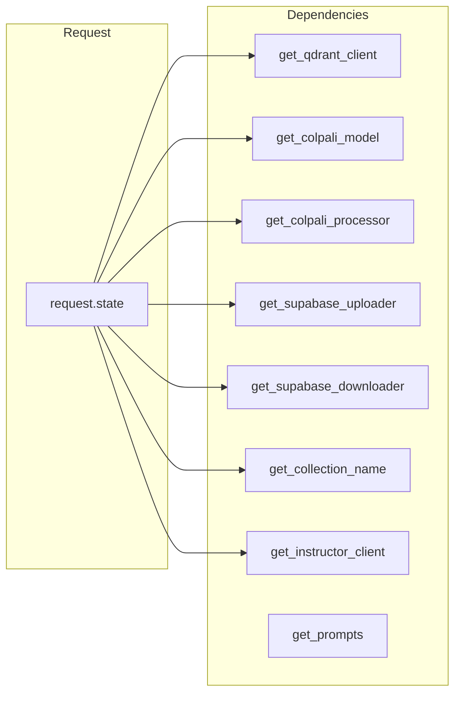
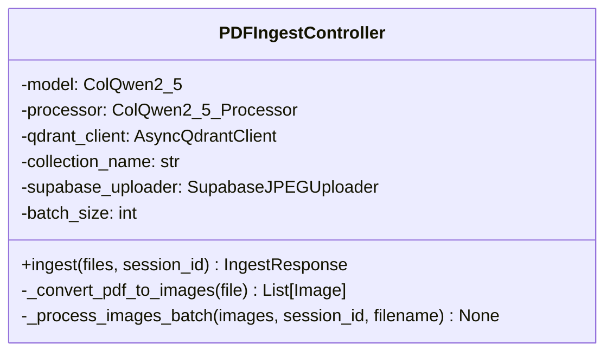
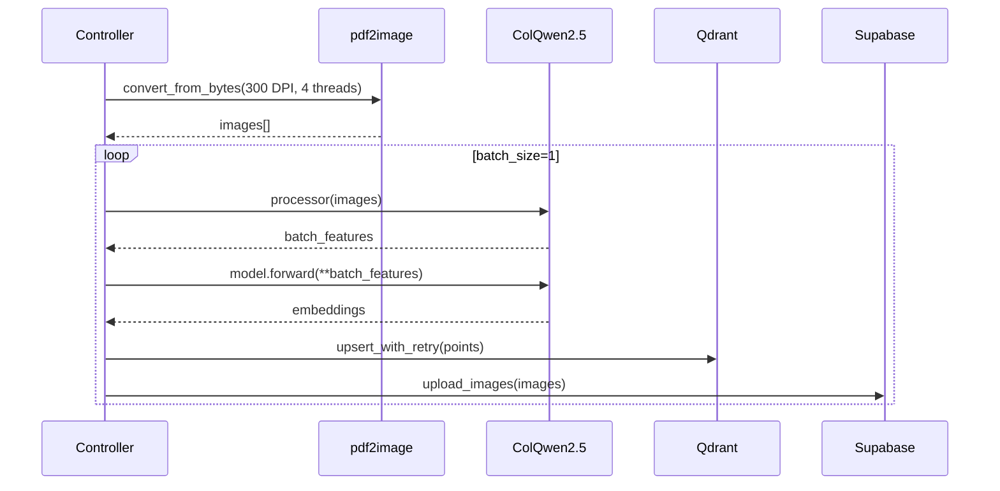
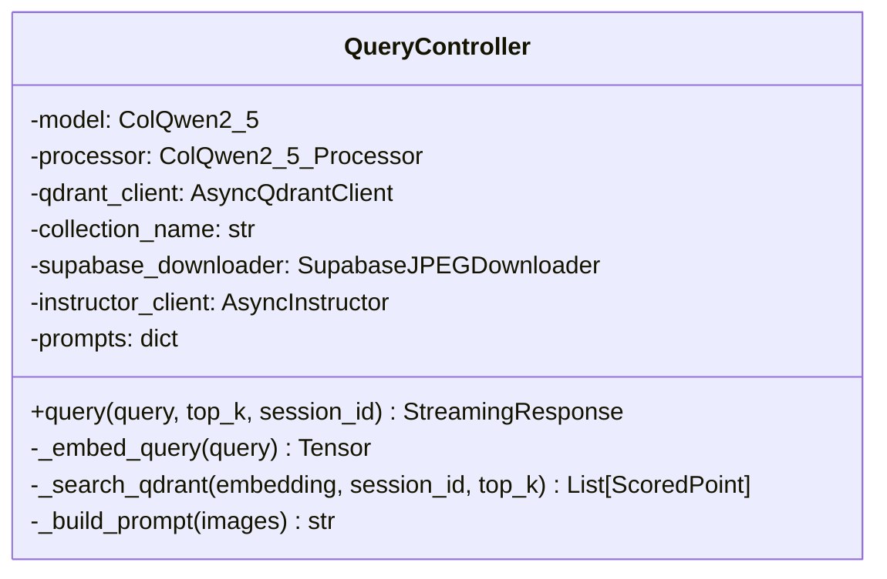
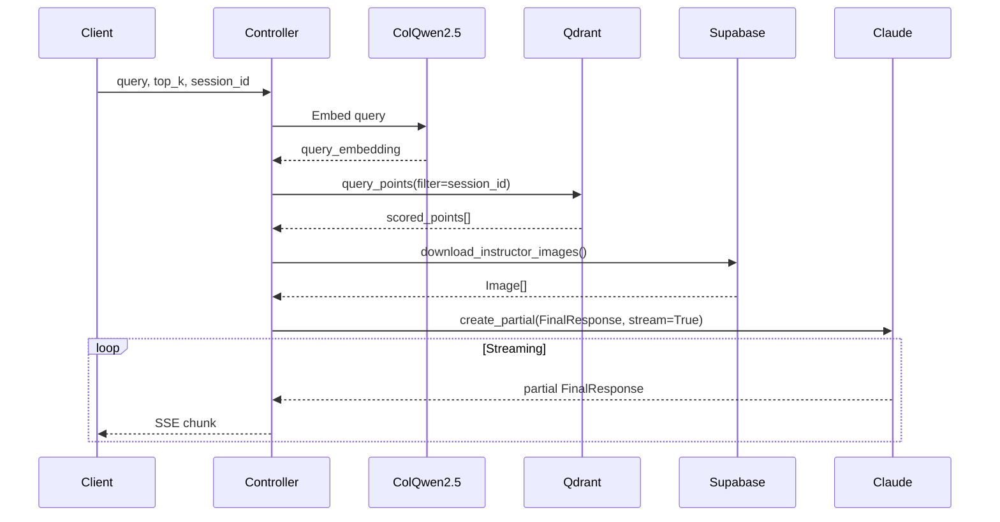

# API Module

The API module contains the FastAPI application setup, endpoints, lifecycle management, and dependency injection.

## Module Structure

```
src/app/api/
├── __init__.py
├── state.py          # Client factory functions
├── lifespan.py       # Application lifecycle manager
├── dependencies.py   # FastAPI dependency injection
└── endpoints/
    ├── __init__.py
    ├── pdf_ingest.py # PDF ingestion endpoint
    └── query.py      # Query endpoint
```

## Component Diagram



---

## state.py - Client Factories

Factory functions for creating async clients.

### Functions

#### `create_qdrant_client(settings: QdrantSettings) -> AsyncQdrantClient`

Creates an async Qdrant client.

```python
def create_qdrant_client(settings: QdrantSettings) -> AsyncQdrantClient:
    return AsyncQdrantClient(
        url=settings.qdrant_url,
        api_key=settings.qdrant_api_key.get_secret_value(),
    )
```

**Parameters:**
- `settings`: QdrantSettings with URL and API key

**Returns:** AsyncQdrantClient instance

---

#### `create_supabase_client(settings: SupabaseSettings) -> AsyncClient`

Creates an async Supabase client.

```python
async def create_supabase_client(settings: SupabaseSettings) -> AsyncClient:
    return await create_client(
        settings.supabase_url,
        settings.supabase_key.get_secret_value(),
    )
```

**Parameters:**
- `settings`: SupabaseSettings with URL and key

**Returns:** Supabase AsyncClient instance

---

#### `create_anthropic_client(settings: AnthropicSettings) -> AsyncAnthropic`

Creates an async Anthropic client.

```python
def create_anthropic_client(settings: AnthropicSettings) -> AsyncAnthropic:
    return AsyncAnthropic(
        api_key=settings.anthropic_api_key.get_secret_value()
    )
```

**Parameters:**
- `settings`: AnthropicSettings with API key

**Returns:** AsyncAnthropic instance

---

## lifespan.py - Lifecycle Manager

Manages application startup and shutdown.

### State TypedDict

```python
class State(TypedDict):
    model: ColQwen2_5
    processor: ColQwen2_5_Processor
    supabase_uploader: SupabaseJPEGUploader
    supabase_downloader: SupabaseJPEGDownloader
    instructor_client: AsyncInstructor
    qdrant_client: AsyncQdrantClient
    collection_name: str
```

### Lifecycle Flow



### Function

#### `lifespan(app: FastAPI) -> AsyncGenerator[State, None]`

Async context manager for application lifecycle.

```python
@asynccontextmanager
async def lifespan(app: FastAPI) -> AsyncGenerator[State, None]:
    # Startup
    settings = get_settings()
    qdrant_client = create_qdrant_client(settings.qdrant)
    anthropic_client = create_anthropic_client(settings.anthropic)
    supabase_client = await create_supabase_client(settings.supabase)

    instructor_client = instructor.from_anthropic(anthropic_client)

    uploader = SupabaseJPEGUploader(supabase_client, settings.supabase.bucket)
    downloader = SupabaseJPEGDownloader(supabase_client, settings.supabase.bucket)

    loader = ColQwen2_5Loader(settings.colpali.colpali_model_name)
    model, processor = loader.load()

    yield {
        "model": model,
        "processor": processor,
        "supabase_uploader": uploader,
        "supabase_downloader": downloader,
        "instructor_client": instructor_client,
        "qdrant_client": qdrant_client,
        "collection_name": settings.qdrant.collection_name,
    }

    # Shutdown
    await qdrant_client.close()
    await anthropic_client.close()
```

---

## dependencies.py - Dependency Injection

FastAPI dependency functions for accessing shared state.

### Dependency Flow



### Functions

All dependency functions follow the same pattern:

```python
async def get_qdrant_client(request: Request) -> AsyncQdrantClient:
    return request.state.qdrant_client
```

| Function | Returns | Source |
|----------|---------|--------|
| `get_qdrant_client` | `AsyncQdrantClient` | `request.state.qdrant_client` |
| `get_colpali_model` | `ColQwen2_5` | `request.state.model` |
| `get_colpali_processor` | `ColQwen2_5_Processor` | `request.state.processor` |
| `get_supabase_uploader` | `SupabaseJPEGUploader` | `request.state.supabase_uploader` |
| `get_supabase_downloader` | `SupabaseJPEGDownloader` | `request.state.supabase_downloader` |
| `get_collection_name` | `str` | `request.state.collection_name` |
| `get_instructor_client` | `AsyncInstructor` | `request.state.instructor_client` |

### Cached Dependency

#### `get_prompts() -> dict[str, str]`

Loads prompts from files (cached with `@lru_cache`).

```python
@lru_cache
def get_prompts() -> dict[str, str]:
    prompts_path = Path("prompts")
    return {
        "prompt_1": read_prompt_from_plain_file(prompts_path / "response_1"),
        "prompt_2": read_prompt_from_plain_file(prompts_path / "response_2"),
    }
```

**Returns:** Dict with `prompt_1` and `prompt_2` keys

---

## endpoints/pdf_ingest.py - Ingestion Endpoint

Handles PDF document ingestion.

### PDFIngestController

Controller class encapsulating ingestion logic.



### Endpoint

#### `POST /ingest-pdfs/`

```python
@router.post("/ingest-pdfs/")
async def ingest_pdfs(
    files: list[UploadFile] = File(...),
    session_id: UUID4 = Form(...),
    model: ColQwen2_5 = Depends(get_colpali_model),
    processor: ColQwen2_5_Processor = Depends(get_colpali_processor),
    qdrant_client: AsyncQdrantClient = Depends(get_qdrant_client),
    collection_name: str = Depends(get_collection_name),
    supabase_uploader: SupabaseJPEGUploader = Depends(get_supabase_uploader),
) -> IngestResponse:
```

### Processing Pipeline



### Response Model

```python
class IngestResponse(BaseModel):
    results: list[dict]  # [{filename, num_pages} or {filename, error}]
```

---

## endpoints/query.py - Query Endpoint

Handles document queries with streaming responses.

### QueryController

Controller class encapsulating query logic.



### Endpoint

#### `POST /query/`

```python
@router.post("/query/")
async def query(
    query: str = Form(...),
    top_k: int = Form(...),
    session_id: UUID4 = Form(...),
    model: ColQwen2_5 = Depends(get_colpali_model),
    processor: ColQwen2_5_Processor = Depends(get_colpali_processor),
    qdrant_client: AsyncQdrantClient = Depends(get_qdrant_client),
    collection_name: str = Depends(get_collection_name),
    supabase_downloader: SupabaseJPEGDownloader = Depends(get_supabase_downloader),
    instructor_client: AsyncInstructor = Depends(get_instructor_client),
    prompts: dict = Depends(get_prompts),
) -> StreamingResponse:
```

### Query Flow



### Streaming Implementation

```python
async def stream_generator():
    async for partial in instructor_client.chat.completions.create_partial(
        model="claude-sonnet-4-20250514",
        messages=messages,
        response_model=FinalResponse,
        stream=True,
    ):
        yield partial.model_dump_json() + "\n"

return StreamingResponse(
    stream_generator(),
    media_type="text/event-stream"
)
```

---

## Usage Example

```python
from fastapi import FastAPI, Depends
from src.app.api.lifespan import lifespan
from src.app.api.dependencies import get_qdrant_client

app = FastAPI(lifespan=lifespan)

@app.get("/example")
async def example(
    qdrant_client = Depends(get_qdrant_client)
):
    # Use qdrant_client...
    pass
```
