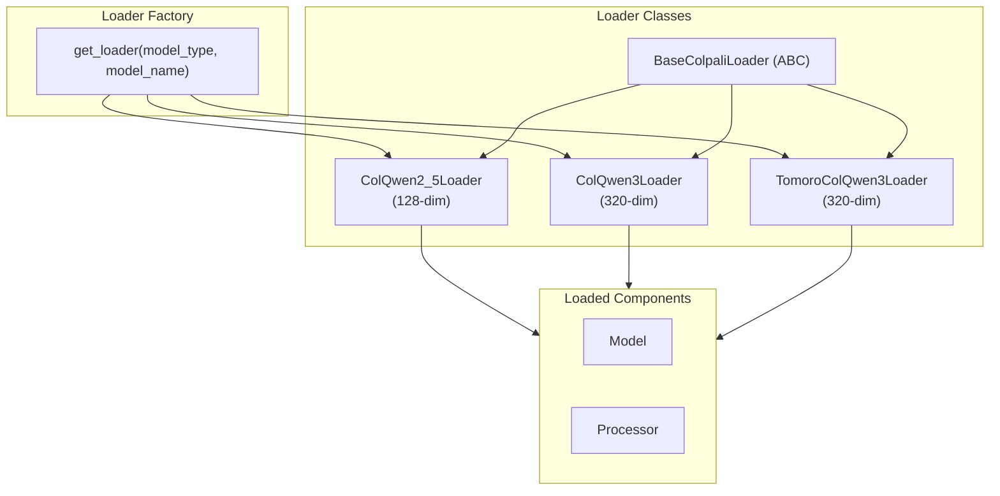

# ColPali Module

The ColPali module handles loading and configuration of vision-language models. It supports multiple model types through a factory pattern.

**Location:** `colpali-vlm/src/vlm/colpali/`

## Module Structure

```
colpali-vlm/src/vlm/colpali/
├── __init__.py
└── loaders.py    # Multi-model loader factory
```

## Overview



---

## BaseColpaliLoader (Abstract)

Base class for all model loaders with automatic hardware detection.

```python
class BaseColpaliLoader(ABC):
    def __init__(self, model_name: str) -> None:
        self.model_name = model_name
        self._device = ...      # cuda > mps > cpu
        self._dtype = ...       # bfloat16 if supported, else float16
        self._attn_implementation = ...  # flash_attention_2 or None
```

### Hardware Detection

- **Device**: CUDA > MPS > CPU
- **Data type**: bfloat16 (if CUDA supports it) > float16
- **Attention**: Flash Attention 2 (if available on CUDA) > default

```python
def _detect_flash_attention(self) -> str | None:
    if self._device == "cuda":
        try:
            import flash_attn
            return "flash_attention_2"
        except ImportError:
            pass
    return None
```

---

## ColQwen2_5Loader

Loader for ColQwen2.5 models using `colpali_engine`.

**Output dimension:** 128

```python
class ColQwen2_5Loader(BaseColpaliLoader):
    def load(self) -> tuple[Any, Any]:
        from colpali_engine.models import ColQwen2_5, ColQwen2_5_Processor

        model = ColQwen2_5.from_pretrained(
            pretrained_model_name_or_path=self.model_name,
            device_map=self._device,
            dtype=self._dtype,
            attn_implementation=self._attn_implementation,
        ).eval()

        processor = ColQwen2_5_Processor.from_pretrained(self.model_name)
        return model, processor
```

---

## ColQwen3Loader

Loader for ColQwen3 models using `colpali_engine`. Includes a rope_scaling patch for AWQ models.

**Output dimension:** 320

```python
class ColQwen3Loader(BaseColpaliLoader):
    def load(self) -> tuple[Any, Any]:
        from colpali_engine.models import ColQwen3, ColQwen3Processor
        from transformers import AutoConfig

        # Load and patch config for AWQ models missing rope_scaling
        config = AutoConfig.from_pretrained(self.model_name, trust_remote_code=True)
        if hasattr(config, 'text_config') and config.text_config is not None:
            if not hasattr(config.text_config, 'rope_scaling') or config.text_config.rope_scaling is None:
                config.text_config.rope_scaling = {
                    "type": "mrope",
                    "mrope_section": [24, 20, 20]
                }

        model = ColQwen3.from_pretrained(
            pretrained_model_name_or_path=self.model_name,
            config=config,
            device_map=self._device,
            dtype=self._dtype,
            attn_implementation=self._attn_implementation,
        ).eval()

        processor = ColQwen3Processor.from_pretrained(self.model_name)
        return model, processor
```

---

## TomoroColQwen3Loader

Loader for TomoroAI ColQwen3 models using `transformers` AutoModel.

**Output dimension:** 320

```python
class TomoroColQwen3Loader(BaseColpaliLoader):
    def load(self) -> tuple[Any, Any]:
        from transformers import AutoModel, AutoProcessor

        model = AutoModel.from_pretrained(
            self.model_name,
            dtype=self._dtype,
            attn_implementation=self._attn_implementation,
            trust_remote_code=True,
            device_map=self._device,
        ).eval()

        processor = AutoProcessor.from_pretrained(
            self.model_name,
            trust_remote_code=True,
            max_num_visual_tokens=1280,
        )
        return model, processor
```

---

## get_loader() Factory

Factory function that creates the appropriate loader based on model type.

```python
def get_loader(model_type: str, model_name: str) -> BaseColpaliLoader:
    if model_type == "colqwen2.5":
        return ColQwen2_5Loader(model_name)
    elif model_type == "colqwen3":
        return ColQwen3Loader(model_name)
    elif model_type == "tomoro-colqwen3":
        return TomoroColQwen3Loader(model_name)
    elif model_type == "auto":
        # Auto-detect based on model name
        if "tomoro" in model_name.lower():
            return TomoroColQwen3Loader(model_name)
        elif "colqwen3" in model_name.lower():
            return ColQwen3Loader(model_name)
        return ColQwen2_5Loader(model_name)  # Default
```

---

## Model Specifications

| Model | Model ID | Loader | Library | Dimensions | Processing |
|-------|----------|--------|---------|-----------|------------|
| ColQwen2.5 | `vidore/colqwen2.5-v0.2` | `ColQwen2_5Loader` | `colpali_engine` | 128 | `process_images` / `process_queries` |
| ColQwen3 | Various | `ColQwen3Loader` | `colpali_engine` | 320 | `process_images` / `process_queries` |
| TomoroAI | `TomoroAI/tomoro-colqwen3-embed-4b` | `TomoroColQwen3Loader` | `transformers` | 320 | `process_images` / `process_texts` |

### Output Format Differences

The embed endpoint handles both output formats:
- **colpali_engine models**: Returns tensor directly
- **TomoroAI models**: Returns object with `.embeddings` attribute

---

## Hardware Requirements

| Configuration | Memory (Model Only) | Recommended |
|--------------|---------------------|-------------|
| CPU + FP16 | ~4 GB | Development |
| CUDA + BF16 | ~4 GB VRAM | Production |
| MPS + FP16 | ~4 GB | Mac development |
