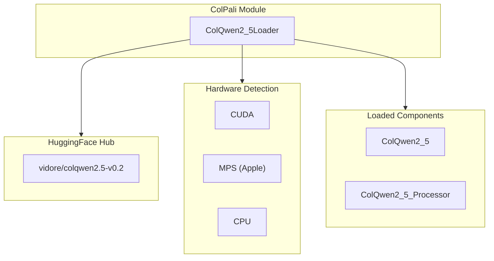
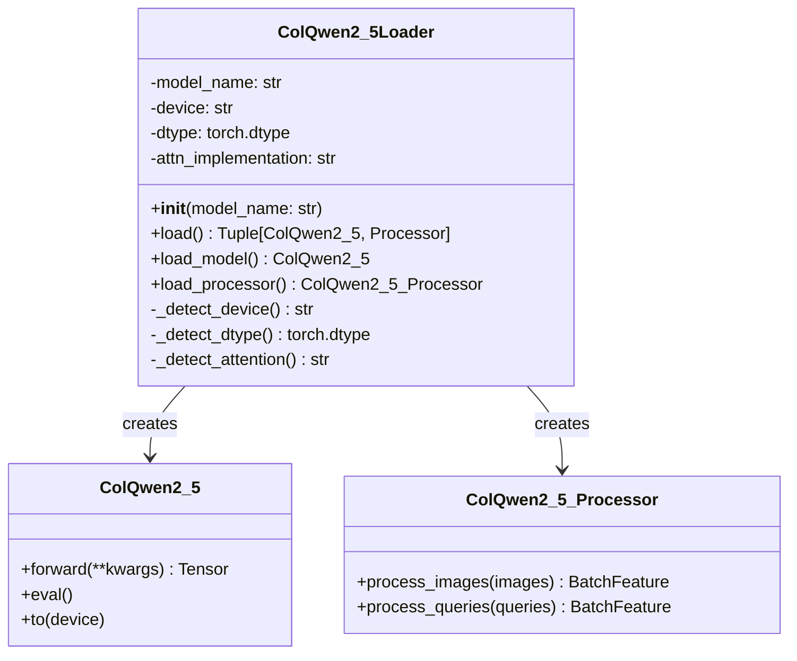
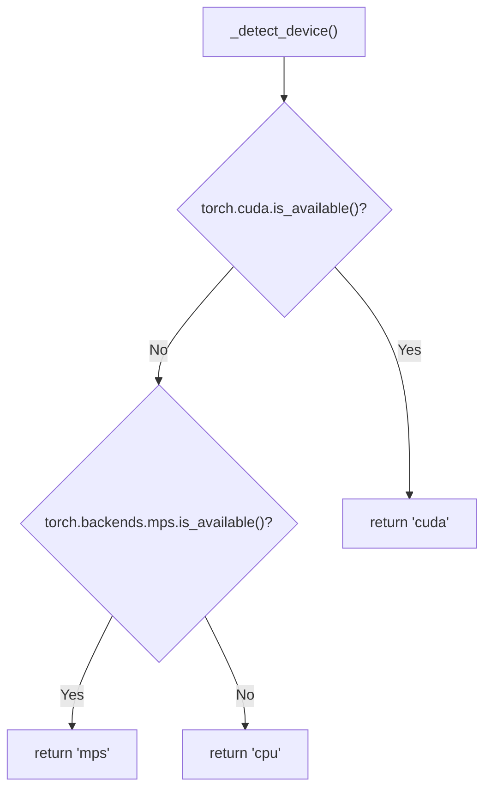
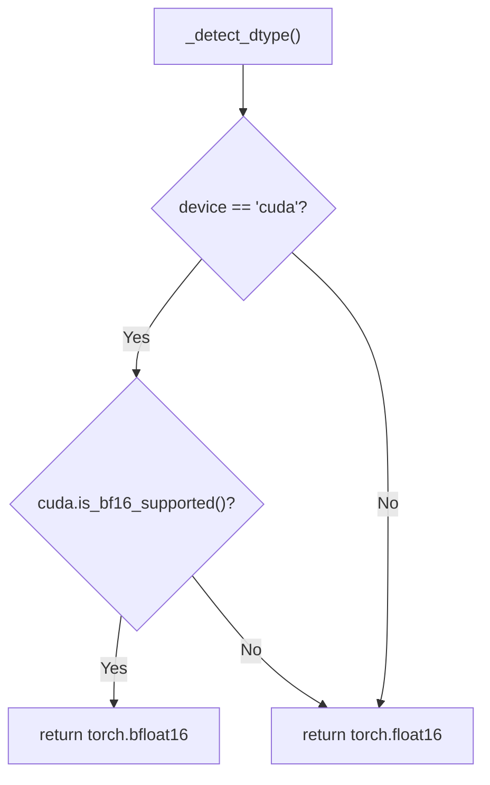
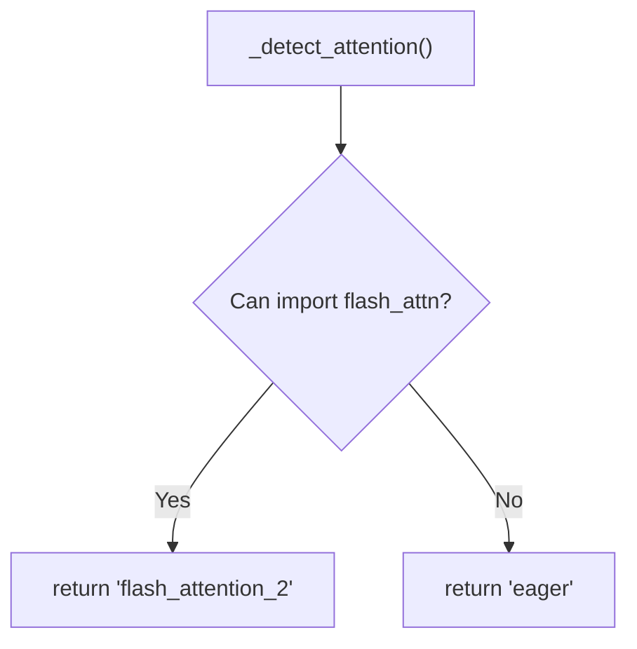
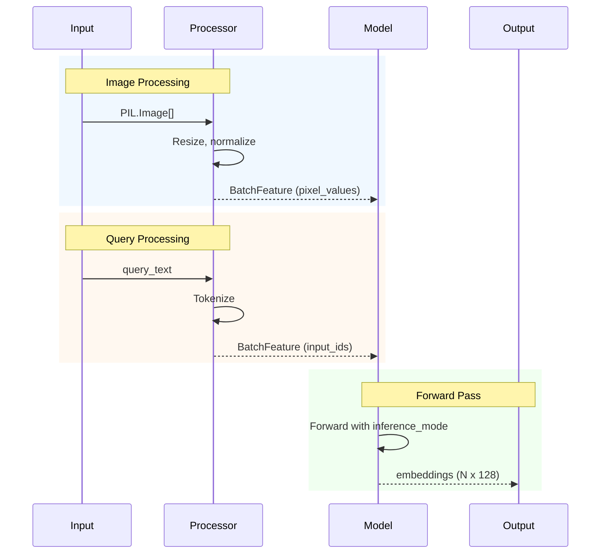

# ColPali Module

The ColPali module handles loading and configuration of the ColQwen 2.5 vision-language model.

## Module Structure

```
src/app/colpali/
├── __init__.py
└── loaders.py    # Model loading logic
```

## Overview



---

## loaders.py

### ColQwen2_5Loader Class

Main class for loading the ColQwen 2.5 model with automatic hardware detection.



### Constructor

```python
def __init__(self, model_name: str):
    self.model_name = model_name
    self.device = self._detect_device()
    self.dtype = self._detect_dtype()
    self.attn_implementation = self._detect_attention()
```

**Parameters:**
- `model_name`: HuggingFace model identifier (e.g., `"vidore/colqwen2.5-v0.2"`)

---

### Device Detection



```python
def _detect_device(self) -> str:
    if torch.cuda.is_available():
        return "cuda"
    elif torch.backends.mps.is_available():
        return "mps"
    return "cpu"
```

---

### Data Type Detection



```python
def _detect_dtype(self) -> torch.dtype:
    if self.device == "cuda" and torch.cuda.is_bf16_supported():
        return torch.bfloat16
    return torch.float16
```

---

### Attention Implementation Detection



```python
def _detect_attention(self) -> str:
    try:
        import flash_attn  # noqa: F401
        return "flash_attention_2"
    except ImportError:
        return "eager"
```

---

### Load Methods

#### `load() -> Tuple[ColQwen2_5, ColQwen2_5_Processor]`

Loads both model and processor.

```python
def load(self) -> tuple[ColQwen2_5, ColQwen2_5_Processor]:
    return self.load_model(), self.load_processor()
```

---

#### `load_model() -> ColQwen2_5`

Loads the ColQwen 2.5 model from HuggingFace.

```python
def load_model(self) -> ColQwen2_5:
    logger.info(f"Loading model: {self.model_name}")
    logger.info(f"Device: {self.device}, dtype: {self.dtype}")
    logger.info(f"Attention: {self.attn_implementation}")

    model = ColQwen2_5.from_pretrained(
        self.model_name,
        torch_dtype=self.dtype,
        device_map=self.device,
        attn_implementation=self.attn_implementation,
    ).eval()

    return model
```

**Returns:** Loaded model in evaluation mode

---

#### `load_processor() -> ColQwen2_5_Processor`

Loads the processor for image/text preprocessing.

```python
def load_processor(self) -> ColQwen2_5_Processor:
    return ColQwen2_5_Processor.from_pretrained(self.model_name)
```

**Returns:** Processor instance

---

## Model Specifications

### ColQwen 2.5

| Property | Value |
|----------|-------|
| Model ID | `vidore/colqwen2.5-v0.2` |
| Output Dimension | 128 |
| Multi-vector | Yes |
| Vision Encoder | Qwen2-VL |

### Processing Pipeline



---

## Usage Example

```python
from src.app.colpali.loaders import ColQwen2_5Loader
from PIL import Image
import torch

# Load model and processor
loader = ColQwen2_5Loader("vidore/colqwen2.5-v0.2")
model, processor = loader.load()

# Process images
images = [Image.open("page1.jpg"), Image.open("page2.jpg")]
batch = processor.process_images(images)
batch = {k: v.to(model.device) for k, v in batch.items()}

# Generate embeddings
with torch.inference_mode():
    embeddings = model(**batch)

# embeddings shape: [batch_size, num_patches, 128]
```

---

## Hardware Requirements

| Configuration | Memory (Model Only) | Recommended |
|--------------|---------------------|-------------|
| CPU + FP16 | ~4 GB | Development |
| CUDA + BF16 | ~4 GB VRAM | Production |
| MPS + FP16 | ~4 GB | Mac development |

---

## Performance Tips

1. **Use CUDA if available**: Significantly faster inference
2. **Enable Flash Attention 2**: Reduces memory and improves speed
3. **Use bfloat16**: Better numerical stability on supported GPUs
4. **Batch processing**: Process multiple images together when possible
5. **inference_mode**: Always use `torch.inference_mode()` for inference
