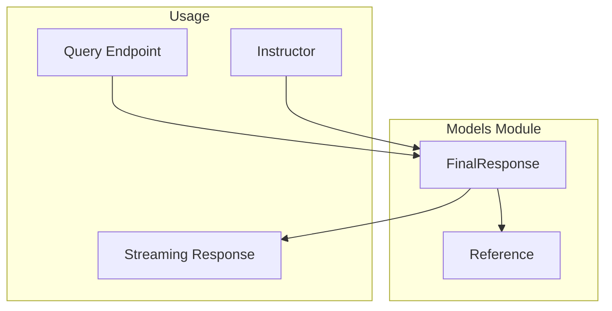
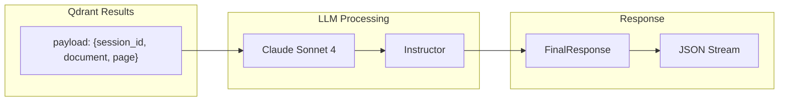

# Models Module

The models module contains Pydantic data models for API requests and responses.

**Location:** `document-api/src/doc_api/models/`

## Module Structure

```
document-api/src/doc_api/models/
├── __init__.py
└── query_response.py    # Query response models
```

## Overview



---

## query_response.py

### Reference Class

Represents a cited document reference.

```python
class Reference(BaseModel):
    id: int = Field(
        description="Sequential numeric identifier for the reference, starting from 1"
    )
    title: str
    filename: str
```

| Field | Type | Description |
|-------|------|-------------|
| `id` | `int` | Sequential citation number (e.g., 1, 2, 3) |
| `title` | `str` | Section or page title |
| `filename` | `str` | Source document filename |

---

### FinalResponse Class

Complete response model with references and answer. Designed for streaming with Instructor's `create_partial()`.

```python
class FinalResponse(BaseModel):
    model_config = ConfigDict(validate_assignment=True)

    references: list[Reference | dict[str, Any]] = Field(
        description="List of unique reference entries"
    )
    answer: str = Field(
        description="The complete answer text with in-text citations [id]"
    )

    @field_serializer("references")
    def serialize_references(self, refs, _info):
        if refs is None:
            return []
        return [
            ref.model_dump() if isinstance(ref, Reference) else ref
            for ref in refs
        ]
```

| Field | Type | Description |
|-------|------|-------------|
| `references` | `list[Reference \| dict]` | Cited document references |
| `answer` | `str` | Response text with `[1]`, `[2]` citations |

The custom serializer handles both complete `Reference` objects and partial dicts during streaming.

---

### Streaming Support

During streaming, references may be:
- Empty list (`[]`)
- Partial dictionaries (`{"id": 1}`)
- Complete Reference objects

```json
{"references": [], "answer": "Revenue"}
{"references": [], "answer": "Revenue increased by 15%"}
{"references": [{"id": 1, "title": "Financial Overview", "filename": "q4_report.pdf"}], "answer": "Revenue increased by 15% in Q4 [1]."}
```

---

## Data Flow



---

## Usage Example

```python
from doc_api.models.query_response import Reference, FinalResponse

# Create references
refs = [
    Reference(id=1, title="Introduction", filename="doc.pdf"),
    Reference(id=2, title="Results", filename="doc.pdf"),
]

# Create response
response = FinalResponse(
    references=refs,
    answer="The study found significant results [1]. Detailed analysis is in [2]."
)

# Serialize to JSON
json_str = response.model_dump_json()
```
