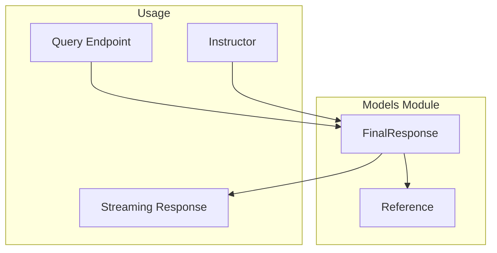
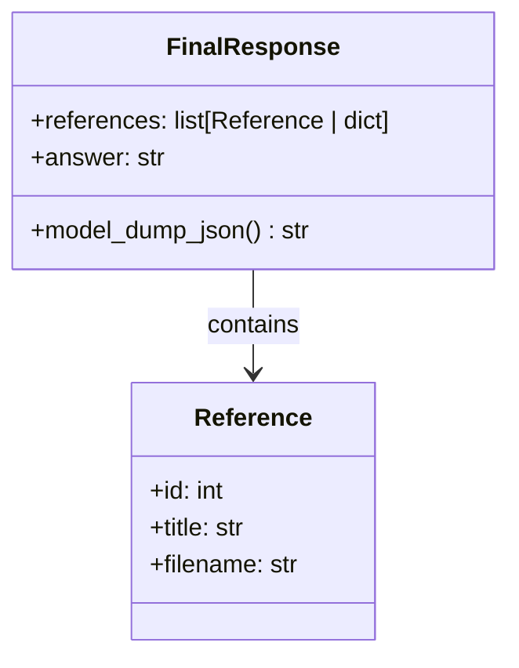
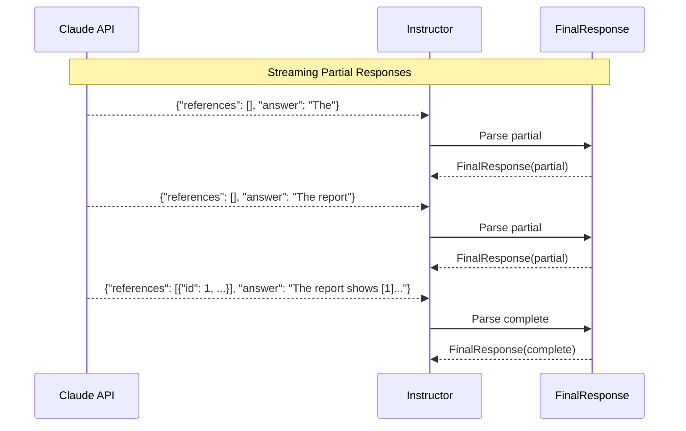
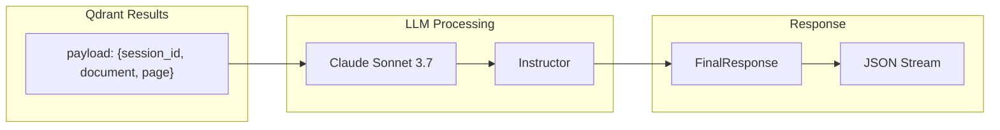

# Models Module

The models module contains Pydantic data models for API requests and responses.

## Module Structure

```
src/app/models/
├── __init__.py
└── query_response.py    # Query response models
```

## Overview



---

## query_response.py

### Reference Class

Represents a cited document reference.

```python
class Reference(BaseModel):
    id: int
    title: str
    filename: str
```

| Field | Type | Description |
|-------|------|-------------|
| `id` | `int` | Sequential citation number (e.g., 1, 2, 3) |
| `title` | `str` | Section or page title |
| `filename` | `str` | Source document filename |

**Example:**
```json
{
  "id": 1,
  "title": "Executive Summary",
  "filename": "annual_report.pdf"
}
```

---

### FinalResponse Class

Complete response model with references and answer.



```python
class FinalResponse(BaseModel):
    references: list[Reference | dict] = Field(
        default_factory=list,
        description="List of document references cited in the answer"
    )
    answer: str = Field(
        default="",
        description="Generated answer with inline citations [1], [2], etc."
    )

    @field_serializer("references")
    def serialize_references(
        self,
        references: list[Reference | dict]
    ) -> list[dict]:
        return [
            ref.model_dump() if isinstance(ref, Reference) else ref
            for ref in references
        ]
```

| Field | Type | Description |
|-------|------|-------------|
| `references` | `list[Reference \| dict]` | Cited document references |
| `answer` | `str` | Response text with `[1]`, `[2]` citations |

---

### Streaming Support

The `FinalResponse` model is designed to work with Instructor's streaming capability.



During streaming, references may be:
- Empty list (`[]`)
- Partial dictionaries (`{"id": 1}`)
- Complete Reference objects

The custom serializer handles all these cases:

```python
@field_serializer("references")
def serialize_references(self, references):
    return [
        ref.model_dump() if isinstance(ref, Reference) else ref
        for ref in references
    ]
```

---

### Example Responses

#### Complete Response

```json
{
  "references": [
    {
      "id": 1,
      "title": "Financial Overview",
      "filename": "q4_report.pdf"
    },
    {
      "id": 2,
      "title": "Market Analysis",
      "filename": "market_study.pdf"
    }
  ],
  "answer": "Revenue increased by 15% in Q4 [1]. This growth was driven primarily by expansion in the Asian market, which saw a 25% increase in sales [2]."
}
```

#### Streaming Chunks

```json
{"references": [], "answer": "Revenue"}
{"references": [], "answer": "Revenue increased"}
{"references": [], "answer": "Revenue increased by 15%"}
{"references": [{"id": 1}], "answer": "Revenue increased by 15% in Q4 [1]"}
{"references": [{"id": 1, "title": "Financial Overview", "filename": "q4_report.pdf"}], "answer": "Revenue increased by 15% in Q4 [1]."}
```

---

## Data Flow



---

## Usage Example

### Creating a Response

```python
from src.app.models.query_response import Reference, FinalResponse

# Create references
refs = [
    Reference(id=1, title="Introduction", filename="doc.pdf"),
    Reference(id=2, title="Results", filename="doc.pdf"),
]

# Create response
response = FinalResponse(
    references=refs,
    answer="The study found significant results [1]. Detailed analysis is in [2]."
)

# Serialize to JSON
json_str = response.model_dump_json()
```

### With Instructor Streaming

```python
async for partial in instructor_client.chat.completions.create_partial(
    model="claude-sonnet-4-20250514",
    messages=messages,
    response_model=FinalResponse,
    stream=True,
):
    # partial is a FinalResponse with potentially incomplete data
    print(partial.model_dump_json())
```

---

## Validation

Pydantic provides automatic validation:

```python
# Valid
response = FinalResponse(
    references=[{"id": 1, "title": "Test", "filename": "test.pdf"}],
    answer="Test answer [1]."
)

# Invalid - will raise ValidationError
response = FinalResponse(
    references=[{"id": "not_an_int"}],  # id must be int
    answer="Test"
)
```

---

## Schema Export

Get the JSON Schema for OpenAPI documentation:

```python
print(FinalResponse.model_json_schema())
```

```json
{
  "properties": {
    "references": {
      "items": {
        "anyOf": [
          {"$ref": "#/$defs/Reference"},
          {"type": "object"}
        ]
      },
      "title": "References",
      "type": "array"
    },
    "answer": {
      "title": "Answer",
      "type": "string"
    }
  },
  "required": ["references", "answer"],
  "title": "FinalResponse",
  "type": "object",
  "$defs": {
    "Reference": {
      "properties": {
        "id": {"title": "Id", "type": "integer"},
        "title": {"title": "Title", "type": "string"},
        "filename": {"title": "Filename", "type": "string"}
      },
      "required": ["id", "title", "filename"],
      "type": "object"
    }
  }
}
```
