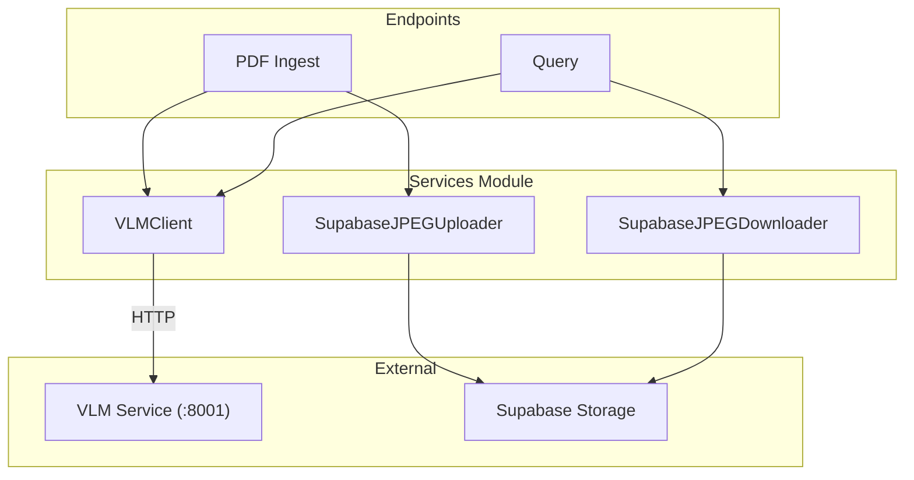
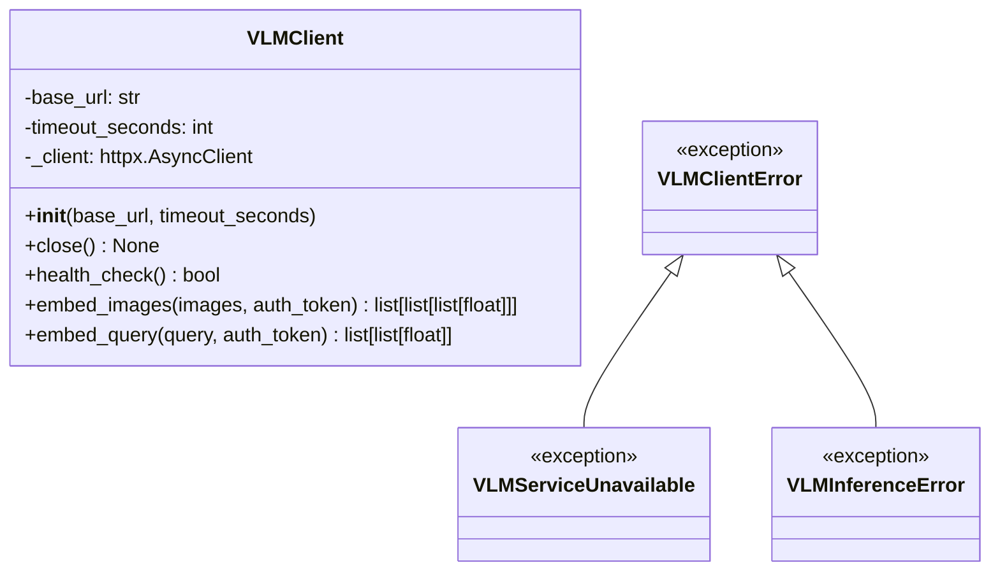
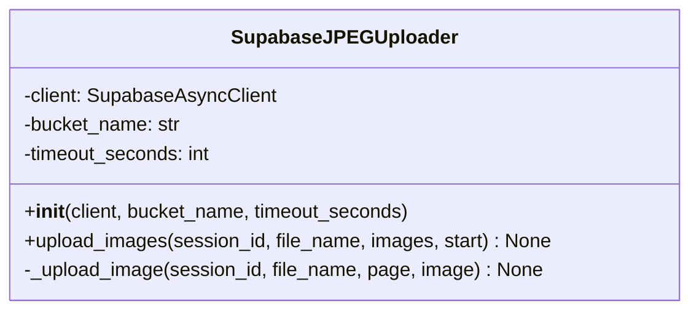
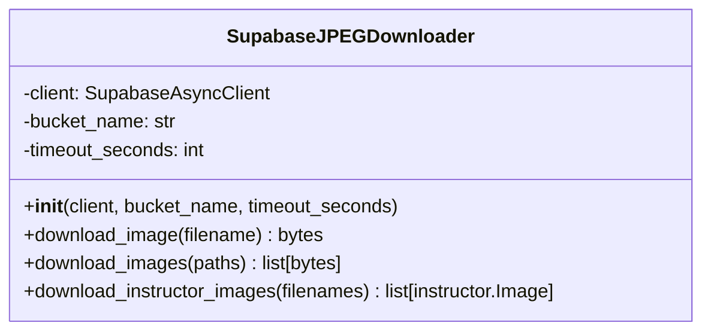

# Services Module

The services module contains the VLM HTTP client and image upload/download services.

**Location:** `document-api/src/doc_api/services/`

## Module Structure

```
document-api/src/doc_api/services/
├── __init__.py
├── vlm_client.py       # HTTP client for VLM service
├── img_uploader.py     # Image upload to Supabase
└── img_downloader.py   # Image download from Supabase
```

## Overview



---

## vlm_client.py

### VLMClient Class

HTTP client for communicating with the VLM embedding service. Uses `httpx.AsyncClient` with `tenacity` retry.



### Constructor

```python
def __init__(self, base_url: str, timeout_seconds: int = 120):
    self.base_url = base_url.rstrip("/")
    self._client = httpx.AsyncClient(
        timeout=httpx.Timeout(float(timeout_seconds)),
        limits=httpx.Limits(max_connections=10, max_keepalive_connections=5),
    )
```

### Methods

#### `health_check() -> bool`

Checks if VLM service is healthy via `GET /health`.

#### `embed_images(images, auth_token) -> list[list[list[float]]]`

Sends images to VLM service for embedding. Decorated with `@retry` (3 attempts, exponential backoff 1-10s).

- Converts PIL images to JPEG bytes
- Sends as multipart form data to `POST /embed/images`
- Forwards auth token in Authorization header
- Returns list of multi-vector embeddings

#### `embed_query(query, auth_token) -> list[list[float]]`

Sends query to VLM service for embedding. Decorated with `@retry` (3 attempts, exponential backoff 1-10s).

- Sends JSON body to `POST /embed/query`
- Forwards auth token in Authorization header
- Returns multi-vector embedding

### Exception Hierarchy

| Exception | When |
|-----------|------|
| `VLMClientError` | Base exception |
| `VLMServiceUnavailable` | Connection to VLM service failed |
| `VLMInferenceError` | VLM returned error (504 timeout, other HTTP errors) |

---

## img_uploader.py

### SupabaseJPEGUploader Class

Handles uploading JPEG images to Supabase storage.



### Methods

#### `upload_images(session_id, file_name, images, start) -> None`

Uploads multiple images concurrently using `asyncio.gather`.

**Path Format:** `{session_id}/{file_name}/{page_number}.jpeg`

#### `_upload_image(session_id, file_name, page, image) -> None`

Uploads a single image with timeout via `asyncio.wait_for`.

---

## img_downloader.py

### SupabaseJPEGDownloader Class

Handles downloading images from Supabase storage.



### Methods

#### `download_image(filename) -> bytes`

Downloads a single image with timeout.

#### `download_images(paths) -> list[bytes]`

Downloads multiple images concurrently using `asyncio.gather`.

#### `download_instructor_images(filenames) -> list[instructor.Image]`

Downloads images and converts to Instructor format (base64 encoded) for Claude.

---

## Storage Path Structure

```
{bucket}/{session_id}/{document_name}/{page_number}.jpeg
```

**Example:**
```
colpali/550e8400-e29b-41d4-a716-446655440000/annual_report/1.jpeg
```

---

## Usage Example

```python
from doc_api.services.vlm_client import VLMClient
from doc_api.services.img_uploader import SupabaseJPEGUploader
from doc_api.services.img_downloader import SupabaseJPEGDownloader

# VLM Client
vlm_client = VLMClient(base_url="http://localhost:8001", timeout_seconds=120)
embeddings = await vlm_client.embed_images(images, auth_token="jwt-token")
query_embedding = await vlm_client.embed_query("What are the findings?")
await vlm_client.close()

# Upload images
uploader = SupabaseJPEGUploader(supabase_client, "colpali", timeout_seconds=120)
await uploader.upload_images(session_id, "report.pdf", images, start=1)

# Download images
downloader = SupabaseJPEGDownloader(supabase_client, "colpali", timeout_seconds=120)
instructor_images = await downloader.download_instructor_images(paths)
```
