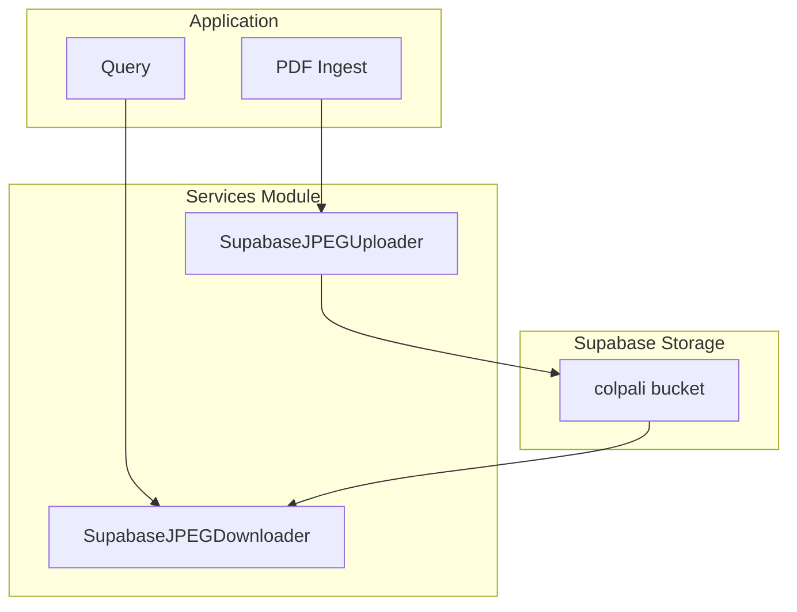
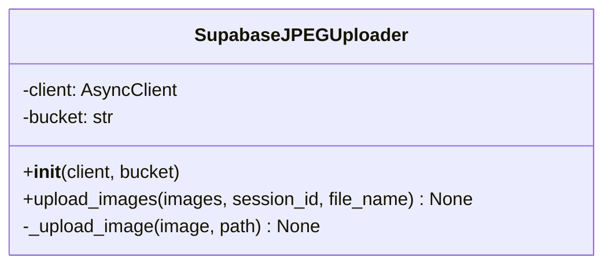
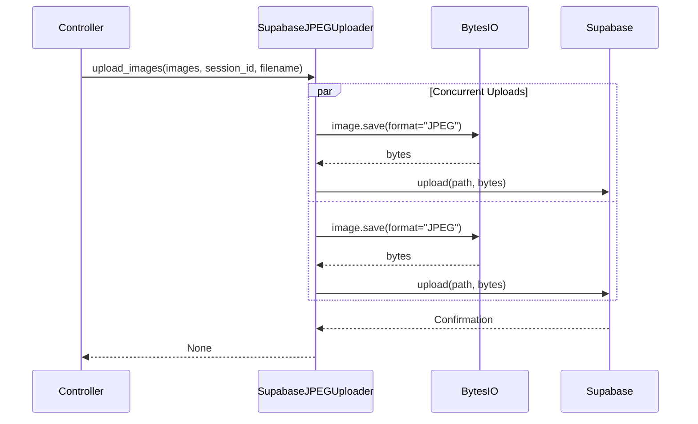
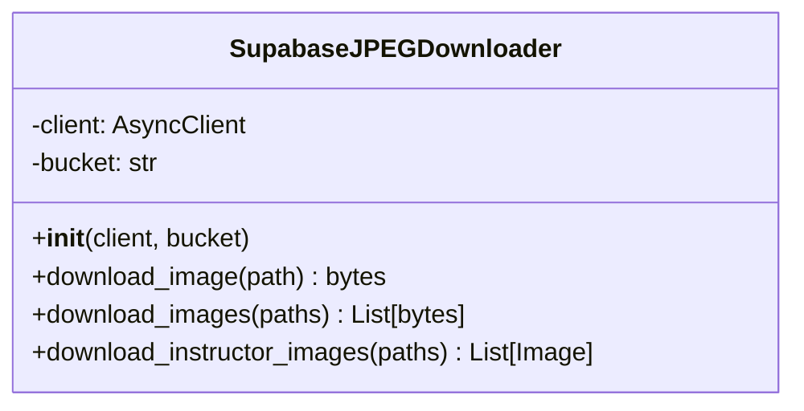
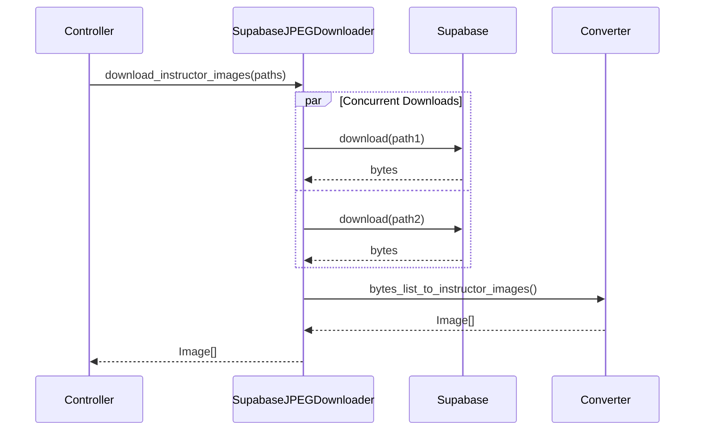
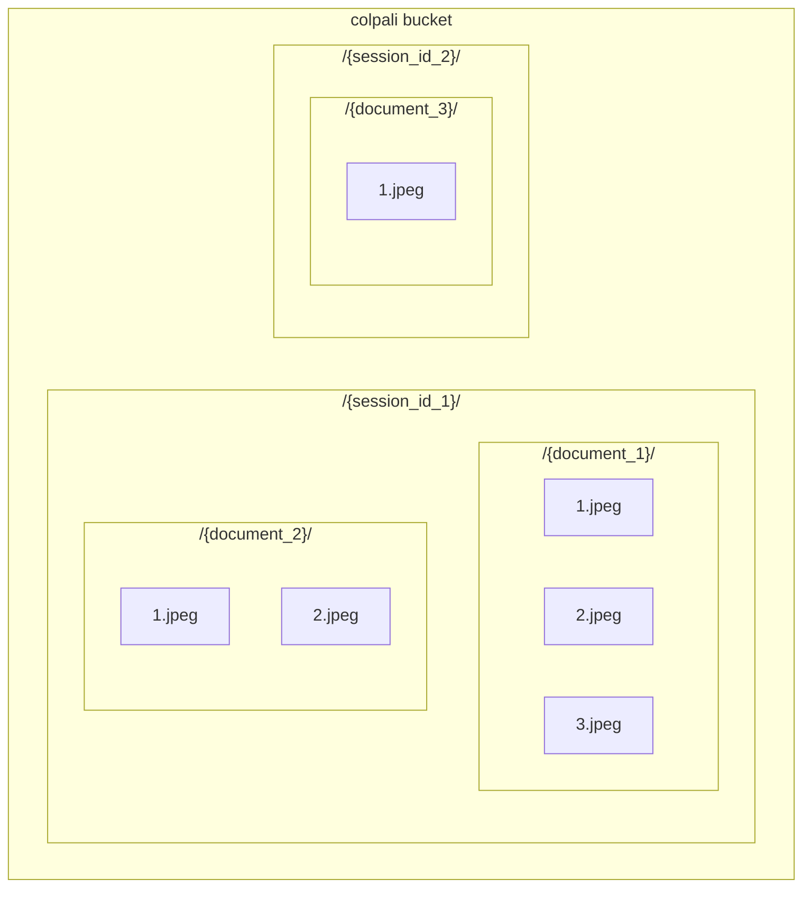

# Services Module

The services module contains image upload and download services for Supabase storage.

## Module Structure

```
src/app/services/
├── __init__.py
├── img_uploader.py    # Image upload to Supabase
└── img_downloader.py  # Image download from Supabase
```

## Overview



---

## img_uploader.py

### SupabaseJPEGUploader Class

Handles uploading JPEG images to Supabase storage.



### Constructor

```python
def __init__(self, client: AsyncClient, bucket: str):
    self.client = client
    self.bucket = bucket
```

**Parameters:**
- `client`: Supabase async client
- `bucket`: Storage bucket name (default: "colpali")

---

### Methods

#### `upload_images(images, session_id, file_name) -> None`

Uploads multiple images concurrently.

```python
async def upload_images(
    self,
    images: list[Image.Image],
    session_id: str,
    file_name: str,
) -> None:
    tasks = [
        self._upload_image(
            image,
            f"{session_id}/{file_name}/{i + 1}.jpeg"
        )
        for i, image in enumerate(images)
    ]
    await asyncio.gather(*tasks)
```

**Parameters:**
- `images`: List of PIL Image objects
- `session_id`: UUID string for session grouping
- `file_name`: Document filename (without extension)

**Path Format:** `{session_id}/{file_name}/{page_number}.jpeg`

---

#### `_upload_image(image, path) -> None`

Uploads a single image to Supabase.

```python
async def _upload_image(self, image: Image.Image, path: str) -> None:
    buffer = io.BytesIO()
    image.save(buffer, format="JPEG")
    buffer.seek(0)

    await self.client.storage.from_(self.bucket).upload(
        path,
        buffer.getvalue(),
        file_options={"content-type": "image/jpeg"}
    )
```

---

### Upload Flow



---

## img_downloader.py

### SupabaseJPEGDownloader Class

Handles downloading images from Supabase storage.



### Constructor

```python
def __init__(self, client: AsyncClient, bucket: str):
    self.client = client
    self.bucket = bucket
```

---

### Methods

#### `download_image(path) -> bytes`

Downloads a single image.

```python
async def download_image(self, path: str) -> bytes:
    response = await self.client.storage.from_(self.bucket).download(path)
    return response
```

**Parameters:**
- `path`: Full path in storage (e.g., `"session_id/document/1.jpeg"`)

**Returns:** Image bytes

---

#### `download_images(paths) -> list[bytes]`

Downloads multiple images concurrently.

```python
async def download_images(self, paths: list[str]) -> list[bytes]:
    tasks = [self.download_image(path) for path in paths]
    return await asyncio.gather(*tasks)
```

**Parameters:**
- `paths`: List of storage paths

**Returns:** List of image bytes

---

#### `download_instructor_images(paths) -> list[Image]`

Downloads images and converts to Instructor format.

```python
async def download_instructor_images(self, paths: list[str]) -> list[Image]:
    image_bytes = await self.download_images(paths)
    return bytes_list_to_instructor_images(image_bytes)
```

**Parameters:**
- `paths`: List of storage paths

**Returns:** List of Instructor Image objects (base64 encoded)

---

### Download Flow



---

## Helper Functions

### `bytes_to_instructor_image(data: bytes) -> Image`

Converts image bytes to Instructor Image format.

```python
def bytes_to_instructor_image(data: bytes) -> Image:
    base64_data = base64.b64encode(data).decode("utf-8")
    return Image(
        source={
            "type": "base64",
            "media_type": "image/jpeg",
            "data": base64_data,
        },
        type="image",
    )
```

---

### `bytes_list_to_instructor_images(data_list: list[bytes]) -> list[Image]`

Batch converts image bytes to Instructor format.

```python
def bytes_list_to_instructor_images(data_list: list[bytes]) -> list[Image]:
    return [bytes_to_instructor_image(data) for data in data_list]
```

---

## Storage Path Structure



### Path Format

```
{bucket}/{session_id}/{document_name}/{page_number}.jpeg
```

**Example:**
```
colpali/550e8400-e29b-41d4-a716-446655440000/annual_report/1.jpeg
```

---

## Usage Example

```python
from src.app.services.img_uploader import SupabaseJPEGUploader
from src.app.services.img_downloader import SupabaseJPEGDownloader
from PIL import Image

# Upload images
uploader = SupabaseJPEGUploader(supabase_client, "colpali")
images = [Image.open(f"page{i}.jpg") for i in range(1, 4)]
await uploader.upload_images(
    images,
    session_id="550e8400-e29b-41d4-a716-446655440000",
    file_name="report"
)

# Download images
downloader = SupabaseJPEGDownloader(supabase_client, "colpali")
paths = [
    "550e8400-e29b-41d4-a716-446655440000/report/1.jpeg",
    "550e8400-e29b-41d4-a716-446655440000/report/2.jpeg",
]
instructor_images = await downloader.download_instructor_images(paths)
```

---

## Error Handling

Both services rely on Supabase client error handling:

| Error | Cause | Handling |
|-------|-------|----------|
| `StorageException` | Path not found | Propagated to caller |
| `AuthenticationError` | Invalid API key | Propagated to caller |
| `TimeoutError` | Network issues | Retried by client |

Consider implementing retry logic for production use:

```python
from tenacity import retry, stop_after_attempt, wait_exponential

@retry(stop=stop_after_attempt(3), wait=wait_exponential())
async def download_with_retry(self, path: str) -> bytes:
    return await self.download_image(path)
```
