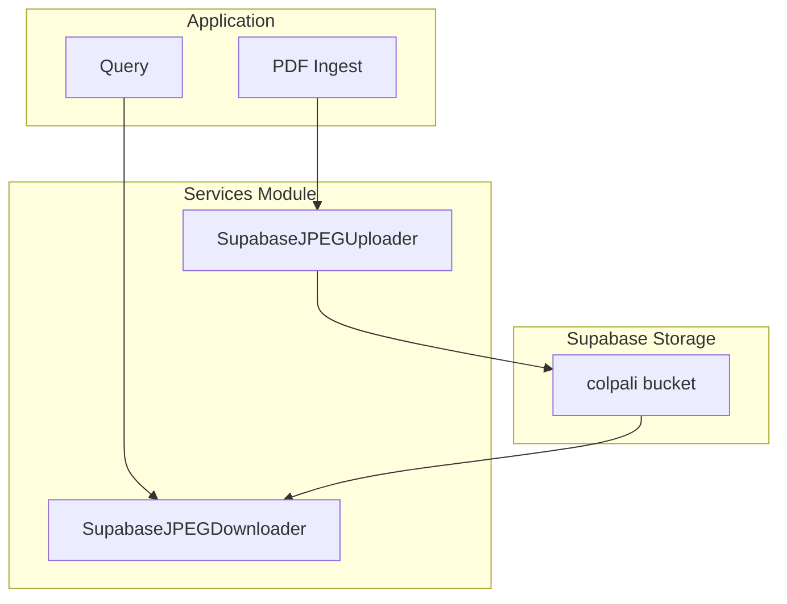
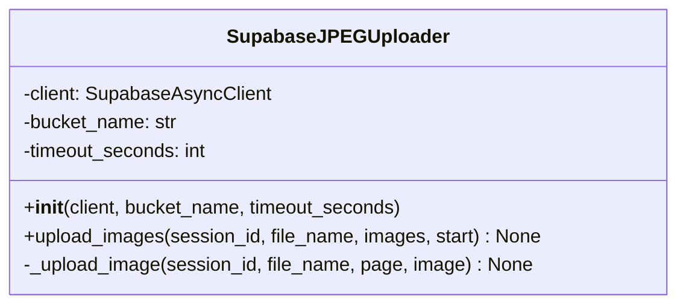
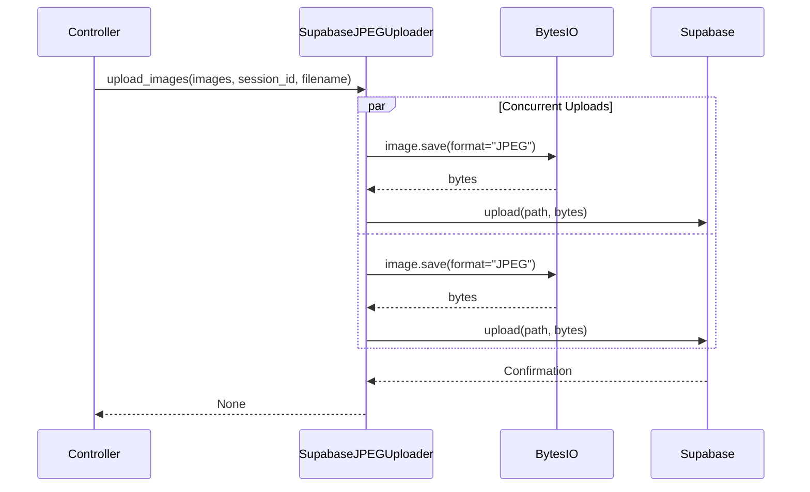
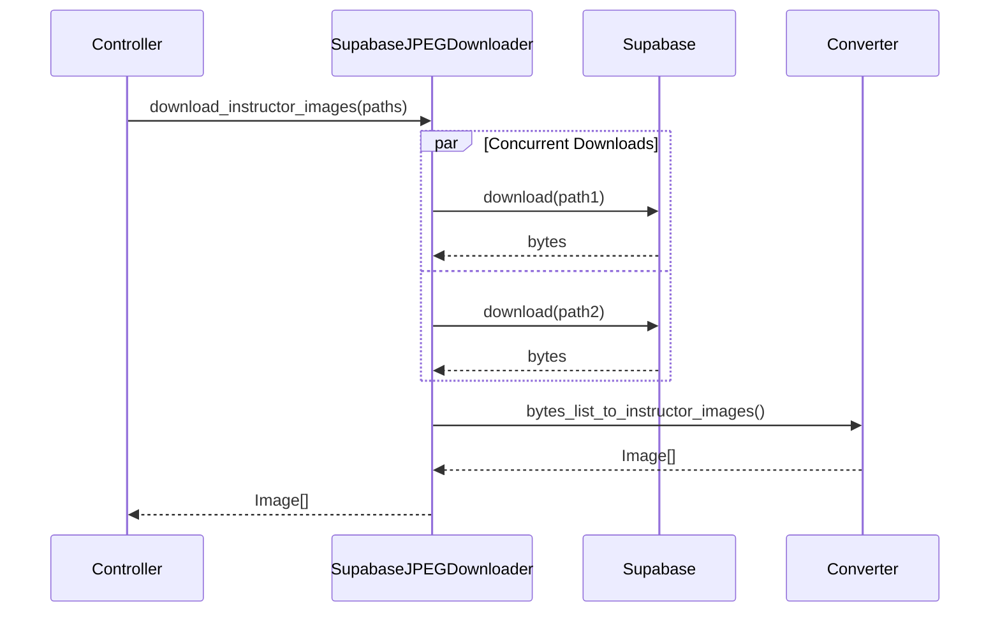
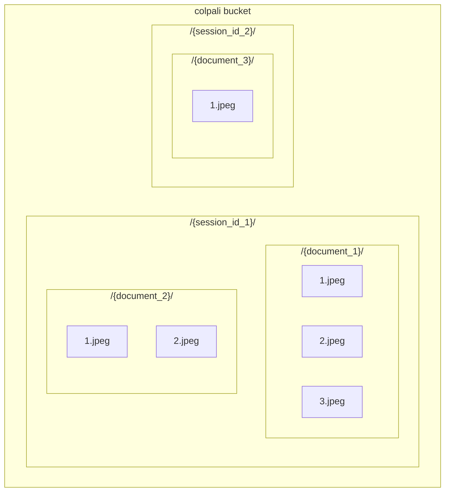

# Services Module

The services module contains image upload and download services for Supabase storage.

## Module Structure

```
src/app/services/
├── __init__.py
├── img_uploader.py    # Image upload to Supabase
└── img_downloader.py  # Image download from Supabase
```

## Overview



---

## img_uploader.py

### SupabaseJPEGUploader Class

Handles uploading JPEG images to Supabase storage.



### Constructor

```python
def __init__(
    self, client: SupabaseAsyncClient, bucket_name: str, timeout_seconds: int = 120
):
    self.client = client
    self.bucket_name = bucket_name
    self.timeout_seconds = timeout_seconds
```

**Parameters:**
- `client`: Supabase async client
- `bucket_name`: Storage bucket name (default: "colpali")
- `timeout_seconds`: Timeout for upload operations (default: 120)

---

### Methods

#### `upload_images(session_id, file_name, images, start) -> None`

Uploads multiple images concurrently with timeout enforcement.

```python
async def upload_images(
    self,
    session_id: UUID4,
    file_name: str,
    images: list[Image.Image],
    start: int = 1,
):
    tasks = [
        self._upload_image(
            session_id=session_id,
            file_name=file_name,
            page=page,
            image=image,
        )
        for page, image in zip(range(start, start + len(images)), images)
    ]
    await asyncio.gather(*tasks)
```

**Parameters:**
- `session_id`: UUID for session grouping
- `file_name`: Document filename
- `images`: List of PIL Image objects
- `start`: Starting page number (default: 1)

**Path Format:** `{session_id}/{file_name}/{page_number}.jpeg`

---

#### `_upload_image(session_id, file_name, page, image) -> None`

Uploads a single image to Supabase with timeout.

```python
async def _upload_image(
    self, session_id: UUID4, file_name: str, page: int, image: Image.Image
):
    path = f"{session_id}/{file_name}/{page}.jpeg"
    with BytesIO() as buffer:
        image.save(buffer, format="JPEG")
        data = buffer.getvalue()
        # Wrap upload with timeout
        await asyncio.wait_for(
            self.client.storage.from_(id=self.bucket_name).upload(
                path=path,
                file=data,
                file_options={"content-type": "image/jpeg"},
            ),
            timeout=self.timeout_seconds,
        )
```

---

### Upload Flow



---

## img_downloader.py

### SupabaseJPEGDownloader Class

Handles downloading images from Supabase storage.


### Constructor

```python
def __init__(
    self, client: SupabaseAsyncClient, bucket_name: str, timeout_seconds: int = 120
):
    self.client = client
    self.bucket_name = bucket_name
    self.timeout_seconds = timeout_seconds
```

---

### Methods

#### `download_image(filename) -> bytes`

Downloads a single image with timeout.

```python
async def download_image(self, filename: str) -> bytes:
    # Wrap download with timeout
    data = await asyncio.wait_for(
        self.client.storage.from_(id=self.bucket_name).download(
            path=filename
        ),
        timeout=self.timeout_seconds,
    )
    return data
```

**Parameters:**
- `filename`: Full path in storage (e.g., `"session_id/document/1.jpeg"`)

**Returns:** Image bytes

---

#### `download_images(paths) -> list[bytes]`

Downloads multiple images concurrently.

```python
async def download_images(self, paths: list[str]) -> list[bytes]:
    tasks = [self.download_image(path) for path in paths]
    return await asyncio.gather(*tasks)
```

**Parameters:**
- `paths`: List of storage paths

**Returns:** List of image bytes

---

#### `download_instructor_images(filenames) -> list[instructor.Image]`

Downloads images and converts to Instructor format.

```python
async def download_instructor_images(
    self, filenames: list[str]
) -> list[instructor.Image]:
    images_bytes = await self.download_images(paths=filenames)
    return bytes_list_to_instructor_images(images_bytes=images_bytes)
```

**Parameters:**
- `filenames`: List of storage paths

**Returns:** List of Instructor Image objects (base64 encoded)

---

### Download Flow



---

## Helper Functions

### `bytes_to_instructor_image(image_bytes: bytes) -> instructor.Image`

Converts image bytes to Instructor Image format.

```python
def bytes_to_instructor_image(image_bytes: bytes) -> instructor.Image:
    base64_str = base64.b64encode(image_bytes).decode("utf-8")
    return instructor.Image.from_raw_base64(base64_str)
```

---

### `bytes_list_to_instructor_images(images_bytes: list[bytes]) -> list[instructor.Image]`

Batch converts image bytes to Instructor format.

```python
def bytes_list_to_instructor_images(
    images_bytes: list[bytes],
) -> list[instructor.Image]:
    return [
        bytes_to_instructor_image(image_bytes=img_bytes)
        for img_bytes in images_bytes
    ]
```

---

## Storage Path Structure



### Path Format

```
{bucket}/{session_id}/{document_name}/{page_number}.jpeg
```

**Example:**
```
colpali/550e8400-e29b-41d4-a716-446655440000/annual_report/1.jpeg
```

---

## Usage Example

```python
from src.app.services.img_uploader import SupabaseJPEGUploader
from src.app.services.img_downloader import SupabaseJPEGDownloader
from PIL import Image

# Upload images
uploader = SupabaseJPEGUploader(supabase_client, "colpali")
images = [Image.open(f"page{i}.jpg") for i in range(1, 4)]
await uploader.upload_images(
    images,
    session_id="550e8400-e29b-41d4-a716-446655440000",
    file_name="report"
)

# Download images
downloader = SupabaseJPEGDownloader(supabase_client, "colpali")
paths = [
    "550e8400-e29b-41d4-a716-446655440000/report/1.jpeg",
    "550e8400-e29b-41d4-a716-446655440000/report/2.jpeg",
]
instructor_images = await downloader.download_instructor_images(paths)
```

---

## Error Handling

Both services rely on Supabase client error handling:

| Error | Cause | Handling |
|-------|-------|----------|
| `StorageException` | Path not found | Propagated to caller |
| `AuthenticationError` | Invalid API key | Propagated to caller |
| `TimeoutError` | Network issues | Retried by client |

Consider implementing retry logic for production use:

```python
from tenacity import retry, stop_after_attempt, wait_exponential

@retry(stop=stop_after_attempt(3), wait=wait_exponential())
async def download_with_retry(self, path: str) -> bytes:
    return await self.download_image(path)
```
