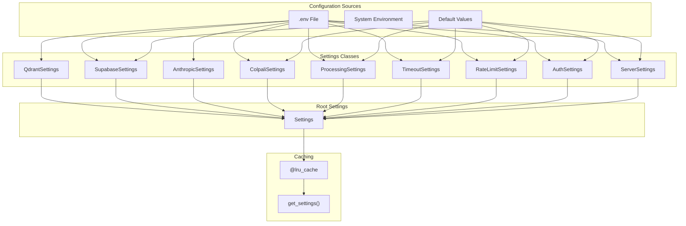
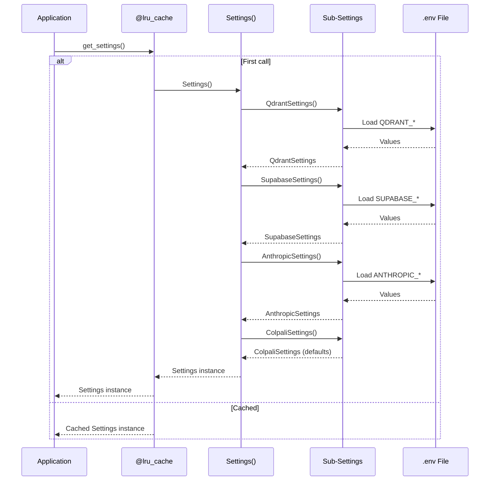

# Settings Module

The settings module handles configuration management using Pydantic Settings.

## Module Structure

```
src/app/
└── settings.py    # All settings classes
```

## Overview



---

## Settings Classes

### QdrantSettings

Configuration for Qdrant vector database.

```python
class QdrantSettings(BaseSettings):
    model_config = SettingsConfigDict(env_file=".env", extra="ignore")

    collection_name: str = ""
    qdrant_url: str = ""
    qdrant_api_key: str = ""
```

| Variable | Type | Required | Default | Description |
|----------|------|----------|---------|-------------|
| `COLLECTION_NAME` | `str` | Yes | - | Qdrant collection name |
| `QDRANT_URL` | `str` | Yes | - | Qdrant instance URL |
| `QDRANT_API_KEY` | `str` | Yes | - | Qdrant API key |

---

### SupabaseSettings

Configuration for Supabase storage.

```python
class SupabaseSettings(BaseSettings):
    model_config = SettingsConfigDict(env_file=".env", extra="ignore")

    supabase_key: str = ""
    supabase_url: str = ""
    supabase_jwt_secret: str = ""
    bucket: str = "colpali"
```

| Variable | Type | Required | Default | Description |
|----------|------|----------|---------|-------------|
| `SUPABASE_KEY` | `str` | Yes | - | Supabase API key |
| `SUPABASE_URL` | `str` | Yes | - | Supabase project URL |
| `SUPABASE_JWT_SECRET` | `str` | No* | - | JWT secret (*required if AUTH_ENABLED=true) |
| `BUCKET` | `str` | No | `colpali` | Storage bucket name |

---

### AnthropicSettings

Configuration for Anthropic API.

```python
class AnthropicSettings(BaseSettings):
    model_config = SettingsConfigDict(env_file=".env", extra="ignore")

    anthropic_api_key: str = ""
    default_model: str = "claude-sonnet-4-20250514"
    max_tokens: int = 8192
    temperature: float = 0.0
```

| Variable | Type | Required | Default | Description |
|----------|------|----------|---------|-------------|
| `ANTHROPIC_API_KEY` | `str` | Yes | - | Anthropic API key |
| `DEFAULT_MODEL` | `str` | No | `claude-sonnet-4-20250514` | Claude model ID |
| `MAX_TOKENS` | `int` | No | `8192` | Maximum response tokens |
| `TEMPERATURE` | `float` | No | `0.0` | Model temperature |

---

### ColpaliSettings

Configuration for ColQwen model.

```python
class ColpaliSettings(BaseSettings):
    model_config = SettingsConfigDict(env_file=".env", extra="ignore")

    colpali_model_name: str = "vidore/colqwen2.5-v0.2"
    max_concurrent_inferences: int = 1
```

| Variable | Type | Required | Default | Description |
|----------|------|----------|---------|-------------|
| `COLPALI_MODEL_NAME` | `str` | No | `vidore/colqwen2.5-v0.2` | HuggingFace model ID |
| `MAX_CONCURRENT_INFERENCES` | `int` | No | `1` | Max concurrent model inferences |

---

### Root Settings

Aggregates all settings classes.

```python
class Settings(BaseSettings):
    qdrant: QdrantSettings = QdrantSettings()
    colpali: ColpaliSettings = ColpaliSettings()
    supabase: SupabaseSettings = SupabaseSettings()
    anthropic: AnthropicSettings = AnthropicSettings()
    processing: ProcessingSettings = ProcessingSettings()
    timeout: TimeoutSettings = TimeoutSettings()
    rate_limit: RateLimitSettings = RateLimitSettings()
    auth: AuthSettings = AuthSettings()
    server: ServerSettings = ServerSettings()
```

---

## Cached Getter

```python
@lru_cache
def get_settings() -> Settings:
    return Settings()
```

The `@lru_cache` decorator ensures settings are loaded only once per application lifetime.

---

## Class Diagram

```mermaid
classDiagram
    class BaseSettings {
        <<pydantic>>
        +model_config: SettingsConfigDict
    }

    class QdrantSettings {
        +collection_name: str = ""
        +qdrant_url: str = ""
        +qdrant_api_key: str = ""
    }

    class SupabaseSettings {
        +supabase_key: str = ""
        +supabase_url: str = ""
        +supabase_jwt_secret: str = ""
        +bucket: str = "colpali"
    }

    class AnthropicSettings {
        +anthropic_api_key: str = ""
        +default_model: str = "claude-sonnet-4-20250514"
        +max_tokens: int = 8192
        +temperature: float = 0.0
    }

    class ColpaliSettings {
        +colpali_model_name: str = "vidore/colqwen2.5-v0.2"
        +max_concurrent_inferences: int = 1
    }

    class ProcessingSettings {
        +max_file_size_mb: int
        +max_total_upload_mb: int
        +max_pages_per_batch: int
        +max_pdf_pages: int
        +clear_cuda_cache_interval: int
    }

    class TimeoutSettings {
        +ingest_endpoint_timeout_seconds: int
        +query_endpoint_timeout_seconds: int
        +qdrant_timeout_seconds: int
        +supabase_timeout_seconds: int
        +anthropic_timeout_seconds: int
        +pdf_conversion_timeout_seconds: int
        +colpali_inference_timeout_seconds: int
    }

    class RateLimitSettings {
        +query_rate_limit: str
        +ingest_rate_limit: str
    }

    class AuthSettings {
        +auth_enabled: bool
        +allowed_origins: list
    }

    class ServerSettings {
        +workers: int
        +host: str
        +port: int
    }

    class Settings {
        +qdrant: QdrantSettings
        +supabase: SupabaseSettings
        +anthropic: AnthropicSettings
        +colpali: ColpaliSettings
        +processing: ProcessingSettings
        +timeout: TimeoutSettings
        +rate_limit: RateLimitSettings
        +auth: AuthSettings
        +server: ServerSettings
    }

    BaseSettings <|-- QdrantSettings
    BaseSettings <|-- SupabaseSettings
    BaseSettings <|-- AnthropicSettings
    BaseSettings <|-- ColpaliSettings
    BaseSettings <|-- ProcessingSettings
    BaseSettings <|-- TimeoutSettings
    BaseSettings <|-- RateLimitSettings
    BaseSettings <|-- AuthSettings
    BaseSettings <|-- ServerSettings
    BaseSettings <|-- Settings

    Settings *-- QdrantSettings
    Settings *-- SupabaseSettings
    Settings *-- AnthropicSettings
    Settings *-- ColpaliSettings
    Settings *-- ProcessingSettings
    Settings *-- TimeoutSettings
    Settings *-- RateLimitSettings
    Settings *-- AuthSettings
    Settings *-- ServerSettings
```



---

## Loading Order



---

## API Key Handling

API keys are stored as plain strings for simplicity. Ensure your `.env` file is not committed to version control:

```python
settings = get_settings()

# Access API key directly
api_key = settings.qdrant.qdrant_api_key
```

**Security Note:** In production, consider using environment variables or a secrets manager rather than `.env` files.

---

## Usage Examples

### In lifespan.py

```python
from src.app.settings import get_settings

async def lifespan(app: FastAPI):
    settings = get_settings()

    qdrant_client = create_qdrant_client(settings.qdrant)
    anthropic_client = create_anthropic_client(settings.anthropic)
    supabase_client = await create_supabase_client(settings.supabase)

    # ...
```

### In state.py

```python
from src.app.settings import Settings

def create_qdrant_client(settings: Settings) -> AsyncQdrantClient:
    return AsyncQdrantClient(
        url=settings.qdrant.qdrant_url,
        api_key=settings.qdrant.qdrant_api_key,
        timeout=settings.timeout.qdrant_timeout_seconds,
    )
```

---

## Environment File

### Example .env

```bash
# Qdrant
COLLECTION_NAME=colpali-documents
QDRANT_URL=https://abc123.cloud.qdrant.io
QDRANT_API_KEY=your-qdrant-api-key

# Supabase
SUPABASE_URL=https://your-project.supabase.co
SUPABASE_KEY=your-supabase-key
SUPABASE_JWT_SECRET=your-jwt-secret  # Required if AUTH_ENABLED=true
# BUCKET=colpali  # Optional

# Anthropic
ANTHROPIC_API_KEY=sk-ant-api03-...
# DEFAULT_MODEL=claude-sonnet-4-20250514
# MAX_TOKENS=8192
# TEMPERATURE=0.0
# MAX_TOKENS=8192
# TEMPERATURE=0.0

# ColPali (Optional)
# COLPALI_MODEL_NAME=vidore/colqwen2.5-v0.2
# MAX_CONCURRENT_INFERENCES=1

# Processing (Optional)
# MAX_FILE_SIZE_MB=50
# MAX_PDF_PAGES=200

# Rate Limiting (Optional)
# QUERY_RATE_LIMIT=30/minute
# INGEST_RATE_LIMIT=10/minute

# Timeouts (Optional)
# INGEST_ENDPOINT_TIMEOUT_SECONDS=600
# QUERY_ENDPOINT_TIMEOUT_SECONDS=180
# QDRANT_TIMEOUT_SECONDS=60
# SUPABASE_TIMEOUT_SECONDS=120
# ANTHROPIC_TIMEOUT_SECONDS=180
# PDF_CONVERSION_TIMEOUT_SECONDS=120
# COLPALI_INFERENCE_TIMEOUT_SECONDS=60

# Authentication (Optional)
# AUTH_ENABLED=true
# ALLOWED_ORIGINS=["https://yourapp.com"]
```

---

## Validation

Pydantic automatically validates settings on load:

```python
# Missing required field
# Raises: ValidationError: QDRANT_URL field required

# Invalid URL format (if URL validator added)
# Raises: ValidationError: invalid URL format
```

### Custom Validators

Add validators for more strict validation:

```python
from pydantic import field_validator

class QdrantSettings(BaseSettings):
    qdrant_url: str

    @field_validator("qdrant_url")
    @classmethod
    def validate_url(cls, v: str) -> str:
        if not v.startswith(("http://", "https://")):
            raise ValueError("qdrant_url must be a valid URL")
        return v
```

---

## Testing

Override settings for testing:

```python
import pytest
from unittest.mock import patch

@pytest.fixture
def mock_settings():
    with patch("src.app.settings.get_settings") as mock:
        mock.return_value = Settings(
            qdrant=QdrantSettings(
                collection_name="test",
                qdrant_url="http://localhost:6333",
                qdrant_api_key=SecretStr("test-key"),
            ),
            # ... other settings
        )
        yield mock
```
