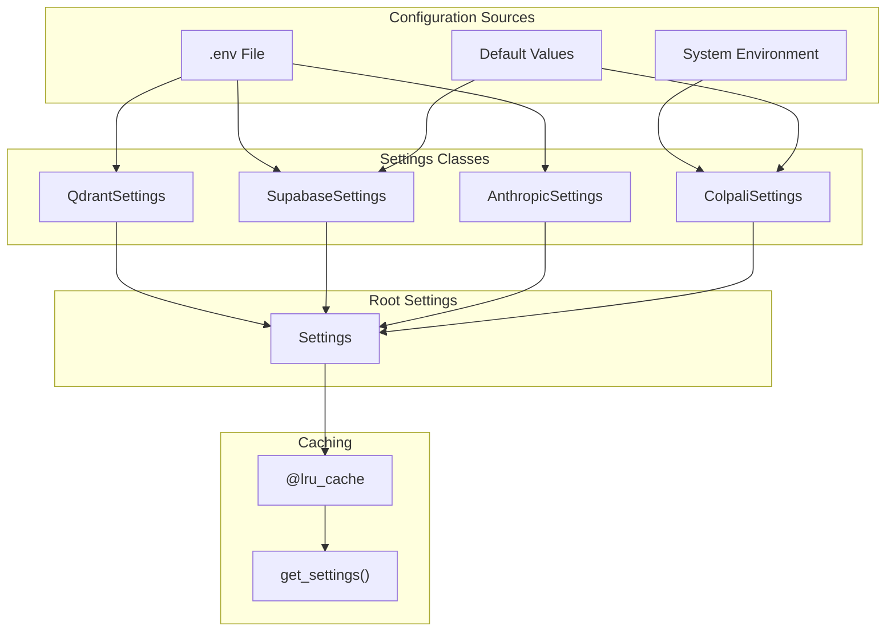
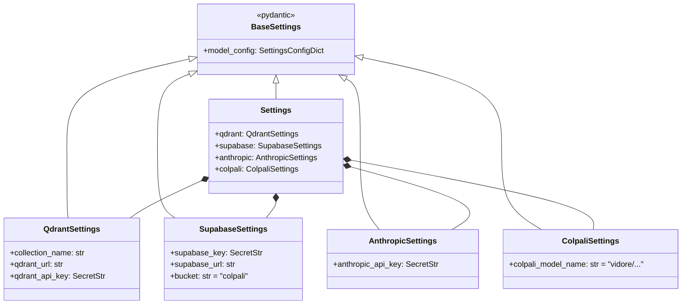
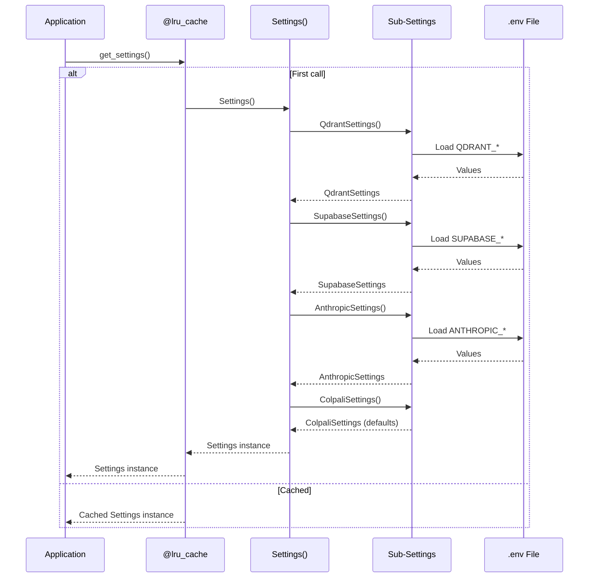

# Settings Module

The settings module handles configuration management using Pydantic Settings.

## Module Structure

```
src/app/
└── settings.py    # All settings classes
```

## Overview



---

## Settings Classes

### QdrantSettings

Configuration for Qdrant vector database.

```python
class QdrantSettings(BaseSettings):
    collection_name: str
    qdrant_url: str
    qdrant_api_key: SecretStr

    model_config = SettingsConfigDict(
        env_file=".env",
        extra="ignore",
    )
```

| Variable | Type | Required | Default | Description |
|----------|------|----------|---------|-------------|
| `COLLECTION_NAME` | `str` | Yes | - | Qdrant collection name |
| `QDRANT_URL` | `str` | Yes | - | Qdrant instance URL |
| `QDRANT_API_KEY` | `SecretStr` | Yes | - | API key (masked in logs) |

---

### SupabaseSettings

Configuration for Supabase storage.

```python
class SupabaseSettings(BaseSettings):
    supabase_key: SecretStr
    supabase_url: str
    bucket: str = "colpali"

    model_config = SettingsConfigDict(
        env_file=".env",
        extra="ignore",
    )
```

| Variable | Type | Required | Default | Description |
|----------|------|----------|---------|-------------|
| `SUPABASE_KEY` | `SecretStr` | Yes | - | Supabase API key |
| `SUPABASE_URL` | `str` | Yes | - | Supabase project URL |
| `BUCKET` | `str` | No | `colpali` | Storage bucket name |

---

### AnthropicSettings

Configuration for Anthropic API.

```python
class AnthropicSettings(BaseSettings):
    anthropic_api_key: SecretStr

    model_config = SettingsConfigDict(
        env_file=".env",
        extra="ignore",
    )
```

| Variable | Type | Required | Default | Description |
|----------|------|----------|---------|-------------|
| `ANTHROPIC_API_KEY` | `SecretStr` | Yes | - | Anthropic API key |

---

### ColpaliSettings

Configuration for ColQwen model.

```python
class ColpaliSettings(BaseSettings):
    colpali_model_name: str = "vidore/colqwen2.5-v0.2"

    model_config = SettingsConfigDict(extra="ignore")
```

| Variable | Type | Required | Default | Description |
|----------|------|----------|---------|-------------|
| `COLPALI_MODEL_NAME` | `str` | No | `vidore/colqwen2.5-v0.2` | HuggingFace model ID |

---

### Root Settings

Aggregates all settings classes.

```python
class Settings(BaseSettings):
    qdrant: QdrantSettings = Field(default_factory=QdrantSettings)
    supabase: SupabaseSettings = Field(default_factory=SupabaseSettings)
    anthropic: AnthropicSettings = Field(default_factory=AnthropicSettings)
    colpali: ColpaliSettings = Field(default_factory=ColpaliSettings)

    model_config = SettingsConfigDict(extra="ignore")
```

---

## Cached Getter

```python
@lru_cache
def get_settings() -> Settings:
    return Settings()
```

The `@lru_cache` decorator ensures settings are loaded only once per application lifetime.

---

## Class Diagram



---

## Loading Order



---

## SecretStr Usage

`SecretStr` masks sensitive values in logs and string representations:

```python
settings = get_settings()

# Masked in repr
print(settings.qdrant.qdrant_api_key)
# Output: SecretStr('**********')

# Access actual value
api_key = settings.qdrant.qdrant_api_key.get_secret_value()
```

---

## Usage Examples

### In lifespan.py

```python
from src.app.settings import get_settings

async def lifespan(app: FastAPI):
    settings = get_settings()

    qdrant_client = create_qdrant_client(settings.qdrant)
    anthropic_client = create_anthropic_client(settings.anthropic)
    supabase_client = await create_supabase_client(settings.supabase)

    # ...
```

### In state.py

```python
from src.app.settings import QdrantSettings

def create_qdrant_client(settings: QdrantSettings) -> AsyncQdrantClient:
    return AsyncQdrantClient(
        url=settings.qdrant_url,
        api_key=settings.qdrant_api_key.get_secret_value(),
    )
```

---

## Environment File

### Example .env

```bash
# Qdrant
COLLECTION_NAME=colpali-documents
QDRANT_URL=https://abc123.cloud.qdrant.io
QDRANT_API_KEY=your-qdrant-api-key

# Supabase
SUPABASE_URL=https://your-project.supabase.co
SUPABASE_KEY=your-supabase-key
# BUCKET=colpali  # Optional

# Anthropic
ANTHROPIC_API_KEY=sk-ant-api03-...

# ColPali (Optional)
# COLPALI_MODEL_NAME=vidore/colqwen2.5-v0.2
```

---

## Validation

Pydantic automatically validates settings on load:

```python
# Missing required field
# Raises: ValidationError: QDRANT_URL field required

# Invalid URL format (if URL validator added)
# Raises: ValidationError: invalid URL format
```

### Custom Validators

Add validators for more strict validation:

```python
from pydantic import field_validator

class QdrantSettings(BaseSettings):
    qdrant_url: str

    @field_validator("qdrant_url")
    @classmethod
    def validate_url(cls, v: str) -> str:
        if not v.startswith(("http://", "https://")):
            raise ValueError("qdrant_url must be a valid URL")
        return v
```

---

## Testing

Override settings for testing:

```python
import pytest
from unittest.mock import patch

@pytest.fixture
def mock_settings():
    with patch("src.app.settings.get_settings") as mock:
        mock.return_value = Settings(
            qdrant=QdrantSettings(
                collection_name="test",
                qdrant_url="http://localhost:6333",
                qdrant_api_key=SecretStr("test-key"),
            ),
            # ... other settings
        )
        yield mock
```
