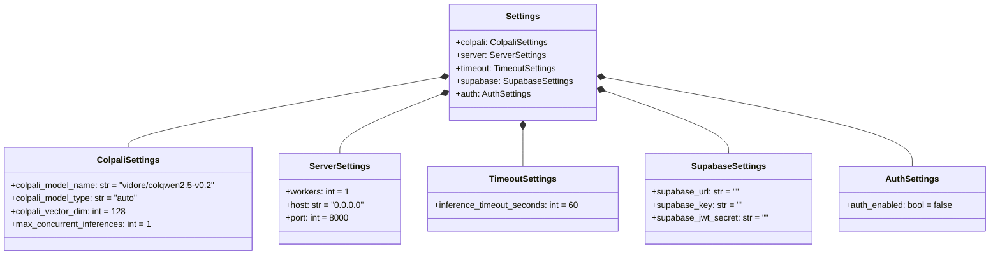

```mermaid
classDiagram
    class QdrantSettings {
        +collection_name: str = ""
        +qdrant_url: str = ""
        +qdrant_api_key: str = ""
        +vector_dim: int = 128
    }

    class VLMSettings {
        +vlm_service_url: str = "http://localhost:8001"
        +vlm_timeout_seconds: int = 120
    }

    class SupabaseSettings {
        +supabase_key: str = ""
        +supabase_url: str = ""
        +supabase_jwt_secret: str = ""
        +bucket: str = "colpali"
    }

    class AnthropicSettings {
        +anthropic_api_key: str = ""
        +default_model: str = "claude-sonnet-4-20250514"
        +max_tokens: int = 8192
        +temperature: float = 0.0
    }

    class ProcessingSettings {
        +max_file_size_mb: int = 50
        +max_total_upload_mb: int = 200
        +max_pages_per_batch: int = 5
        +max_pdf_pages: int = 200
    }

    class TimeoutSettings {
        +ingest_endpoint_timeout_seconds: int = 600
        +query_endpoint_timeout_seconds: int = 180
        +qdrant_timeout_seconds: int = 60
        +supabase_timeout_seconds: int = 120
        +anthropic_timeout_seconds: int = 180
        +pdf_conversion_timeout_seconds: int = 120
    }

    class RateLimitSettings {
        +query_rate_limit: str = "30/minute"
        +ingest_rate_limit: str = "10/minute"
    }

    class AuthSettings {
        +auth_enabled: bool = true
        +allowed_origins: list[str] = ["*"]
    }

    class ServerSettings {
        +workers: int = 1
        +host: str = "0.0.0.0"
        +port: int = 8000
    }

    class Settings {
        +qdrant: QdrantSettings
        +vlm: VLMSettings
        +supabase: SupabaseSettings
        +anthropic: AnthropicSettings
        +processing: ProcessingSettings
        +timeout: TimeoutSettings
        +rate_limit: RateLimitSettings
        +auth: AuthSettings
        +server: ServerSettings
    }

    Settings *-- QdrantSettings
    Settings *-- VLMSettings
    Settings *-- SupabaseSettings
    Settings *-- AnthropicSettings
    Settings *-- ProcessingSettings
    Settings *-- TimeoutSettings
    Settings *-- RateLimitSettings
    Settings *-- AuthSettings
    Settings *-- ServerSettings
```

# Settings Module

The settings module handles configuration management using Pydantic Settings. Each service has its own settings classes and `.env` file.

## VLM Service Settings

**Location:** `colpali-vlm/src/vlm/settings.py`

### Class Diagram



### Settings Classes

#### ColpaliSettings

| Variable | Type | Default | Description |
|----------|------|---------|-------------|
| `COLPALI_MODEL_NAME` | `str` | `vidore/colqwen2.5-v0.2` | HuggingFace model ID |
| `COLPALI_MODEL_TYPE` | `str` | `auto` | `auto`, `colqwen2.5`, `colqwen3`, `tomoro-colqwen3` |
| `COLPALI_VECTOR_DIM` | `int` | `128` | 128 for ColQwen2.5, 320 for ColQwen3/TomoroAI |
| `MAX_CONCURRENT_INFERENCES` | `int` | `1` | Max concurrent GPU inferences |

#### TimeoutSettings (VLM)

| Variable | Type | Default | Description |
|----------|------|---------|-------------|
| `INFERENCE_TIMEOUT_SECONDS` | `int` | `60` | Model inference timeout |

#### SupabaseSettings (VLM)

Required only if `AUTH_ENABLED=true`.

| Variable | Type | Default | Description |
|----------|------|---------|-------------|
| `SUPABASE_URL` | `str` | `""` | Supabase project URL |
| `SUPABASE_KEY` | `str` | `""` | Supabase API key |
| `SUPABASE_JWT_SECRET` | `str` | `""` | JWT secret |

#### AuthSettings (VLM)

| Variable | Type | Default | Description |
|----------|------|---------|-------------|
| `AUTH_ENABLED` | `bool` | `false` | Enable JWT authentication |

---

## Document API Settings

**Location:** `document-api/src/doc_api/settings.py`

### Class Diagram



### Settings Classes

#### QdrantSettings

| Variable | Type | Default | Description |
|----------|------|---------|-------------|
| `COLLECTION_NAME` | `str` | `""` | Qdrant collection name |
| `QDRANT_URL` | `str` | `""` | Qdrant instance URL |
| `QDRANT_API_KEY` | `str` | `""` | Qdrant API key |
| `VECTOR_DIM` | `int` | `128` | Vector dimension (must match VLM service) |

#### VLMSettings

| Variable | Type | Default | Description |
|----------|------|---------|-------------|
| `VLM_SERVICE_URL` | `str` | `http://localhost:8001` | VLM service URL |
| `VLM_TIMEOUT_SECONDS` | `int` | `120` | VLM HTTP request timeout |

#### SupabaseSettings (API)

| Variable | Type | Default | Description |
|----------|------|---------|-------------|
| `SUPABASE_KEY` | `str` | `""` | Supabase API key |
| `SUPABASE_URL` | `str` | `""` | Supabase project URL |
| `SUPABASE_JWT_SECRET` | `str` | `""` | JWT secret (required if AUTH_ENABLED=true) |
| `BUCKET` | `str` | `colpali` | Storage bucket name |

#### AnthropicSettings

| Variable | Type | Default | Description |
|----------|------|---------|-------------|
| `ANTHROPIC_API_KEY` | `str` | `""` | Anthropic API key |
| `DEFAULT_MODEL` | `str` | `claude-sonnet-4-20250514` | Claude model ID |
| `MAX_TOKENS` | `int` | `8192` | Maximum response tokens |
| `TEMPERATURE` | `float` | `0.0` | Model temperature |

#### ProcessingSettings

| Variable | Type | Default | Description |
|----------|------|---------|-------------|
| `MAX_FILE_SIZE_MB` | `int` | `50` | Maximum file size per PDF |
| `MAX_TOTAL_UPLOAD_MB` | `int` | `200` | Maximum total upload size |
| `MAX_PAGES_PER_BATCH` | `int` | `5` | Pages processed per batch |
| `MAX_PDF_PAGES` | `int` | `200` | Maximum pages per PDF |

#### TimeoutSettings (API)

| Variable | Type | Default | Description |
|----------|------|---------|-------------|
| `INGEST_ENDPOINT_TIMEOUT_SECONDS` | `int` | `600` | Ingest endpoint timeout |
| `QUERY_ENDPOINT_TIMEOUT_SECONDS` | `int` | `180` | Query endpoint timeout |
| `QDRANT_TIMEOUT_SECONDS` | `int` | `60` | Qdrant operations timeout |
| `SUPABASE_TIMEOUT_SECONDS` | `int` | `120` | Supabase operations timeout |
| `ANTHROPIC_TIMEOUT_SECONDS` | `int` | `180` | Claude API timeout |
| `PDF_CONVERSION_TIMEOUT_SECONDS` | `int` | `120` | PDF conversion timeout |

#### RateLimitSettings

| Variable | Type | Default | Description |
|----------|------|---------|-------------|
| `QUERY_RATE_LIMIT` | `str` | `30/minute` | Query endpoint rate limit |
| `INGEST_RATE_LIMIT` | `str` | `10/minute` | Ingest endpoint rate limit |

#### AuthSettings (API)

| Variable | Type | Default | Description |
|----------|------|---------|-------------|
| `AUTH_ENABLED` | `bool` | `true` | Enable JWT authentication |
| `ALLOWED_ORIGINS` | `list[str]` | `["*"]` | CORS allowed origins |

---

## Cached Getter

Both services use `@lru_cache` to ensure settings are loaded only once:

```python
@lru_cache
def get_settings() -> Settings:
    return Settings()
```

---

## Usage

```python
# VLM service
from vlm.settings import get_settings
settings = get_settings()
model_name = settings.colpali.colpali_model_name

# Document API
from doc_api.settings import get_settings
settings = get_settings()
vlm_url = settings.vlm.vlm_service_url
```
