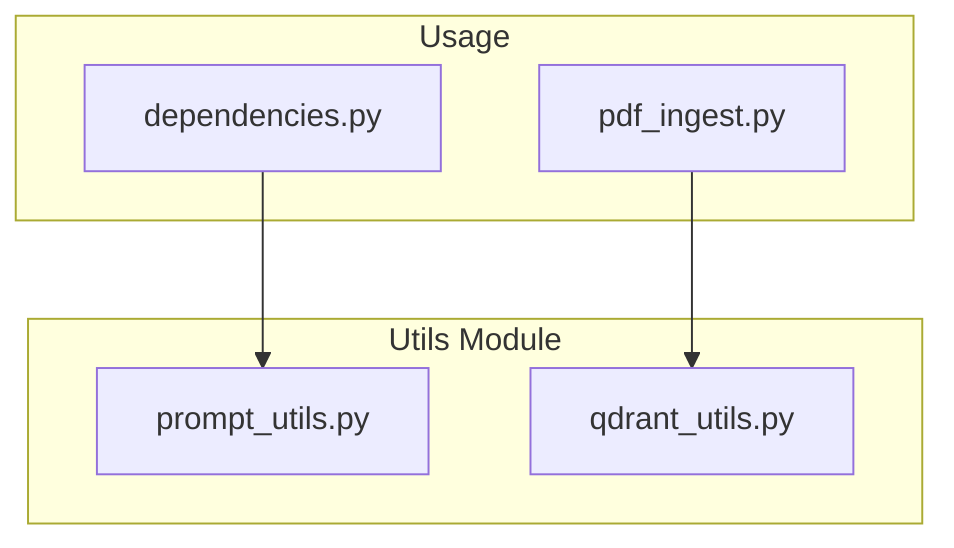
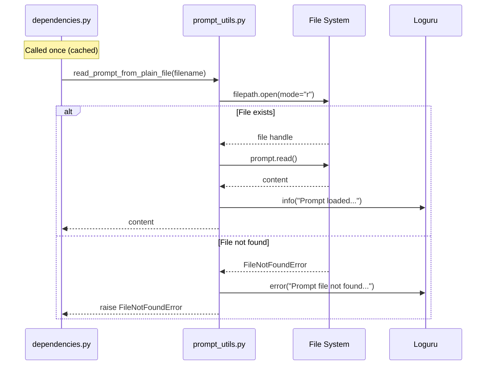
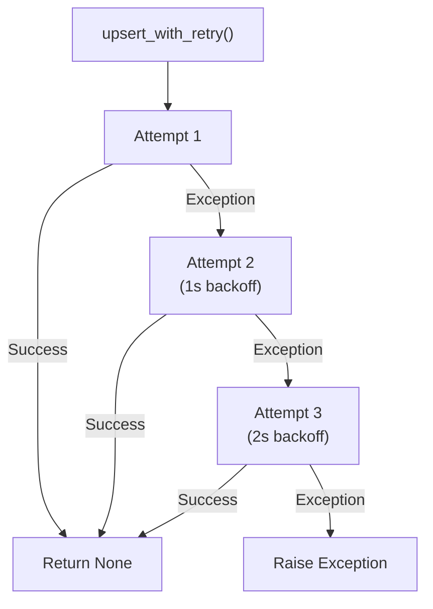

# Utils Module

The utils module contains utility functions for prompts and Qdrant operations.

## Module Structure

```
src/app/utils/
├── __init__.py
├── prompt_utils.py    # Prompt file reading
└── qdrant_utils.py    # Qdrant operations with retry
```

## Overview



---

## prompt_utils.py

Utility functions for reading prompt files.

### read_prompt_from_plain_file

Reads prompt content from a plain text file.

```python
def read_prompt_from_plain_file(filename: str) -> str:
    """
    Read prompt content from a plain text file.

    Args:
        filename: Path to the prompt file as string

    Returns:
        File contents as string

    Raises:
        FileNotFoundError: If file doesn't exist
    """
    filepath = Path(filename)
    try:
        with filepath.open(mode="r") as prompt:
            content = prompt.read()
            return content
    except FileNotFoundError:
        logger.error("Prompt file not found | path={}", filepath)
        raise
```

### Usage Flow



### Prompt Files

| File | Purpose |
|------|---------|
| `prompts/response_1` | System instructions for document analysis |
| `prompts/response_2` | Output format and citation instructions |

### Example

```python
from src.app.utils.prompt_utils import read_prompt_from_plain_file

# Load a prompt
system_prompt = read_prompt_from_plain_file("prompts/response_1")
```

---

## qdrant_utils.py

Utility functions for Qdrant operations with retry logic.

### ensure_collection_exists

Ensures the Qdrant collection exists, creating it if necessary.

```python
async def ensure_collection_exists(
    qdrant_client: AsyncQdrantClient,
    collection_name: str,
) -> None:
    """Ensure the collection exists, create it if it doesn't."""
    collections_response = await qdrant_client.get_collections()
    collections = [
        collection.name for collection in collections_response.collections
    ]

    if collection_name not in collections:
        await qdrant_client.create_collection(
            collection_name=collection_name,
            vectors_config=models.VectorParams(
                size=128,
                distance=models.Distance.COSINE,
                multivector_config=models.MultiVectorConfig(
                    comparator=models.MultiVectorComparator.MAX_SIM
                ),
                on_disk=False,
            ),
            on_disk_payload=False,
        )

        # Create index on session_id for faster filtering
        await qdrant_client.create_payload_index(
            collection_name=collection_name,
            field_name="session_id",
            field_schema=models.PayloadSchemaType.KEYWORD,
        )
```

---

### upsert_with_retry

Upserts points to Qdrant with automatic retry on failure.



### Implementation

```python
from tenacity import (
    before_sleep_log,
    retry,
    retry_if_exception_type,
    stop_after_attempt,
    wait_exponential,
)

@retry(
    retry=retry_if_exception_type(Exception),
    stop=stop_after_attempt(3),
    wait=wait_exponential(multiplier=1, min=1, max=10),
    reraise=True,
    before_sleep=before_sleep_log(logger, logging.WARNING),
)
async def upsert_with_retry(
    qdrant_client: AsyncQdrantClient,
    collection_name: str,
    points: list[models.PointStruct],
) -> None:
    """
    Upsert points to Qdrant with retry logic.

    Args:
        qdrant_client: Async Qdrant client
        collection_name: Name of the collection
        points: List of points to upsert

    Raises:
        Exception: After 3 failed attempts
    """
    # Ensure collection exists before upserting
    await ensure_collection_exists(qdrant_client, collection_name)

    # Now perform the upsert
    await qdrant_client.upsert(
        collection_name=collection_name,
        points=points,
        wait=True,
    )
```

### Retry Configuration

| Parameter | Value | Description |
|-----------|-------|-------------|
| `stop_after_attempt` | 3 | Maximum retry attempts |
| `wait_exponential.multiplier` | 1 | Base multiplier |
| `wait_exponential.min` | 1 second | Minimum wait time |
| `wait_exponential.max` | 10 seconds | Maximum wait time |
| `before_sleep` | Log warning | Log before each retry |

### Retry Timing

| Attempt | Wait Before |
|---------|-------------|
| 1 | 0s (immediate) |
| 2 | ~1s |
| 3 | ~2s |
| Fail | - |

### Example

```python
from qdrant_client import AsyncQdrantClient
from qdrant_client.models import PointStruct
from src.app.utils.qdrant_utils import upsert_with_retry

# Create points
points = [
    PointStruct(
        id="point-1",
        vector={"default": [0.1, 0.2, ...]},
        payload={"session_id": "123", "document": "doc.pdf", "page": 1}
    )
]

# Upsert with automatic retry
await upsert_with_retry(
    client=qdrant_client,
    collection_name="my_collection",
    points=points,
)
```

---

## Error Handling

### prompt_utils.py

```python
try:
    prompt = read_prompt_from_plain_file(Path("prompts/missing"))
except FileNotFoundError as e:
    print(f"Error: {e}")
```

### qdrant_utils.py

```python
from tenacity import RetryError

try:
    await upsert_with_retry(client, collection, points)
except RetryError as e:
    # All 3 attempts failed
    print(f"Failed after 3 attempts: {e.last_attempt.exception()}")
```

---

## Logging

Both utilities use Loguru for logging:

### prompt_utils.py Logs

```
2024-01-15 10:30:45 | INFO | prompt_utils:read_prompt_from_plain_file:15 | Loaded prompt from prompts/response_1 (1234 chars)
```

```
2024-01-15 10:30:45 | ERROR | prompt_utils:read_prompt_from_plain_file:12 | Prompt file not found: prompts/missing
```

### qdrant_utils.py Logs

```
2024-01-15 10:30:45 | WARNING | retry:before_sleep:85 | Retrying upsert_with_retry in 1.0 seconds as it raised ConnectionError: Connection refused
```

---

## Integration

### In dependencies.py

```python
from functools import lru_cache
from src.app.utils.prompt_utils import read_prompt_from_plain_file

@lru_cache(maxsize=1)
def get_prompts():
    prompt1 = read_prompt_from_plain_file("prompts/response_1")
    prompt2 = read_prompt_from_plain_file("prompts/response_2")
    return {"prompt1": prompt1, "prompt2": prompt2}
```

### In pdf_ingest.py

```python
from src.app.utils.qdrant_utils import upsert_with_retry

async def _process_batch(self, ...):
    points = [...]
    await upsert_with_retry(
        self.qdrant_client,
        self.collection_name,
        points,
    )
```
