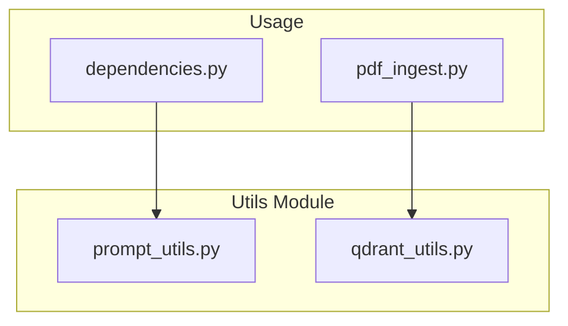

# Utils Module

The utils module contains utility functions for prompts and Qdrant operations.

**Location:** `document-api/src/doc_api/utils/`

## Module Structure

```
document-api/src/doc_api/utils/
├── __init__.py
├── prompt_utils.py    # Prompt file reading
└── qdrant_utils.py    # Qdrant operations with retry
```

## Overview



---

## prompt_utils.py

Utility functions for reading prompt files.

### read_prompt_from_plain_file

Reads prompt content from a plain text file.

```python
def read_prompt_from_plain_file(filename: str) -> str:
    filepath = Path(filename)
    try:
        with filepath.open(mode="r") as prompt:
            content = prompt.read()
            return content
    except FileNotFoundError:
        logger.error("Prompt file not found | path={}", filepath)
        raise
```

### Prompt Files

Prompts are stored in `document-api/prompts/`:

| File | Purpose |
|------|---------|
| `document-api/prompts/response_1` | System instructions for document analysis |
| `document-api/prompts/response_2` | Output format and citation instructions |

### Usage

```python
from doc_api.utils.prompt_utils import read_prompt_from_plain_file

# In dependencies.py (cached)
@lru_cache(maxsize=1)
def get_prompts():
    prompt1 = read_prompt_from_plain_file("prompts/response_1")
    prompt2 = read_prompt_from_plain_file("prompts/response_2")
    return {"prompt1": prompt1, "prompt2": prompt2}
```

---

## qdrant_utils.py

Utility functions for Qdrant operations with retry logic.

### ensure_collection_exists

Ensures the Qdrant collection exists, creating it if necessary. Accepts a `vector_dim` parameter to support different model dimensions.

```python
async def ensure_collection_exists(
    qdrant_client: AsyncQdrantClient,
    collection_name: str,
    vector_dim: int = 128,
) -> None:
    collections_response = await qdrant_client.get_collections()
    collections = [c.name for c in collections_response.collections]

    if collection_name not in collections:
        await qdrant_client.create_collection(
            collection_name=collection_name,
            vectors_config=models.VectorParams(
                size=vector_dim,
                distance=models.Distance.COSINE,
                multivector_config=models.MultiVectorConfig(
                    comparator=models.MultiVectorComparator.MAX_SIM
                ),
                on_disk=False,
            ),
            on_disk_payload=False,
        )

        await qdrant_client.create_payload_index(
            collection_name=collection_name,
            field_name="session_id",
            field_schema=models.PayloadSchemaType.KEYWORD,
        )
```

**Parameters:**
- `qdrant_client`: Async Qdrant client
- `collection_name`: Name of the collection
- `vector_dim`: Vector dimension (128 for ColQwen2.5, 320 for ColQwen3/TomoroAI)

---

### upsert_with_retry

Upserts points to Qdrant with automatic retry on failure. Also accepts `vector_dim` to pass to `ensure_collection_exists`.

```python
@retry(
    retry=retry_if_exception_type(Exception),
    stop=stop_after_attempt(3),
    wait=wait_exponential(multiplier=1, min=1, max=10),
    reraise=True,
    before_sleep=before_sleep_log(logger, logging.WARNING),
)
async def upsert_with_retry(
    qdrant_client: AsyncQdrantClient,
    collection_name: str,
    points: list[models.PointStruct],
    vector_dim: int = 128,
) -> None:
    await ensure_collection_exists(qdrant_client, collection_name, vector_dim)
    await qdrant_client.upsert(
        collection_name=collection_name,
        points=points,
        wait=True,
    )
```

### Retry Configuration

| Parameter | Value | Description |
|-----------|-------|-------------|
| `stop_after_attempt` | 3 | Maximum retry attempts |
| `wait_exponential.multiplier` | 1 | Base multiplier |
| `wait_exponential.min` | 1 second | Minimum wait time |
| `wait_exponential.max` | 10 seconds | Maximum wait time |

### Usage

```python
from doc_api.utils.qdrant_utils import upsert_with_retry

await upsert_with_retry(
    qdrant_client=qdrant_client,
    collection_name="colpali",
    points=points,
    vector_dim=settings.qdrant.vector_dim,
)
```
